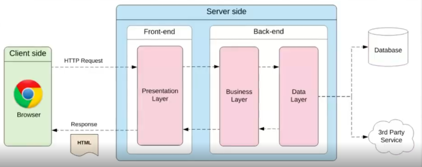

# 02 - Fundamentos de la computación en la nube

# 0. ESTRUCTURA DE CUALQUIER DESARROLLO WEB

- **Cliente (browser):** el usuario envía una petición y recibe la respuesta.
- **Front-end (presentación):** muestra la información (interfaz).
- **Back-end:**
    - **Business layer:** lógica de la aplicación
    - **Data layer:** acceso a los datos
- **Base de datos / servicios externos:** donde se guarda o se obtiene la información

## 🔄 Flujo básico

1. Cliente → envía petición
2. Servidor → procesa (lógica + datos)
3. Servidor → responde
4. Cliente → muestra resultado

---

# 1. LA NUBE

## 1.1 QUÉ ES LA NUBE

La computación en la nube es un modelo que permite acceder a recursos tecnológicos (*almacenamiento servidores, bases de datos, redes, software*) a través de internet, en lugar de tenerlos físicamente en nuestro ordenador o empresa

**Un día sin que la nube funcionara, sería un día de caos global.**

### CARACTERÍSTICAS CLAVE DEL CLOUD

- **Autoservicio bajo demanda →** usas recursos cuando quieras sin depender del proveedor.
- **Acceso por red →** acceso desde internet, en cualquier lugar.
- **Agrupación de recursos →** varios usuarios comparten infraestructura de forma segura.
- **Elasticidad →** los recursos se ajustan (suben o bajan) según la necesidad.
- **Pago por uso →** solo pagas por lo que consumes
- **Costes variables →** puedes pasar de gastos fijos a pagar según uso (más flexible)

---

## 1.2 MODELOS DE SERVICIO EN LA NUBE (aaS, as a Service)

Los modelos de servicio en la nube definen **qué parte de la infraestructura gestiona el proveedor y qué parte controla el usuario**. Van desde servicios totalmente gestionados (*menos control, más facilidad*) hasta servicios más configurables (*más control, más responsabilidad*).

### SaaS (Software as a Service)

Son aplicaciones listas para usar a través de internet, sin necesidad de instalación ni mantenimiento. **Está pensado para usuarios finales o empresas que solo quieren usar el software sin preocuparse por la infraestructura.**

*Ejemplos: Gmail, Google Docs, Salesforce*

### PaaS (Platform as a Service)

Plataforma en la nube que permite desarrollar, ejecutar y desplegar aplicaciones sin gestionar servidores. **Pensado para desarrolladores que quieren centrarse en el código sin preocuparse por la infraestructura.**

*Ejemplos: Heroku, Google App Engine, Microsoft Azure App Service*

### IaaS (Infraestructure as a Service)

Infraestructura virtual (*servidores, redes, almacenamiento*) que el usuario configura y administra. **Pensado para administradores de sistemas o empresas que necesitan control total sobre el entorno**.

*Ejemplos: Amazon EC2, Google Compute Engine, Microsoft Azure Virtual Machines*

---

### COMPARATIVA

| Capa | On-premise | IaaS | PaaS | SaaS |
| --- | --- | --- | --- | --- |
| Applications | Tú | Tú | Tú | Proveedor |
| Data | Tú | Tú | Tú | Proveedor |
| Runtime | Tú | Tú | Proveedor | Proveedor |
| Middleware | Tú | Tú | Proveedor | Proveedor |
| O/S | Tú | Tú | Proveedor | Proveedor |
| Virtualization | Tú | Proveedor | Proveedor | Proveedor |
| Servers | Tú | Proveedor | Proveedor | Proveedor |
| Storage | Tú | Proveedor | Proveedor | Proveedor |
| Networking | Tú | Proveedor | Proveedor | Proveedor |

---

## Resumen

- **SaaS:** usas aplicaciones → cero gestión
- **PaaS:** desarrollas apps → gestión parcial
- **IaaS:** control total → máxima flexibilidad

---

En este curso vamos a ver **AWS**, pero sabed que también existen proveedores muy parecidos como **Azure o clouds de empresas.**

---

## 1.3 MODALIDADES DE INFRAESTRUCTURA

- **Nube Privada →** La usa una sola organización con sus datos privados. Servicio e infraestructura están en centros de datos privados
*Un banco como el Banco Santander cuenta con sus propios centros de datos internos*
- **Nube Híbrida →** combinación entre pública y privada, con servicios que suelen estar integrados
*Una empresa que guarda datos sensibles en su nube privada, pero luego usa AWS para escalar aplicaciones en momentos de alta demanda*
- **Nube Pública →** Puede compartirse entre varias organizaciones y cuenta con un proveedor que administra el software
*AWS, Microsoft Azure, Google Cloud…*

---