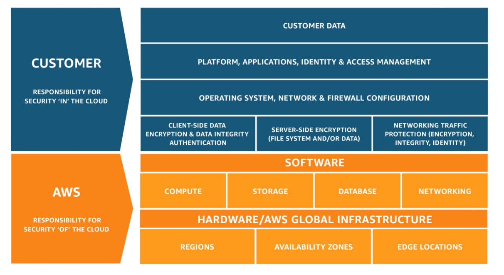

# 05 - Seguridad en AWS e IAM

# 1. MODELO DE RESPONSABILIDAD COMPARTIDA



El modelo de responsabilidad compartida de AWS define qué parte de la seguridad gestiona AWS y qué parte gestiona el cliente.

---

## 1.1 RESPONSABILIDAD DE AWS (SEGURIDAD DE LA NUBE)

AWS se encarga de proteger la infraestructura que ejecuta los servicios:

- Centros de datos físicos
- Hardware
- Redes globales
- Regiones y zonas de disponibilidad
- Infraestructura base (servidores, almacenamiento, etc.)

---

## 1.2 RESPONSABILIDAD DEL CLIENTE (SEGURIDAD EN LA NUBE)

El cliente es responsable de lo que ejecuta dentro de AWS:

- Datos del cliente
- Aplicaciones
- Sistema operativo
- Configuración de red y firewall
- Gestión de identidades y accesos (IAM)
- Cifrado y protección de datos

---

# 2. CASOS PRÁCTICOS

## 2.1 EJEMPLOS VISTOS EN CLASE


1. **Cliente** – Gestiona el sistema operativo en Amazon EC2.
2. **AWS** – Se encarga de la seguridad física de los centros de datos.
3. **AWS** – Controla la infraestructura de virtualización.
4. **Cliente** – Configura los grupos de seguridad (firewall) en EC2.
5. **Cliente** – Administra las aplicaciones que ejecuta en EC2.
6. **AWS** – Gestiona parches en servicios administrados como Amazon RDS.
7. **Cliente** – En EC2, el cliente gestiona el software (incluido Oracle).
8. **Cliente** – Configura permisos y acceso en Amazon S3.

---

## 2.2 MÁS EJEMPLOS

### Caso 1: fallo en un centro de datos

👉 **Respuesta: AWS →** Porque AWS gestiona la **infraestructura física**.

### Caso 2: contraseña débil de un usuario

👉 **Respuesta: Cliente →** Porque el cliente gestiona **usuarios y accesos (IAM)**.

### Caso 3: parchear el sistema operativo en EC2

👉 **Respuesta: Cliente →** Porque el cliente controla el **sistema operativo** en Amazon EC2.

### Caso 4: seguridad del hardware

👉 **Respuesta: AWS →** Porque AWS controla servidores físicos y data centers.

### Caso 5: configuración de firewall (Security Groups)

👉 **Respuesta: Cliente →** Porque el cliente configura la **red y reglas de acceso**.

### Caso 6: cifrado de datos

👉 **Respuesta: Cliente (principalmente) →** El cliente decide si cifra y cómo protege sus datos

### Caso 7: disponibilidad de la región

👉 **Respuesta: AWS →** AWS garantiza la **infraestructura global (regiones y AZ)**.

---

- **Si es físico → AWS**
- **Si es configuración/datos → Cliente**

---

# 3. IAM (IDENTITY AND ACCESS MANAGEMENT)


Se trata de un servicio de AWS que permite controlar quién puede acceder a los recursos y qué puede hacer.  Se trata de una característica de cuenta de AWS gratuita. Sirve para:

- Gestionar accesos a recursos de AWS
- Controlar permisos de usuarios
- Proteger la cuenta
- *Ejemplo: decidir quién puede apagar una instancia de Amazon EC2 o acceder a Amazon S3*

---

## 3.1 PERMISOS

IAM decide permisos detallados sobre:

- **Quién** puede acceder (usuarios, grupos, roles)
- **A qué recursos** puede acceder
- **Qué acciones** puede realizar
- **Cómo** se accede (contraseña, claves, MFA, etc.)

---

## 3.2 COMPONENTES ESENCIALES

- **Usuario**: persona o aplicación con acceso
- **Grupo**: conjunto de usuarios
- **Rol**: permisos temporales
- **Políticas**: reglas que definen permisos

---

## 3.3 ALGUNAS PREGUNTAS

### ¿Qué es una política de IAM y en qué formato están escritas?

En **AWS Identity and Access Management (IAM)**, una **política** es un documento que define **qué permisos tiene un usuario, grupo o rol** dentro de AWS. Es decir, especifica:

- Qué acciones se permiten o deniegan
- Sobre qué recursos
- Bajo qué condiciones

Están escritas en formato **JSON (JavaScript Object Notation)**

```json
{
  "Version": "2012-10-17",
  "Statement": [
    {
      "Effect": "Allow",
      "Action": "s3:ListBucket",
      "Resource": "*"
    }
  ]
}
```

---

### ¿Quién es el responsable de gestionar la seguridad de mi aplicación y de los datos que utiliza?

**El cliente** es responsable de gestionar la seguridad de su aplicación y los datos que utiliza en AWS

---