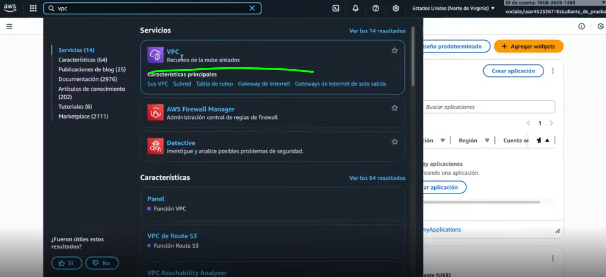

# 07 - PRÁCTICA - Crear una VPC

# 1. DIRECCIONES IP PRIVADAS

Cuando nos conectamos a internet, se nos asigna una IP pública que es la que tenemos de cara al exterior (puedes verla en https://whatismyipaddress.com/) . Sin embargo, con nuestro router tendremos una privada.

Por lo tanto, puedes encontrarte conectada a una red privada doméstica, y a la red pública de internet al mismo tiempo y por lo tanto, tener varias ip asignadas al mismo tiempo.

**Las direcciones IP privadas están reservadas para uso interno**. No se usan en internet, sino dentro de redes locales como LAN, VPC, oficinas, etc.

**Los tres rango principales son:**

| Rango | Notación CIDR | Nº de IPs | Uso típico |
| --- | --- | --- | --- |
| 10.0.0.0 – 10.255.255.255 | 10.0.0.0/8 | 16,777,216 | Grandes redes (empresas, cloud) |
| 172.16.0.0 – 172.31.255.255 | 172.16.0.0/12 | 1,048,576 | Redes medianas |
| 192.168.0.0 – 192.168.255.255 | 192.168.0.0/16 | 65,536 | Redes pequeñas (hogar, WiFi) |

---

# 2. AMAZON VPC

Amazon VPC es un servicio de AWS que permite crear una red virtual privada y aislada dentro de la nube. **Es como tener tu propia red dentro de AWS**.

Amazon VPC nos permite:

- Aprovisionar una sección **aislada de forma lógica** de la nube de AWS, donde puede iniciar recursos de AWS en una red virtual definida por el usuario.
- **Controlar nuestros recursos de redes virtuales:**
    - Selección de un rango de direcciones IP
    - Creación de subredes
    - Configuración de tablas de enrutamiento y puertas de enlace de Red
- **Personalizar la configuración de Red** desde nuestra VPC
- Usar **varias capas de seguridad**

---

# 3. LEARNER LAB

Asignaturas → AWS Academy Learner Lab → Contenidos → Laboratorio para el alumnado de AWS Academy → **Lanzamiento**

---

Me aparece la página de inicio de la consola. **Busco el servicio de VPC:**

---

A continuación veo que en mi región tengo 1 VPC (Redes Privadas Virtuales) y 6 Subredes:

---

**VPC →** 

- Una **red virtual aislada** dentro deAmazon Web Services
- **Propia de tu cuenta**
- Ubicada en **una sola región**
- Puede abarcar **varias Availability Zones**

**Subredes →**

- Es un **rango de direcciones IP** dentro de la VPC
- Está en **una sola Availability Zone**
- Puede ser:
    - **Pública** (con acceso a Internet)
    - **Privada** (sin acceso directo a Internet)

---

Voy a **Subredes** para ver las 6 subredes disponibles

Y en **VPC**:

*Al abrir una nueva cuenta, Amazon te crea automáticamente una VPC*

---

**Direccionamiento IP**

- Al crear una VPC se asigna un bloque CIDR IPv4 (rango de IP privadas).
- No se puede cambiar después de crear la VPC.
- Tamaño máximo: /16.
- Tamaño mínimo: /28.
- También admite IPv6.
- Las subredes no pueden superponerse.

Entonces vamos a probar a crear una VPC…

---

1. Crear VPC
2. Configuración inicial:

1. Personalización de bloques de CIDR de subredes para que sea más simple:

---

Lo siguiente que vamos a necesitar es una **tabla de enrutamiento y rutas**

- Una tabla de enrutamiento es un conjunto de reglas para dirigir el tráfico de la subred.
- Como puedes ver en la imagen, se han creado varias tabals de enrutamiento:
    - Una para la subred pública
    - Dos para las subredes privadas
    
    
    

Le damos a **crear VPC y empieza a hacer sus cosas**

---

**¡YA LA TENGO!**

