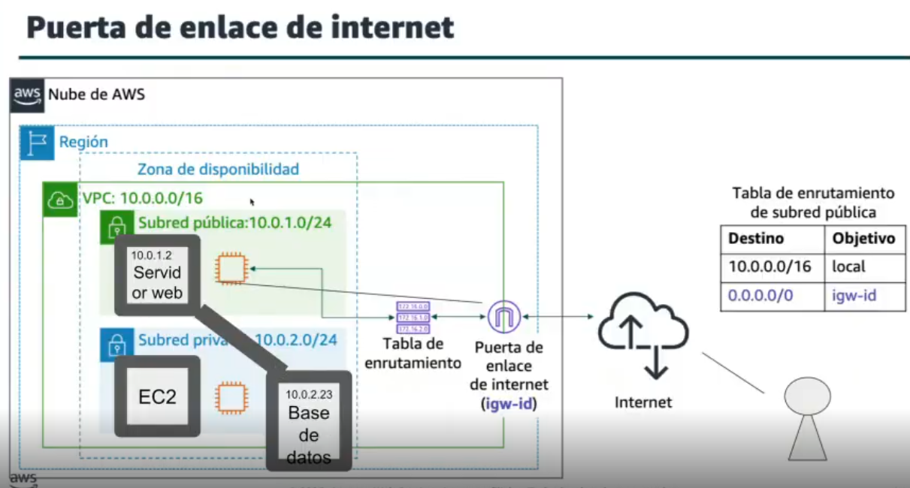

# 08 - Redes y Amazon VPC. Seguridad en VPC

# 1. EXPLICACIÓN DE ESTE CROQUIS

En este diagrama estamos viendo una red en AWS donde hay:

- Una **VPC** → mi red privada (*mi casa*)
- Una **subred pública** → conectada a Internet (*la puerta de entrada*)
- Una **subred privada** → NO conectada a Internet (*una habitación sin ventana*)
- Una **puerta de enlace (Internet Gateway)** → la salida a Internet (*puerta que da a la calle*)

---

**¿Qué es lo que sucede?**

1. **Un usuario desde Internet quiere ver mi web** → Entra por la **Internet Gateway**
2. **Llega al servidor web (10.0.1.2) (subred pública)**, que es accesible
3. **El servidor habla con la base de datos**, la cual está en una subred privada (más segura y no expuesta a internet)
4. **Se devuelve la respuesta:**
Base de datos → servidor web → Internet → usuario

---

**La tabla de rutas (lo importante)**

- En la subred pública hay esto:
    - `10.0.0.0/16 → local` → comunicación interna
    - `0.0.0.0/0 → igw` → TODO lo demás va a Internet
- Esto es lo que permite salir a Internet

---

**Claves**

- **Solo la subred pública tiene acceso a Internet**
- La **privada NO** (la base de datos está protegida)

---

# 2. ALGUNAS PREGUNTAS

### ¿Cuántas IPs hay disponibles para la red 192.168.1.0 /24?

- **Cálculo de IPs:**
    - **/24** significa que hay **24 bits para red**
    - Quedan **8 bits para hosts**
    - 28=256
- **IPs utilizables**
    - De esas 256:
        - 1 es la **dirección de red** → 192.168.1.0
        - 1 es la **broadcast** → 192.168.1.255
        - **IPs utilizables: 256 - 2 = 254**
- **Respuestas**
    - **Total IPs:** 256
    - **IPs disponibles (usables):** 254
- Una red /24 tiene **256 direcciones totales y 254 utilizables**

---

### ¿Para qué sirve la tabla de enrutamiento en la red?

La **tabla de enrutamiento** es un conjunto de reglas que determina **por dónde debe enviarse el tráfico en una red según su destino**, indicando si los datos deben permanecer dentro de la red (ruta local) o salir hacia otros destinos como Internet o servicios externos, actuando como una guía que decide el camino que siguen los datos.

---

# 3. SEGURIDAD EN VPC

## 3.1 GRUPOS DE SEGURIDAD

Actúan como un **firewall a nivel de instancia** (por ejemplo, una EC2)

**Características:**

- Controlan tráfico **de entrada y salida**
- Son **stateful (con estado)**
    - Si permites entrada, la respuesta sale automáticamente
- Solo permiten reglas **ALLOW (permitir)**
- Se aplican directamente a recursos (EC2, RDS, etc.)

*Ejemplo: permitir tráfico HTTP (puerto 80) a un servidor web*

---

## 3.2 LISTAS DE CONTROL DE ACCESO (ACL DE RED)

Actúan como un **firewall a nivel de subred**

**Características:**

- Controlan tráfico **de entrada y salida**
- Son **stateless (sin estado)**
    - Hay que permitir entrada y salida por separado
- Permiten reglas **ALLOW y DENY**
- Se aplican a **subredes**, no a instancias

*Ejemplo: bloquear una IP específica en toda la subred*

---

**En una VPC, los Security Groups protegen recursos individuales (stateful), mientras que las NACL protegen subredes completas (stateless).**