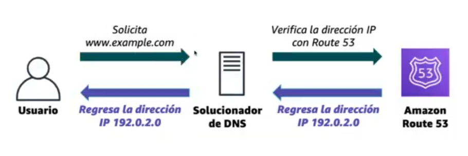

# 10 - Amazon VPC | Route 53 y CloudFront

# 0. ALGUNAS PREGUNTAS

### ¿Diferencia entre un grupo de seguridad y un ACL en relación a la seguridad de VPC?

- Un **grupo de seguridad** actúa a nivel de **instancia** (por ejemplo, una EC2), es **stateful** (si permites entrada, la salida se permite automáticamente) y solo permite reglas de tipo **ALLOW**.
- Una **ACL** actúa a nivel de **subred**, es **stateless** (hay que configurar entrada y salida por separado) y permite tanto **ALLOW como DENY**.

---

### ¿Qué significa que en mi grupo de seguridad permita la entrada al puerto 80 a 0.0.0.0/0?

Significa que **cualquier IP puede acceder al recurso por HTTP. Traducción:** 

*“Mi servidor web está abierto al público en Internet”* 

Es normal para páginas web públicas, pero puede ser peligroso si:

- No es un servidor web
- No está protegido correctamente

---

# 1. AWS VPC: ROUTE 53



Amazon Route 53 es un servicio que funciona como un **DNS (Sistema de Nombres de Dominio)**. Traduce nombres como `www.ejemplo.com` en direcciones IP como `192.0.2.1`.

### ¿Para qué sirve?

- Dirigir a los usuarios a tu aplicación
- Traducir nombres de dominio a IP
- Registrar dominios
- Comprobar el estado de recursos (health checks)
- Distribuir tráfico (routing)

### Características

- Dirigir a los usuarios a tu aplicación
- Traducir nombres de dominio a IP
- Registrar dominios
- Comprobar el estado de recursos (health checks)
- Distribuir tráfico (routing)


Todas las opciones de AWS Route 53

---

## 1.1 TIPOS DE ENRUTAMIENTO EN ROUTE 53

- **Simple**: un solo servidor
- **Round robin ponderado**: reparte el tráfico según pesos
- **Latencia**: envía al servidor más rápido
- **Geolocalización**: según ubicación del usuario
- **Geoproximidad**: según ubicación de los recursos
- **Conmutación por error (failover)**: usa un servidor de respaldo si falla el principal
- **Multivalor**: devuelve varias IP disponibles al azar

---

## 1.2 CASO PRÁCTICO


Tengo una web (**example.com**) desplegada en dos regiones distintas de AWS:

1. 🇺🇸 **us-west-2** (Estados Unidos)
2. 🌏 **ap-southeast-2** (Asia/Australia)

Cada una tiene su propio **Load Balancer (ELB)**. Cuando un usuario entra:

- Route 53 decide a qué región enviarlo
- Normalmente al **más cercano o más rápido**

Route 53 distribuye el tráfico entre varias regiones para mejorar **velocidad y disponibilidad**.

---

## 1.3 COMANDO `dig`

El comando **`dig` (Domain Information Groper)** se usa para **consultar información DNS**. Permite saber a qué IP apunta un dominio.

```bash
dig google.com
```

Muestra:

- Dirección IP
- Servidores DNS
- Tipo de registro (A, MX, etc.)

*Normalmente este comando no viene preinstalado por defecto en el cmd. Puedes usar `nslookup` en su lugar, que da una respuesta más simple:*


---

# 2. CLOUDFRONT (CDN)

Amazon CloudFront es un servicio de AWS que funciona como una **CDN (Content Delivery Network)**. Sirve para **entregar contenido más rápido a los usuarios** desde ubicaciones cercanas.

- Es una red de servidores distribuidos por todo el mundo
- Guarda copias (caché) de contenido usado frecuentemente
- Entrega el contenido desde el servidor más cercano al usuario
- Hace que las páginas carguen más rápido
- Mejora el rendimiento y la escalabilidad

### ¿Cómo funciona?

1. El usuario solicita contenido (web, imagen, vídeo)
2. CloudFront lo entrega desde el **servidor más cercano (edge location)**
3. Si no lo tiene, lo obtiene del servidor original (S3, EC2, etc.)
4. Lo guarda en caché para futuras solicitudes

### ¿Para qué sirve?

- Acelerar la carga de páginas web
- Reducir latencia
- Distribuir contenido globalmente
- Mejorar la experiencia del usuario

---

## 2.1 DEMO CLOUDFRONT

1. Digamos que tengo una imagen subida en Amazon S3 (que viene a ser como una especie de servicio de almacenamiento)


1. Quiero desplegar esa imagen en un cd. Para ello voy a Amazon Cloudfront:
Crear una distribución → Free → Le pongo nombre → Origen: Amazon S3 > Selecciono la imagen → Creo


1. Si creo un html e inserto la URL de la distribución que me acabo de crear con un .png y **lo abro en un navegador**, veremos la imagen. **Es una imagen obtenida de manera dinámica, no local**


---

## ANEXO → TIPOS DE REGISTRO DNS

Algunos de los más usados:

| Tipo | Significado | Ejemplo | Uso |
| --- | --- | --- | --- |
| A | Dirección IPv4 | [www.midominio.com](http://www.midominio.com/) → 54.12.34.56 | Sitios web, servidores |
| AAAA | Dirección IPv6 | [www.midominio.com](http://www.midominio.com/) → 2001:db8::1 | Web con IPv6 |
| CNAME | Alias | blog.midominio.com → [www.midominio.com](http://www.midominio.com/) | Alias entre nombres |
| MX | Mail Exchange | midominio.com → mail.protonmail.com | Correo electrónico |