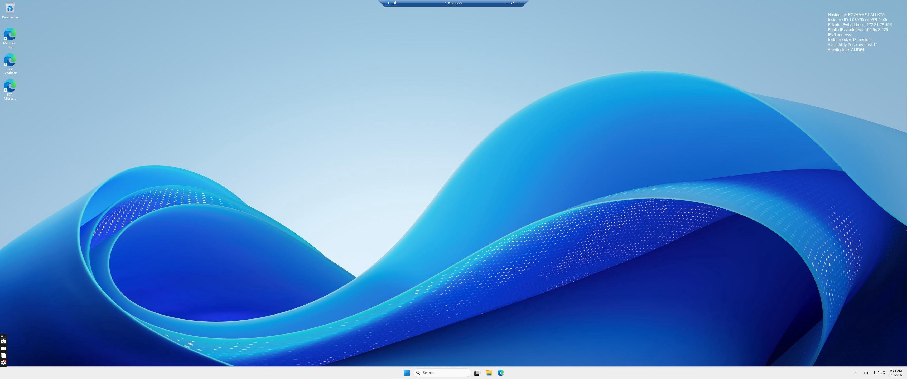

# 14 - Amazon EC2 - Práctica Windows Server

### 1. ME CONECTO A UNA NUEVA INSTANCIA WINDOWS

- Creo una instancia Windows llamada `windows_server_discos` **(va a ser t3.medium)**
- Me conecto a la instancia vía RDP

---

### 2. CREO UN NUEVO VOLUMEN Y LO ASOCIO

- Ya dentro del Windows Server, en el propio explorador puedo ver que tengo 1 volumen:

- Voy a crear un nuevo volumen `disk_D` desde la consola y asociarlo a mi instancia

---

### 3. MONTAJE DEL DISCO

- Ahora voy a montar el nuevo volumen a partir de una herramienta del Windows Server llamada **Disk Management**
- Aparece un disco que no está inicializado, **este es mi volumen nuevo**
- Botón dcho. → New Simple Volume → Voy siguiendo los menús → **Se formatea**

- Ahora puedo ver el disco en el explorador de archivos:

---

### 4. HACIENDO PRUEBAS

- Dentro del nuevo volumen, creo un archivo .txt llamado `prueba.txt`:

- Creo un nuevo volumen a partir de una instantánea: **Acciones → Crear Instantánea**
- Ahora creo un volumen a partir de esta instantánea: **Acciones → Crear volumen a partir de instantánea**

- Asocio el nuevo volumen al que he llamado `windows_backup`a la máquina.
- Ya podré verlo desde el explorador y el Disk Management:

- ¡Y no solo eso! Si lo abro, en su interior encuentro una copia dl archivo `prueba.txt` que había creado antes. WOOOW

¡ÉXITO!