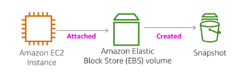

# 15 - Almacenamiento en Amazon EBS.

# 1. AMAZON EBS

**Amazon EBS (Elastic Block Store)** es un servicio de almacenamiento en la nube de Amazon Web Services que proporciona **almacenamiento en bloques persistente** para usar con instancias de Amazon EC2. 

Puedes imaginarlo como un **disco duro virtual en la nube**:

- Se conecta a una instancia EC2 como si fuera un disco físico
- Los datos permanecen aunque la instancia se detenga
- Está diseñado para **alto rendimiento y baja latencia**

---

### CARACTERÍSTICAS

1. Almacenamiento persistente

- Los datos no se pierden al apagar o reiniciar la instancia
- Ideal para bases de datos, aplicaciones y sistemas de archivos

2. Almacenamiento en bloques

- Funciona como un disco real
- Puedes formatearlo (ext4, NTFS, etc.)

3. Snapshots (copias de seguridad)

- Permite crear copias de seguridad almacenadas en Amazon S3
- Útiles para recuperación ante desastres

4. Escalabilidad

- Puedes aumentar el tamaño o rendimiento del volumen fácilmente

5. Alta disponibilidad

- Los datos se replican automáticamente dentro de una zona de disponibilidad

---

### FUNCIONES

- Instantáneas
    - Instantáneas puntuales
    - Volver a crear un volumen nuevo en cualquier momento
- Cifrado:
    - Volúmenes de Amazon EBS cifrados
    - Sin costo adicional
- Elasticidad
    - Aumentar capacidad
    - Cambiar a diferentes tipos

---

### TIPOS DE VOLÚMENES DE AMAZON EBS

| Característica | SSD (Uso general) | SSD (IOPS aprovisionadas) | HDD (Rendimiento optimizado) | HDD (Frío) |
| --- | --- | --- | --- | --- |
| **Capacidad máxima del volumen** | 16 TiB | 16 TiB | 16 TiB | 16 TiB |
| **IOPS máximos/volumen** | 16,000 | 64,000 | 500 | 250 |
| **Rendimiento máximo/volumen** | 250 MiB/s | 1000 MiB/s | 500 MiB/s | 250 MiB/s |

Los volúmenes de Amazon EBS de AWS incluyen SSD de uso general (equilibrio), SSD con IOPS aprovisionadas (alto rendimiento), HDD optimizado (datos secuenciales) y HDD en frío (bajo costo para acceso poco frecuente)

---

# Hoy vamos a hacer el Laboratorio 4:

**→ Academy Cloud Foundations / Módulo 7 / Ejercicio de Laboratorio 4 - Trabajo con EBS**

