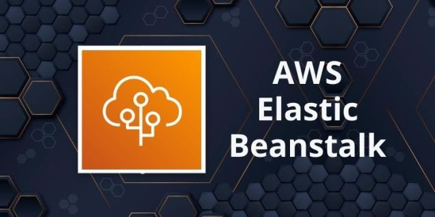

# 20. AWS Elastic Beanstalk

# ALGUNAS PREGUNTAS DE REPASO

### **¿Qué diferencias existen entre AWS lambda y AWS EC2?**

**Modelo de ejecución**

- Lambda: Serverless (no gestionas servidores)
- EC2: Máquinas virtuales que tú administras
**Escalabilidad**
- Lambda: Automática e inmediata
- EC2: Manual o mediante auto-scaling
**Coste**
- Lambda: Pagas solo por ejecución (milisegundos)
- EC2: Pagas por tiempo de instancia activa
**Gestión**
- Lambda: AWS gestiona la infraestructura
- EC2: Tú gestionas sistema operativo, parches, etc.
**Duración de ejecución**
- Lambda: Máximo limitado (ej. minutos)
- EC2: Sin límite mientras la instancia esté activa
**Casos de uso**
- Lambda: Procesos event-driven, automatizaciones
- EC2: Aplicaciones completas, servidores persistentes

### **¿Qué maneras existen de "lanzar" una función lambda?**

- Evento HTTP (API Gateway)
- Subida de archivos a S3
- Cambios en base de datos (DynamoDB, RDS)
- Mensajes en colas (SQS, SNS)
- Eventos programados (CloudWatch / EventBridge)
- Llamada directa desde código o SDK

---

# 1. AWS ELASTIC BEANSTALK

AWS Elastic Beanstalk es un servicio de AWS que permite desplegar y gestionar aplicaciones web de forma automática, sin tener que encargarte directamente de la infraestructura.

Es un **servicio administrado**, es decir, que maneja automáticamente de casi todo, como:

- Configurar servidores
- Desplegar la aplicación
- Balancear el tráfico (balanceo de carga)
- Ajustar recursos según demanda (escalado automático)
- Vigilar si la app funciona bien (monitoreo)
- Ayudar a encontrar errores (debugging)
- Guardar logs (registros)

### LENGUAJES QUE SOPORTA

- Java
- .NET
- PHP
- Node.js
- Python
- Ruby
- Go
- Docker

### DÓNDE SE EJECUTA

Las aplicaciones corren en servidores web como:

- Apache
- NGINX
- Passenger
- Puma
- IIS (Microsoft)

### ADMINISTRACIÓN

**Tú administras:**

- El código de tu aplicación
**AWS administra:**
- Servidor HTTP
- Servidor de aplicaciones
- Intérprete del lenguaje
- Sistema operativo
- Infraestructura (host)

### VENTAJAS

- **Rápido y sencillo de usar:** permite desplegar aplicaciones en pocos pasos sin configurar infraestructura manualmente.
- **Productividad para los desarrolladores:** te centras en el código y no en servidores, redes o configuraciones complejas.

### A TENER EN CUENTA

- **Difícil de optimizar:** al ser un servicio gestionado, tienes menos control fino para optimizar recursos.
- **Control completo de recursos:** AWS maneja gran parte de la infraestructura, lo que limita la personalización avanzada.

---

# 2. **PRÁCTICA DE AWS ELASTIC BEANSTALK**

Completar el siguiente laboratorio de AWS:
`Cloud fundamentals -> Modulo 6 -> Activity: AWS Elastic Beanstalk`

