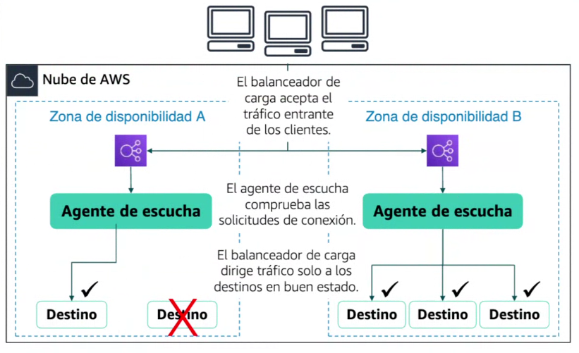

# 22. Escalado y balanceo de la carga de su arquitectura

# 1. CONCEPTOS TEÓRICOS

## ALTA DISPONIBILIDAD

La **alta disponibilidad (High Availability, HA)** es un principio de diseño en sistemas informáticos que busca que un servicio esté **disponible y funcionando el mayor tiempo posible**, incluso cuando ocurren fallos.

En otras palabras: el sistema está preparado para **no caerse** o recuperarse muy rápido si algo falla. Se consigue de esta forma:

- **Redundancia** (varios servidores, discos, redes)
- **Balanceo de carga** (repartir tráfico)
- **Replicación de datos**
- **Sistemas de failover** (cambio automático ante fallos)

## ELASTIC LOAD BALANCING

El balanceador evita caídas distribuyendo la carga entre varios servidores. En AWS, **Elastic Load Balancing (ELB)** distribuye el tráfico entre varios destinos (EC2, contenedores, IPs o Lambda). Puede trabajar en **una o varias zonas de disponibilidad** → mejora la **alta disponibilidad** y se **adapta automáticamente al tráfico** (escala según la demanda).

- **Sin balanceador:**
    - Solo hay un servidor → punto único de fallo
    - Se satura fácilmente
    - Si falla, la aplicación cae
    - Escalado manual
- **Con balanceador:**
    - Reparte el tráfico entre varios servidores
    - Mayor **alta disponibilidad**
    - Permite **escalado automático**
    - Hay **redundancia** (si uno falla, otros siguen funcionando)

| Tipo de balanceador | Características principales | Capa OSI |
| --- | --- | --- |
| Application Load Balancer (ALB) | HTTP/HTTPS, basado en contenido, ideal para microservicios | Capa 7 |
| Network Load Balancer (NLB) | TCP/UDP/TLS, alto rendimiento y baja latencia | Capa 4 |
| Classic Load Balancer (CLB) | HTTP/HTTPS/TCP/SSL, balanceo básico entre EC2 | Capa 4 y 7 |

---

# 2. AUTOESCALADO

### ¿POR QUE ES IMPORTANTE EL AUTOESCALADO?

Sin escalado adecuado:

- A veces hay **capacidad desperdiciada** (pagas de más).
- Otras veces la demanda **supera la capacidad** (fallos o lentitud).

Con escalado:

- Ajustas recursos según la **demanda real**.
- Evitas **sobrecarga** y **costes innecesarios**.

## AMAZON EC2 AUTO SCALING

Auto Scaling ajusta automáticamente los recursos para mantener rendimiento y disponibilidad sin intervención manual.

- Mantiene la **alta disponibilidad** de las aplicaciones.
- **Añade o elimina instancias EC2 automáticamente** según la demanda.
- Detecta instancias fallidas y las **reemplaza sin intervención**.
- Permite varios tipos de escalado:
    - Manual
    - Programado
    - Dinámico
    - Bajo demanda / predictivo

## ESCALADO ASCENDENTE VS ESCALADO DESCENDENTE

Piensa en un sistema con varias máquinas (instancias) trabajando juntas para atender usuarios. En una situación normal, tienes un número base de instancias funcionando. Ese es tu punto de partida: suficiente para el tráfico habitual.

Cuando **aumenta la demanda** (por ejemplo, más usuarios de lo normal), entra en juego el **escalado ascendente**: el sistema crea nuevas instancias automáticamente para repartir la carga. Así evita que la aplicación se vuelva lenta o se caiga.

En cambio, cuando **la demanda baja**, ocurre el **escalado descendente**: se eliminan algunas instancias porque ya no son necesarias. Esto permite no pagar por recursos que no se están usando.

En resumen, el sistema se adapta continuamente:

- Añade recursos cuando hacen falta
- Los reduce cuando sobran

La idea es mantener siempre un equilibrio entre **rendimiento** (que todo funcione bien) y **coste** (no gastar de más).

## ESCALADO VERTICAL VS HORIZONTAL

El **escalado vertical** consiste en hacer más potente una sola máquina. Es decir, aumentar CPU, RAM o almacenamiento de un servidor existente. Es como “hacer el servidor más grande”. Es sencillo de implementar y no requiere cambiar mucho la arquitectura, pero tiene límites físicos (no puedes crecer indefinidamente) y, además, si ese único servidor falla, todo el sistema cae.

En cambio, el **escalado horizontal** consiste en añadir más máquinas en lugar de hacer una sola más potente. Es como pasar de un solo servidor a varios trabajando juntos. Esto permite repartir la carga entre ellos, mejorar la disponibilidad y crecer casi sin límite. Eso sí, es más complejo porque necesitas coordinar múltiples servidores (por ejemplo, usando balanceadores de carga).

En resumen:

- **Vertical:** más potencia en un solo servidor → simple pero limitado y menos resistente a fallos
- **Horizontal:** más servidores trabajando juntos → más escalable y con alta disponibilidad, pero más complejo

La idea clave es que el vertical “crece hacia arriba” (más potencia) y el horizontal “crece hacia los lados” (más máquinas).

---

# 2. EJERCICIO LABORATORIO 6

AWS Academy Cloud Fundations → Módulo 10 → Laboratorio 6