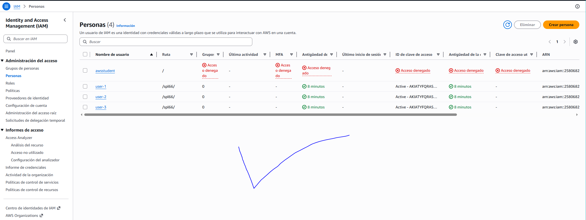

# Laboratorio 1

# COMPLETAR EL LABORATORIO #1

¡Felicitaciones! Aprendió a realizar correctamente lo siguiente:

- Analizar usuarios y grupos de IAM creados previamente
- Inspeccionar políticas de IAM aplicadas a los grupos creados previamente
- Según una situación real, agregar usuarios a los grupos con capacidades específicas habilitadas
- Ubicar y utilizar la dirección URL de inicio de sesión de IAM
- Experimentar con los efectos de las políticas en el acceso a los servicios

---

## #1. ANALIZAR LOS USUARIOS Y LOS GRUPOS

---

## #2. AGREGAR USUARIOS A LOS GRUPOS

---

## #3 INICIAR SESIÓN Y PROBAR USUARIOS

**Todo hecho siguiento las instrucciones**

---

## #4. COMPLETAR Y ENVIAR

