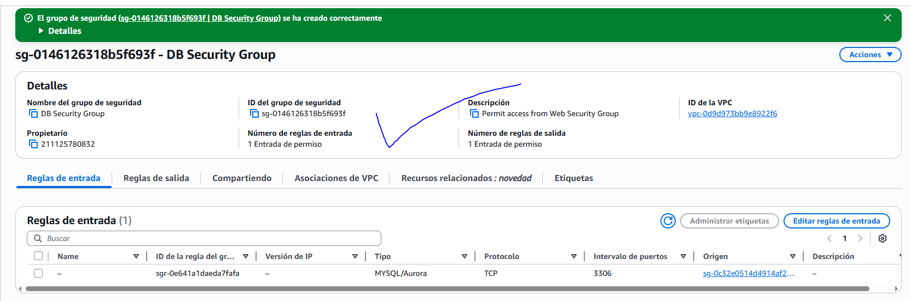

# Laboratorio 5

# COMPLETAR EL LABORATORIO #5

Al final de este laboratorio, podrá hacer lo siguiente:

- Lanzar una instancia de base de datos de Amazon RDS con alta disponibilidad
- Configurar la instancia de base de datos para permitir conexiones desde su servidor web
- Abrir una aplicación web e interactuar con su base de datos

---

## #1. CREAR UN GRUPO DE SEGURIDAD PARA LA INSTANCA DE BASE DE DATOS RDS

---

## #2. CREAR UN GRUPO DE SUBREDES DE BASES DE DATOS

---

## #3. CREAR UNA INSTANCIA DE BASE DE DATOS DE AMAZON RDS

---

## #4. INTERACTUAR CON LA BASE DE DATOS

---

## #5. COMPLETAR Y ENVIAR

