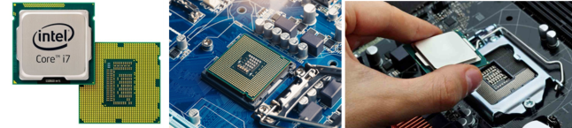

# Componentes básicos de tu ordenador

## A) PROCESADOR

Es el componente principal de la computadora. Ejecuta instrucciones y realiza cálculos para que el sistema funcione. Digamos que es como el cerebro :brain:  del equipo, ya que interpreta y procesa los datos de los programas y controla el funcionamiento del resto de los componentes.

→ El procesador (CPU) se encuentra montado en la placa base (o tarjeta madre).

*Ejemplos: Intel Core i3, i5, i7, 19 / AMD Ryzen 3, 5, 7, 9 / Apple M1, M2, M3 / etc.*

---

## B) UNIDAD DE ALMACENAMIENTO

Es un dispositivo físico que guarda y almacena datos en un ordenador y permite guardar y acceder a datos de manera rápida y eficiente. Lee datos, los procesa y los vuelve a almacenar. Tipos:

- **HDD o Disco duro:** el de “toda la vida”. Son discos magnéticos. Ya se están quedando obsoletos, prácticamente ya no se usan en portátiles.
- **Unidad SSD o Unidad de Estado Sólido:** es más rápido, silencioso y resistente.
- **Discos M.2:** un SSD moderno que usa un conector M2 para ofrecer mayor velocidad y eficiencia en comparación con los HDD y los SSD SATA. Son los que más se están empezando a usar hoy en día.

Digamos que el procesador le pide x datos a la unidad de almacenamiento. Surge un problema: cargar estos datos directa y constantemente desde la unidad sería un proceso muy lento. ¿Solución? → **¡La memoria RAM o Volátil!**

---

## C) MEMORIA RAM (Random Access Memory)

La encontraríamos entre el procesador y el almacenamiento principal. Es un tipo de memoria temporal que almacena datos e instrucciones que la CPU necesita mientras el equipo está en uso:

En lugar de cargar datos directamente desde el almacenamiento principal al procesador, se cargan a la RAM, permitiendo al procesador trabajar directamente con ellos en dicha RAM. Cuando hace falta guardar datos para que no se borren nunca, estos irían a la memoria principal. Todo esto permite que el sistema operativo y los programas se ejecuten de forma rápida, ya que la RAM es mucho más rápida.

→ Cuando el ordenador se apaga, la información guardada en la RAM se borra.

*Ejemplos: DDR4 Crucial Ballistix, DDR5 G.Skill Trident Z5, DDR5 Kingston Fury Beast…*

---

## D) PLACA BASE O TARJETA MADRE

Es uno de los componentes más complejos de la computadora. Aquí se conectan y comunican todos los demás elementos de la computadora: procesador, memoria RAM, almacenamiento, tarjeta gráfica, puertos USB, etc.

---

## E) FUENTE DE ALIMENTACIÓN

Convierte la corriente eléctrica de la toma corriente (CA o Corriente Alterna) en CC o Corriente Continua. Así, proporciona la energía correspondiente a cada elemento de la computadora protegiéndolos de sobrecargas o variaciones eléctricas.

→ Convierte esta corriente alterna “de la calle” en distintas salidas con distintos voltajes, en función del voltaje que necesite cada componente.

*Ahora, volviendo al procesador… Pensad que este procesador está hecho de silicio, que es un material semiconductor que, dicho de forma muuuy general, nos permite hacer cálculos muy complejos y variados con la corriente, abrir y cerrar “compuertas”, etc.*

*Pero nos surge un problema muy grave: existe una cierta resistencia para dejar pasar esta corriente y parte de la misma se queda en el camino… Y no se pierde, sino que se convierte en calor. Es decir, que nuestro procesador, solo por el hecho de estar encendido, genera calor, **¡tenemos que enfriarlo como sea!***

---

## F) DISIPADOR

Es un dispositivo que ayuda a enfriar los componentes electrónicos, especialmente la CPU y la GPU (Tarjeta Gráfica), disipando el calor generado para evitar sobrecalentamiento.

- **Por aire:** usan aletas de metal y ventiladores
- *Por líquido: **usan líquido refrigerante que circula por tuberías y radiadores

---

## G) EL PCH (Platform Controller Hub)

Es un chip de la placa base que gesiona la comunicación entre la CPU y otros componentes del sistema como almacenamiento, puertos USB, audio, red y tarjetas de expansión.

- Controla puertos de entrada/salida (USB, SATA, PCle, audio…)
- Gestiona comunicaciones con la memoria, almacenamiento y dispositivos externos
- Maneja funciones de red, audio y seguridad

Vamos, que es la leche, pues se encarga de controlar quién y cómo habla con el procesador.

---

## H) LA GPU (Tarjeta Gráfica)

Pensad que el procesador puede calcular todo tipo de cosas… Pero hay un cálculo en concreto que se le da faaatal: calcular las imágenes en pantalla. Pensad en un monitor, que no es más que una “rejilla” de cuadrados de colores que forman una imagen(píxeles). Calcular qué cuadradito tiene qué color se le da muy mal al ordenador. Para resolver esto, se utiliza otro tipo de procesadores, unos co-procesadores gráficos conocidos como **GPU o GraphiCs Processing Unit**.

→ La GPU es un procesador especializado en realizar cálculos relacionados con gráficos e imágenes. Renderiza imágenes en 2D y 3D, procesa videos y animaciones y ejecuta tareas de inteligencia artificial o aprendizaje automático en máquinas modernas. Es el cerebro visual de nuestra computadora.

---