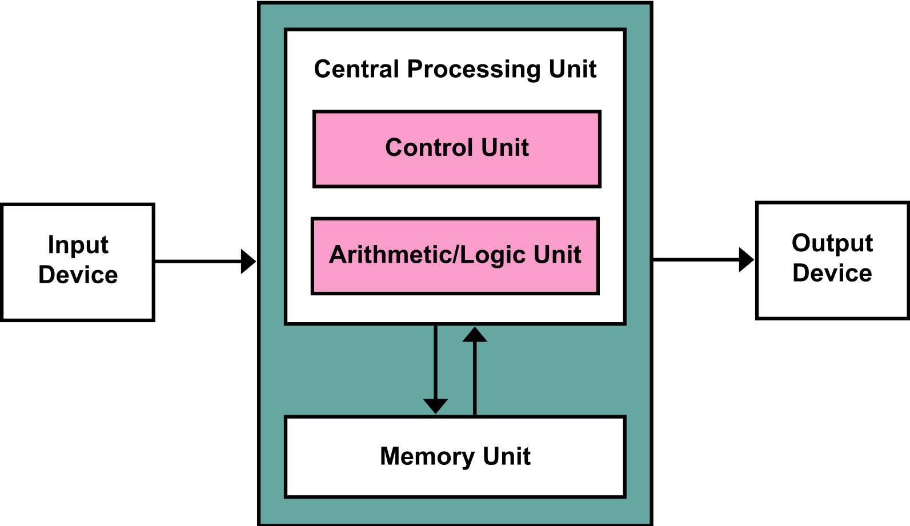

# Von Neumann vs Hardvard

# ARQUITECTURA DE VON NEUMANN

Propuesta por John Von Neumann en 1945, esta arquitectura utiliza una sola memoria para almacenar tanto instrucciones (programa) como datos.

- Una única memoria para datos e instrucciones.
- Un solo bus para acceder a la memoria (bus de direcciones y datos compartido).
- Las instrucciones se ejecutan de forma secuencial.
- Puede sufrir del “cuello de botella de Von Neumann”, porque solo puede acceder a una instrucción o un dato por ciclo de reloj.

✅Diseño más simple y económico.
✅Facilita la programación y la modificación del código.

❌Baja velocidad al compartir el mismo bus para datos e instrucciones.
❌Posible interferencia entre instrucciones y datos.

*Ej: computadoras personales, microprocesadores clásicos (como los Intel x86 en sus versiones antiguas)*

---

# ARQUITECTURA HARDVARD

Usa memorias separadas para datos y programas, con buses independientes para cada uno.

- Dos memorias distintas: una para instrucciones y otra para datos.
- Buses independientes → se pueden leer instrucciones y datos al mismo tiempo.
- Mayor rendimiento y velocidad de procesamiento.

✅Dos memorias distintas: una para instrucciones y otra para datos.
✅Buses independientes → se pueden leer instrucciones y datos al mismo tiempo.
✅Mayor rendimiento y velocidad de procesamiento.

❌Más costosa y compleja.
❌Menos flexible (las memorias son de tamaños fijos y separados).

*Ej: microcontroladores PIC, AVR, ARM Cortex-M, DSP (procesadores digitales de señal)*