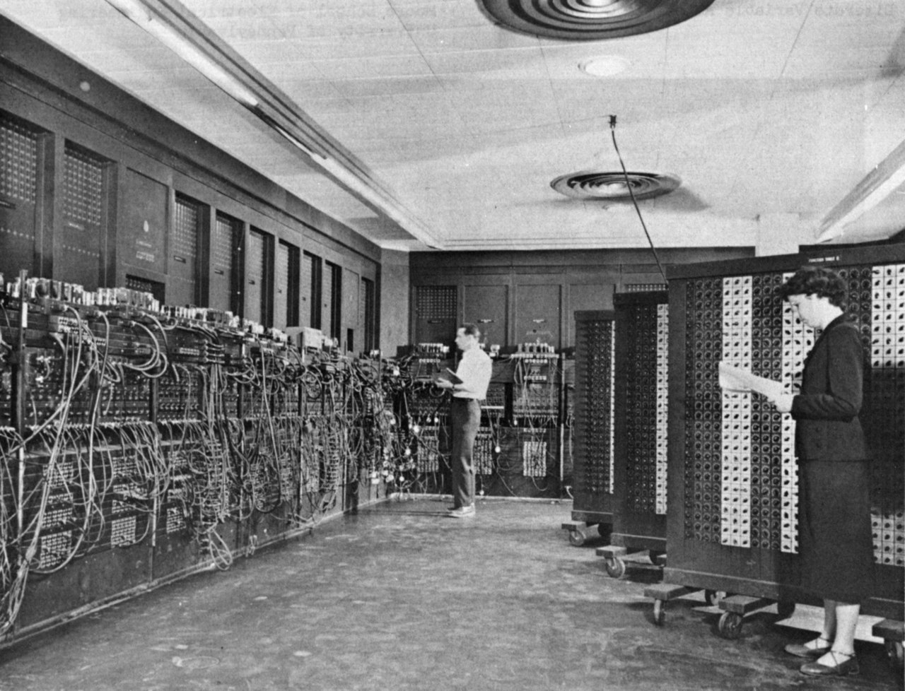

# Von Neumann al detalle

# 1. ¿QUIÉN ERA VON NEUMAN?

John von Neumann fue un matemático, físico y científico computacional húngaro-estadounidense. Nacido en 1903 y fallecido en 1957, hizo contribuciones fundamentales en áreas como la matemática, la física cuántica, la economía, y sobre todo en la informática. Es conocido por desarrollar **la arquitectura de Von Neumann**, base del diseño de las computadoras modernas, y por su trabajo en el proyecto Manhattan (la bomba atómica). También es uno de los fundadores de la teoría de juegos.

---

# 2. EL DISEÑO DE LA AQRQUITECTURA

Su diseño consta de:

- Unidad de control
- Unidad aritmética y lógica (ALU)
- Registros
- Unidad de memoria
- Entradas y salidas
- Los buses que conectan todos estos dispositivos

En la arquitectura de Von Neumann los datos de instrucción y los datos de programa se almacenan en una misma unidad de memoria

---

# 3. COMPONENTES

## A) Unidad Central de Procesamiento (CPU)

Es el circuito electrónico responsable de ejecutar las instrucciones de un programa. La CPU contiene:

### **Registros**

Son áreas de almacenamiento de alta velocidad en la CPU. Piensa que tooodos los datos deben almacenarse en un registro entes de que puedan ser procesados. Dentro de los registros, encontramos:

- *Registro de Dirección de Memoria (MAR): ** contiene la dirección de la memoria donde se va a leer o escribir un dato.
- **Registro de Datos de Memoria (MDR):** almacena los datos que se están transfiriendo desde o hacia la memoria.
- **Contador de programa (PC):** guarda la dirección de la próxima instrucción a ejecutar.
- **Registro de Instrucción Actual (CIR):** almacena la instrucción actual que está siendo ejecutada por la CPU.
- **Acumulador (ACC):** almacena resultados intermedios de operaciones aritméticas y lógicas.

### **ALU**

Permite que se lleven a cabo operaciones aritméticas y lógicas. Digamos que es lo que procesa los datos.

- **Ariméticas:** sumar, restar, dividir...
- **Lógicas:** and, or , not...

### **Unidad de control**

Controla el funcionamiento de la ALU, la Memoria y los dispositivos de entrada y salida de la computadora indicándoles a cada una cómo responder a las instrucciones del programa que acaba de leer desde la Unidad de Memoria. Las principales funciones que integra son:

- *Secuenciador:**controla el orden de ejecución de las instrucciones en la CPU. Determina cuál instrucción viene después y coordina el flujo de control.
- **Reloj:** genera señales eléctricas a intervalos regulares para sincronizar todas las operaciones de la CPU. Su velocidad se mide en Hertz (Hz) y determina cuántas operaciones por segundo puede realizar el procesador.
- *Decodificador:**interpreta o traduce las instrucciones que llegan desde la memoria (en código binario) y las convierte en señales que indican a otros componentes qué deben hacer.

---

## B) Buses

Es un canal de comunicación que permite transferir datos entre los distintos componentes de una computadora (CPU, memoria, dispositivos de entrada/salida). Encontramos los siguientes tipos:

- **Bus de datos:** transporta los datos entre la CPU, la memoria y otros dispositivos. Es bidireccional.
- **Bus de direcciones:** transporta las direcciones de memoria que la CPU usa para leer o escribir datos. Es unidireccional.
- **Bus de control:** transporta señales de control (como lectura, escritura, interrupciones) que coordinan y gestionan el uso del bus de datos y direcciones. Puede ser bidireccional o unidireccional.

---

## C) Unidad de memoria

La unidad de memoria es el componente donde se almacenan tanto los datos como las instrucciones del programa. Es **única**, lo que significa que datos e instrucciones comparten el mismo espacio de almacenamiento. Sus principales funciones son las siguientes:

- **Almacenamiento de instrucciones →**  La CPU toma las instrucciones del programa directamente de la memoria.
- **Almacenamiento de datos →**  Los datos que la CPU necesita para procesar se guardan en la misma memoria.
- **Interacción con la CPU mediante el bus →**  La CPU lee y escribe información en la memoria usando un bus compartido (tanto para datos como para instrucciones).

**Características:**

- **Memoria unificada:** datos e instrucciones comparten el mismo espacio físico.
- **Acceso secuencial o aleatorio:** la CPU accede a cada celda de memoria según la dirección especificada.
- **Cuello de botella de Von Neumann:** debido a que solo un dato o instrucción puede ser transferido por el bus a la vez, el acceso puede ser un factor limitante en la velocidad.
- **Volátil o permanente:** generalmente la memoria principal (RAM) es volátil, mientras que la memoria secundaria (discos) es permanente.