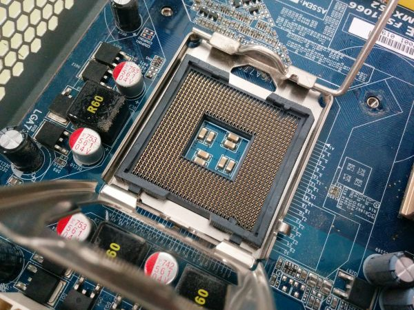

# Placa base al detalle

## 1. PLACA BASE

La **placa base** (también llamada **motherboard**) es el **circuito principal del ordenador** donde se conectan todos los componentes del hardware.

Permite que **CPU, memoria, almacenamiento y periféricos se comuniquen entre sí**.

---

## 2. COMPONENTES DE LA PLACA BASE

### Zócalo del procesador (Socket)

Es el **conector donde se instala la CPU**. Permite que el procesador se comunique con el resto del sistema.

*Ejemplo: sockets Intel o AMD.*

### Ranuras de memoria RAM

Son los **slots donde se instalan los módulos de memoria RAM**.

Funciones:

- Almacenar datos temporales
- Permitir acceso rápido al procesador

### Chipset

Es un **conjunto de chips que controla la comunicación** entre el procesador, la memoria y los dispositivos.

Funciones:

- Gestionar datos entre componentes
- Controlar puertos y dispositivos

### Ranuras de expansión

Permiten **añadir tarjetas adicionales** al ordenador.

Ejemplos:

- Tarjeta gráfica
- Tarjeta de red
- Tarjeta de sonido

La más común hoy es **PCI Express (PCIe)**.

### Conectores de almacenamiento

Sirven para conectar **discos duros o SSD**.

Tipos comunes:

- SATA
- M.2 (SSD modernos)

### Conectores de alimentación

Reciben la **electricidad de la fuente de alimentación** para distribuirla a todos los componentes.

---

##