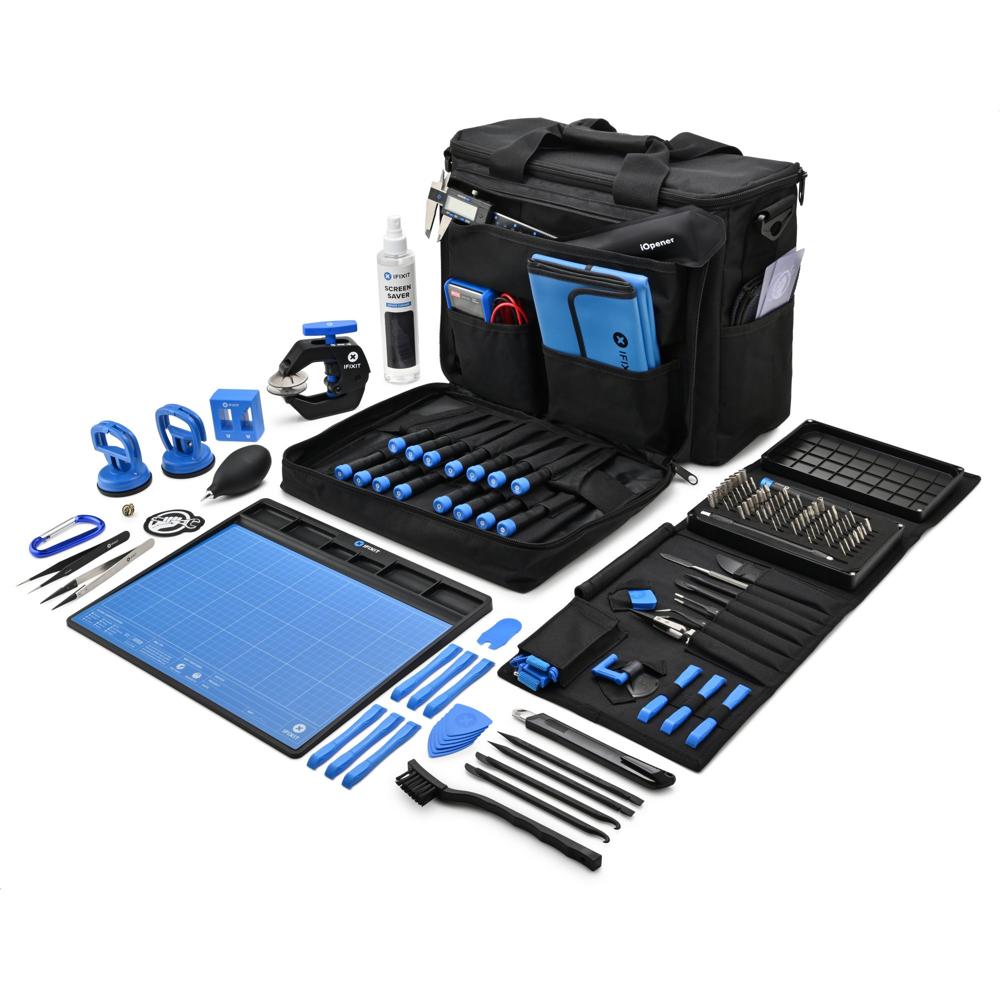

# Manual de montaje y mantenimiento de equipos (Navidad)

---

## 1. PREPARACIÓN DE LOS COMPONENTES, SEGURIDAD DE ENTORNOS Y HERRAMIENTAS

### **A) Componentes**

En primer lugar, antes de comprar nada y mediante investigación y documentación, me cercioro de que todos los componentes que voy a adquirir para la instalación o mantenimiento de mi equipo son compatibles entre sí y encajan en la torre (*tal y como hemos hecho en el apartado anterior*)

### **B) Seguridad**

Existen ciertos riesgos durante el montaje de una computadora, entre ellos:

- **La electricidad estática:** puedo freír componentes sensibles como la CPU o la RAM con una descarga de electricidad estática de mi propio cuerpo. Lo contrarresto usando una pulsera antiestática y con una conexión a tierra. También conviene que evite ciertas superficies conductoras como alfombras, camas, sofás,
- **Las prisas:** sistematizo el montaje o mantenimiento siguiendo una secuencia lógica, y si veo que algo no encaja, no lo fuerzo. Reviso la posición y
- **El desconocimiento:** cada componente cuenta con un manual propio. Ante la duda, siempre será mejor consultarlos antes que Hago especial hincapié en el manual de la placa base, uno de los componentes más complejos y con más conectores.

### **C) Herramientas**

Algunas herramientas clave son:

- Destornillador de estrella (Phillips)
- Pulsera antiestática
- Pasta térmica (si el disipador no la trae de antes)
- Bridas y velcros para agrupar cables

Existe un kit de herramientas llamado **iFixit** que contiene todo lo necesario para cualquier apaño, montaje o reparación. Es muy versátil, podrá servirme de ayuda para torres, portátiles e incluso teléfonos móviles.

---

## 2. MONTAJE DE UN EQUIPO NUEVO

La analogía de la construcción de una casa es muy buena:

| Caja | Estructura de la casa |
| --- | --- |
| Placa base | Suelo base |
| CPU | Cerebro |
| RAM | Mesa de trabajo |
| Fuente | Electricidad |
| Almacenamiento | Armarios |
| Gráfica | Ventanas |
| Cables | Instalación eléctrica |

Y a continuación, un paso a paso más detallado:

### **1. Seguridad y área de trabajo**

- Tal y como hemos visto antes…
- Superficie limpia, seca y sin electricidad estática
- Herramientas: destornillador, pulsera antiestática
- Comprobar que todos los componentes están disponibles

### **2. Montaje de componentes en la placa base (fuera de la caja)**

- Instalar CPU (procesador)
- Colocar disipador y pasta térmica
- Instalar memoria RAM
- Instalar SSD M.2 (si lo hay)

### **3. Instalación de la placa base en la caja**

- Colocar separadores (standoffs)
- Atornillar la placa base correctamente
- Asegurar que los puertos encajan con el panel trasero

### **4. Instalación de la fuente de alimentación**

- Colocar la **fuente (PSU)** en su compartimento
- Atornillarla firmemente
- Dejar preparados los cables principales

### **5. Instalación de las unidades de almacenamiento**

- Montar **HDD o SSD SATA** en sus bahías
- Conectar **cable SATA** y **cable de alimentación**

### **6. Instalación de la GPU**

- Insertar la **GPU** en la ranura PCIe
- Atornillarla a la caja
- Conectar cables de alimentación PCIe si son necesarios

### **7. Conexión de cableado**

- Conectar:
    - Alimentación de placa base (24 pines)
    - Alimentación de CPU
    - Cables del panel frontal (power, reset, USB, audio)
- Ordenar los cables para mejorar ventilación

### **8. Comprobaciones y encendido**

- Revisar que todo esté bien conectado
- Conectar monitor, teclado y ratón
- Encender el equipo
- Acceder a **BIOS/UEFI** para verificar que todo funciona