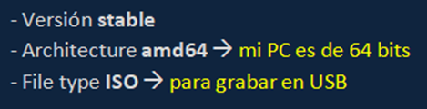

# Clonezilla (Manual de herramientas de software) (Navidad)

Clonezilla es, básicamente, una herramienta de clonación y copias de seguridad de discos y particiones. Algunas de sus utilidades son:

- Clonar discos duros o SSD
- Hacer copiad de seguridad de Sistemas Operativos
- Restauración de Sistemas
- Desplegar un mismo sistema en muchos ordenadores

### A continuación, voy a usar Clonezilla para clonar un disco de una máquina virtual Kali Linux:

---

# PRIMEROS PASOS

1. **Descripción de mi escenario**
    - Host: Virtual Box
    - VM: Kali Linux
    - Objetivo: clonar un disco completo a otro disco virtual usando Clonezilla Live

### **2. Descargar Clonezilla**

- Descargo Clonezilla Live desde la web: 
[clonezilla.org/downloads.php](https://clonezilla.org/downloads.php)
- Elijo las siguientes características:

- Guardo la ISO en mi sistema anfitrión

### **3. Preparar mi entorno en Virtual Box**

La VM debe tener al menos dos discos:

- Disco origen (*a clonar*)
- Disco destino (*vacío, destino del clonado*) (recomendable que ocupe más que el origen)

### **4. Montar la ISO en mi VM**

En VirtualBox y con la máquina apagada:

- Configuración > Almacenamiento
- En el controlador IDE/SATA > Unidad óptica
- Monto la ISO de Clonezilla

- No me olvido de configurar el orden de arranque para que la VM se inicie primero desde el CD/DVD:

---

# ARRANCAR CLONEZILLA

- Inicio la Máquina Virtual
- Aparece el menú de Clonezilla por defecto
- Selecciono:

- Idioma: Español
- No cambiar el mapa del teclado
- **Iniciar Clonezilla**

---

# CLONACIÓN

1. **Elijo el modo de clonación**
    - Tipo de operación: Disco a Disco
        
        
        
    - Selecciono el modo Principiante
        
        
        
    - Selecciono el tipo de clonación disk_to_local_disk
        
        
        

1. **Selección de discos**

*¡Asegúrate de seleccionar los discos correctos! Recuerda que todo el contenido del disco de destino **se borrará***

- **Disco origen:** selecciono el disco que quiero clonar:
    
    
    
- **Disco destino:** selecciono el disco donde se copiará el contenido:
    
    *Todo el contenido de este disco será borrado*
    
    
    

1. **Últimas comprobaciones**
    - Es recomendable comprobar el sistema de archivos:
        
        
        
    - Selecciono las siguientes comprobaciones finales:
        
        
        
        
        
        
        
    - Por último, a medida que continúo Clonezilla me va recordando que **todos los datos del disco de destino se borrarán:**
        
        
        
2. **Clonación y apagado**
    - Durante el proceso de clonación, irán apareciendo barras de progreso como estas:
        
        
        
    
    •  Una vez finalizado el proceso (*tarda unos minutos*), apago la máquina:
    
    
    

---

# COMPROBACIONES FINALES

- Retiro la ISO de Clonezilla para que no arranque desde la misma
    
    
    
- "Expulso" el disco original para que la VM se ejecute desde el disco clonado
    
    
    
- Como todo ha ido bien, mi Kali Linux se ha ejecutado como siempre, he tenido que introducir las mismas credenciales y el sistema operativo se ha iniciado correctamente sobre el disco clonado. **¡Bravo!**
    
    
    
- Además, con el comando lsblk puedo comprobar que el disco tiene el tamaño correcto y las particiones que tiene que tener:
    
    