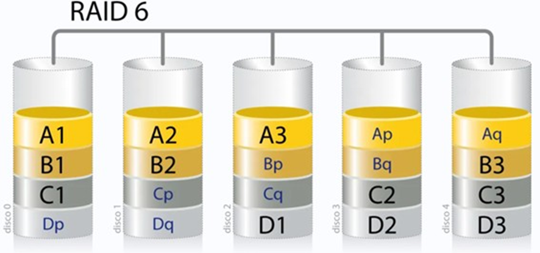

# RAID 6 (Manual de herramientas de software) (Navidad)



---

# 1. PERO… ¿QUÉ ES RAID 6?

**RAID 6** es un nivel de RAID (Redundant Array of Independent Disks) que **combina varios discos duros** para mejorar la **tolerancia a fallos** y la **disponibilidad de los datos**.

Funciona mediante **striping con doble paridad distribuida**, lo que significa que los datos y **dos bloques de paridad** se reparten entre todos los discos.

RAID 6 puede **soportar la falla simultánea de hasta dos discos** sin pérdida de datos.

### RAID 6 VS RAID 5

Hemos visto RAID 5 en Implantación de Sistemas Operativos... ¿Cuáles son las diferencias?

| CARACTERÍSTICA | RAID 5 | RAID 6 |
| --- | --- | --- |
| Nº mínimo de discos | 3 | 4 |
| Paridad | Simple | **Doble** |
| Fallos tolerados | 1 disco | **2 discos** |
| Seguridad de datos | Media | **Alta** |
| Rendimiento en escritura | Bueno | **Más lento** |
| Capacidad útil | (N−1) discos | **(N−2) discos** |
| Riesgo durante reconstrucción | Más alto | **Más bajo** |

---

---

# 2. CÓMO MONTAR RAID 6

Cosas importantes a tener en cuenta con RAID 6:

- Es muy útil para prácticas académicas y laboratorios
- RAID 6 no sustituye a las copias de seguridad
- Los discos usados en el RAID **se borrarán**
- Se recomienda usar discos virtuales nuevos y vacíos

### Dicho lo dicho... ¡Vamos a ello!

---

## 2.1 Preparo los discos en VirtualBox

- Tengo la VM apagada
- Configuración > Almacenamiento
- Añado al menos 4 discos duros virtuales nuevos:
    
    Tipo VDI | Asignación dinámica | Mismo tamaño (2GB en mi caso)
    
    
    
- **Inicio Kali Linux**

---

## 2.2 Verifico los discos en Kali

- Ejecuto el comando lsblk . Aparecen los discos virtuales que he añadido:
    
    
    

---

## 2.3 Herramienta `mdadm`para RAID

**`mdadm`** (*Multiple Device Administrator*) es una **herramienta de Linux** que permite **crear, administrar y supervisar arreglos RAID por software**. Se usa para implementar niveles RAID como **RAID 0, 1, 5, 6 y 10** sin necesidad de una controladora RAID física.

- Primero, compruebo si tengo `mdadm` instalado y actualizado:

```bash
sudo apt update
sudo apt install mdadm -y
```

- A continuación, creo el RAID 6:

```bash
sudo mdadm --create /dev/md0 \
--level=6 \
--raid-devices=4 \
/dev/sdb /de
```

---

## 2.4 Verificación

- Verifico que RAID 6 está funcionando escribiendo:

```bash
cat /proc/mdstat
```

- Me devuelve lo siguiente. ¡Funciona!
    
    
    

---

## 2.5 Dar formato y montar

Ya tenemos el RAID 6, pero darle un formato (un sistema de archivos) y montarlo, es decir, darle una ubicación.

- Formateamos con:

```bash
sudo mkfs.ext4 /dev/md0
```

- Creamos el directorio de destino de montaje:

```bash
sudo mkdir /mnt/raid6
```

- Montamos el RAID

```bash
sudo mount /dev/md0 /mnt/raid6
```

---

## 2.6 Comprobaciones finales

**El RAID ya está montado**. Voy a comprobar que podemos hacer cosas aquí...

- Voy a crear un archivo en el directorio con `touch` :

```bash
sudo touch /mnt/raid6 verificacion_raid6.txt
```

- Ahora voy a comprobar que se ve el archivo con `ls` :

```bash
ls -l /mnt/raid6
```

- **¡Correcto! Todo funciona:**


---

---

# 3. MONTAJE AUTOMÁTICO AL ARRANCAR

## 3.1 Guardar configuración del RAID

Cuando reinicie, toda la configuración de montaje del RAID 6 que acabo de hacer se borrará. Yo no quiero esto, así que voy a guardar dicha configuración usando una vez más la herramienta `mdadm` :

```bash
/sudo mdadm --detail --scan | sudo tee -a
/etc/mdadm/mdadm.conf
```

El siguiente código actualizará el arranque (**`initramfs`**) para que RAID se

cargue al iniciar:

```bash
/sudo update-initramfs -u
```

---

## 3.2 Editar el archivo maestro de montajes (`fstab`)

Primero necesito obtener el UUID. Me dará un nº tipo UUID=xxxxxxxx-xxxx- xxxx-xxx…

```bash
sudo blkid /dev/md0
```

Ahora edito el archivo fstab con el editor **nano**

```bash
sudo nano /etc/fstab
```

Añado el UUID con su línea correspondiente quedando algo como esto:

```bash
UUID=xxxxxxxx-xxxx-xxxx-xxxx-xxxxxxxxxxxx	/mnt/raid6	ext4
defaults	0	0
```


---

## 3.3 Últimas comprobaciones

- Si introduzco la línea `mount -a`no debería salir nada. Esto quiere decir que no hay errores
- Si introduzco la línea `df -h | grep raid6`debería obtener:
    
    
    
- El RAID está montado
✔ El punto `/mnt/raid6` es correcto
✔ El sistema de archivos funciona
✔ `fstab` está bien configurado
✔ No hay errores con  `mount -a`

---

## 3.4 Reinicio y verificación

Por último, reinicio la VM y verifico que RAID se monta automáticamente:

```bash
lsblk 
df -h
cat /proc/mdstat
```

Debería aparecer algo como esto... **ÉXITO**


**Interpretación**

- Tengo **4 discos físicos**: `sdb sdc sdd sde`
- Todos están **correctamente ensamblados** en: `/dev/md0`
- `TYPE = raid6` → ✔ nivel correcto
- `MOUNTPOINT = /mnt/raid6` → ✔ montado automáticamente

**Esto confirma que mdadm ha ensamblado el RAID al arranque.**

---

---

# 4. PRUEBA DE FUEGO (FALLO DE 1 DISCO)

## 4.1 Fallo de `sbd`

Por ejemplo, me falla `/dev/sdb` :

```bash
sudo mdadm /dev/md0 --fail /dev/sdb
```

Compruebo el estado del RAID y debería de dar un resultado como el siguiente:

```bash
cat /proc/mdstat
```


Efectivamente, en el disco `sdb` aparece una [F], y sin embargo **RAID SIGUE FUNCIONANDO**

### **También puedo usar** :

```bash
  watch -n1 sudo mdadm --detail /dev/md0
```


- He simulado **la caída de un disco**
- RAID 6 sigue **operativo**
- Está en estado **degradado pero limpio**

---

## 4.2 Pruebo el acceso

Compruebo que sigo pudiendo acceder:

```bash
ls /mnt/raid6
```


**¡Éxito!**

---

## 4.3 Limpieza

Por último, retiro el disco fallido con:

```bash
sudo mdadm /dev/md0 --remove /dev/sdb
```


El estado actual es el siguiente:


---

## 4.4 Recuperación del disco fallido

En una **máquina virtual**, el disco “nuevo” suele ser **el mismo disco virtual** ( `/dev/sdb` ) que se vuelve a añadir.

```bash
sudo mdadm /dev/md0 --add /dev/sdb
```

En cuanto ejecuto esto:

- NO hay que hacer nada más
- La reconstrucción empieza automáticamente

Para verla en tiempo real ejecuto:

```bash
watch -n 1 cat /proc/mdstat
```

Como última comprobación ejecuto  `cat /proc/mdstat y	sudo mdadm -- detail /dev/md0`   


---

---

# 5. CONCLUSIÓN

- RAID 6 usa **doble paridad**
- Con 1 disco fallido:
    - Los datos se leen sin problemas
- Al añadir el disco:
    - `mdadm` **reconstruye automáticamente** los bloques
    - Calcula datos + paridad
    - Copia al nuevo disco

Esto es la **autorrecuperación**