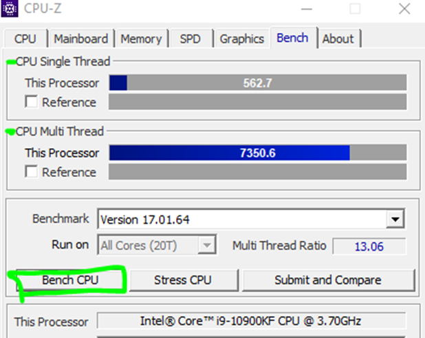

# Herramientas de Benchmarks (Navidad)

El **benchmarking** permite medir y comparar el rendimiento del hardware mediante pruebas estandarizadas, utilizando diversos Softwares, (algunos vistos en el apartado anterior). Estas herramientas se dividen principalmente en **benchmarks sintéticos** y **benchmarks de mundo real**.

---

---

# 1. BENCHMARKS SINTÉTICOS

Los benchmarks sintéticos ejecutan pruebas controladas para medir el **rendimiento teórico** de componentes específicos. A continuación, voy a realizar prácticas rápidas con las siguientes herramientas:

---

## 1.1 CPU-Z

### **Objetivo:**

Medir el rendimiento del **procesador** utilizando el benchmark integrado de CPU-Z y analizar los resultados **Single Thread** y **Multi Thread**.

### Práctica:

Pulso Bench CPU y espero

### Resultados:

Single Thread: 562.7

Multi Thread: 7350.6

---

## 1.2 GPU-Z

### Objetivo:

Comprobar las **características y el rendimiento básico de la tarjeta gráfica** utilizando la herramienta integrada **Render Test** de GPU-Z.

### Práctica:

Ejecuto un reder test

### Resultados antes / durante la prueba:

- % de uso de la GPU:
    
    15% / 97%
    
- Temperatura GPU:
    
    49.2ºC / 68.5ºC
    
- Bus Interface load:
    
    0% / 9%
    

---

---

# 2. BENCHMARKS DEL MUNDO REAL

Estos benchmarks se basan en el uso cotidiano del sistema y **comparan resultados con otros miles de usuarios**. Para este apartado, usaré el Software de UserBenchmark.

- Enlace de descarga: [h ttps://www.userbenchmark.com/Software](https://www.userbenchmark.com/Software)

### Objetivo:

Analizar el rendimiento del **ordenador completo** (CPU, GPU, RAM y disco) mediante un benchmark de **uso real** y comparar los resultados con otros equipos similares.

### Práctica:

Ejecutar el benchmark de UserBenchmark

### Resultados:

- UserBenchmarks: Game 64%, Desk 95%, Work 70%
- CPU: Intel Core i9-10900KF - 5%
- GPU: Nvidia RTX 3070 - 4%
- SSD: WD Black SN750 NVMe PCIe M.2 500GB (2019) - 184.7%
- HDD: Seagate Barracuda 2TB (2018) - 6%
- RAM: Kingston HyperX DDR4 3200 C16 2x16GB - 7%
- MBD: Asus PRIME Z490M-PLUS

---

---

# 3. BENCHMARKS DE ALMACENAMIENTO

Se tratan de herramientas específicas para medir la **velocidad de discos duros y unidades SSD**. Yo voy a utilizar el software **CrystalDiskMark** para medir velocidades de lectura y escritura:

### Objetivo:

Medir la **velocidad de lectura y escritura** de mi **dispositivo de almacenamiento D:**

utilizando CrystalDiskMark.

### Práctica:

Ejecutar el benchmark de CrystalDiskMark

### Resultados:

### **Lectura y escritura secuencial:**

- Lectura: ~209 MB/s
- Escritura: ~203 MB/s

### Interpretación:

Estos valores son muy buenos para un HDD de 7200 RPM.

### Lectura y escritura aleatoria 4K

- Lectura: 0.78 – 1.68 MB/s
- Escritura: 0.79 – 0.92 MB/s

### ⚠ Interpretación:

Estos valores son bajos, pero normales en discos duros mecánicos

---

---