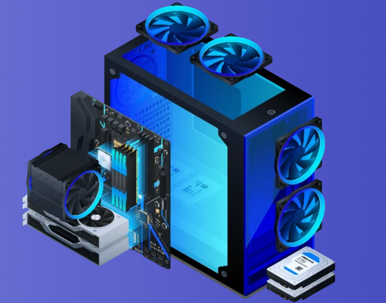

# Manual de configuración y reconocimiento de equipos (Navidad)

---

## 1.1 CONFIGURACIÓN DE EQUIPOS

Creación de un equipo destinado a un departamento de dibujo técnico. Mi objetivo es que cumpla con los siguientes requisitos, sin escatimar demasiado en gastos:

- **Procesador:** 8-16 núcleos y alta frecuencia de boost (4.0-4.5 GHz)
    
    *¡Ojo! Muchos programas de dibujo se benefician más del rendimiento por núcleo que del nº de núcleos en sí*
    
- **Placa madre:** robusta y compatible con posibles futuras mejoras. Con alimentación estable.
    
    *Una placa con buena VRM ayuda a mantener el CPU a frecuencia máxima bajo carga sostenida*
    
- **GPU (Tarjeta Gráfica):** para diseño 2D no es necesaria una GPU ultra potente, pero si se trabajara con diseño 3D y render complejos, haría falta más potencia (una GPU dedicada 6-12+ GB VRAM)
    
    *He investigado que para cubrir bien todos los frentes de diseño, tanto 2D como 3D, la gama profesional de NVIDIA RTX es muy adecuada*
    
- **RAM (Memoria):** estaría bien que tuviera unos 32-64GB (2x16 o 2x32). El tipo dependerá de la placa base (DDR4 o DDR5)
- **CPU Cooler (Disipador):** un renderizado largo genera “estrés térmico” continuo, así que este componente es bastante importante. Si además es poco ruidoso,
    
    *Una refrigeración líquida de 240mm-360mm podría funcionar. También habría que chequear el tamaño con respecto a la caja.*
    
- **Almacenamiento:** elegir un buen tamaño que permita, no solo contener el sistema operativo y software sino también almacenar
    
    *Para ello, estaría bien un mínimo de 2 TB. NVMe mejor frente a SATA, mucho más rápido*
    
- **Fuente de alimentación (PSU):** la fiabilidad, estabilidad y durabilidad de la PSU es
    
    *750 W – 1000 W es un buen rango. Algunos extras de protección aumentarían la fiabilidad de la fuente (ej: OVP, UVP, OCP…)*
    
- **Ventilación general:** además de la refrigeración para la CPU, también hay que mantener un buen flujo de aire en nuestra
    
    *Ventiladores frontales, superiores y traseros nos ayudarán a mantener un flujo de aire constante y mantendrá el aire más fresco, prolongando la vida útil del hardware*
    

---

A continuación y con ayuda del sitio [BuildCores](https://es.buildcores.com/)  escojo mis componentes en base a los requisitos anteriormente descritos:

| **Caja:**
 [Fractal Design North ATX Mid](https://es.buildcores.com/products/PCCase/4q0wbqe0g/Fractal-Design-North-ATX-Mid-Tower-Black-with-Mesh-Side-Panel-and-USB-3.2-Gen-2-Type-C%2C-USB-3.2-Gen-1-Type-A) | Buen tamaño, bonita, estética apropiada para un estudio o departamento de diseño | 132,70€ |
| --- | --- | --- |
| **Procesador:**
 [AMD Ryzen 9 9950X 4.3 GHz](https://es.buildcores.com/products/CPU/6t815egdh/AMD-Ryzen-9-9950X-4.3-GHz-16-Core-AM5) | Ideal a nivel profesional, incluso para render 3d complejo y manejo de varios proyectos simultáneamente. | 539,00€ |
| **Placa madre:**
 [MSI X670E GAMING PLUS](https://es.buildcores.com/products/Motherboard/ybdupg1l8/MSI-X670E-GAMING-PLUS-WIFI-DDR5-ATX) | Soporta procesadores modernos y potentes como el que le vamos a implantar. El VRM es robusto y tiene una entrega de energía potente, lo que ayudaría en el rendimiento de renderizados y otras tareas complejas.
Además tiene soporte para memoria DDR5 rápida, muy útil también para estas exigencias. | 240,90€ |
| **Gráfica:**
 [Asus PRIME OC GeForce RTX](https://es.buildcores.com/products/GPU/zcgyfq6dn/Asus-PRIME-OC-GeForce-RTX-5070-12-GB) | Soporta CPUs modernas, admite DDR5 y en general es una gráfica moderna, potente y profesional | 590,00€ |
| **RAM:**
 [Corsair Vengeance DDR5-](https://es.buildcores.com/products/RAM/iew3dcrzq/Corsair-Vengeance-RGB-Black-%2F-Gray-DDR5-8000-CL36-32GB-(2x16GB)) | Muy rápida y con un ancho de banda excelente para estas tareas exigentes | 528,99€ |
| **Disipador:**
[Corsair NAUTILUS Water](https://es.buildcores.com/products/CPUCooler/5pl135uoc/Corsair-NAUTILUS-Water-360mm-RS-ARGB-Black) | Encaja bien en la torre, poco ruidosa, refrigeración líquida, estética chula con RGB… | 92,95€ |
| **Almacenamiento:**
 [Rocket NVMe 4.0 SSD – 2TB](https://es.buildcores.com/products/Storage/hljnujpax/Rocket-NVMe-4.0-SSD---2TB-M.2-2280-PCIe%C2%A04.0-NVMe%C2%A0TLC-SSD-%2B-Heatsink) | Compatible, fiable y rápido. Siempre puede ampliarse el almacenamiento con una memoria externa en caso de que 2T fuera insuficiente. | desde 230€ |
| **Fuente de alimentación:**
 [dark Power Pro 11 750W 80](https://es.buildcores.com/products/PSU/sc5iitj7z/Dark-Power-Pro-11-750W-80-Plus-Platinum-Modular-Power-Supply) | Tecnología 80+ platinum, compatibilidad y gran potencia. Además incluye muchas protecciones eléctricas (OCP, OVP, UVP, SCP, OTP y OPP) | 663,14€ |
| **Ventilación:**
 [darkFlash INF34 ARGB PWM](https://es.buildcores.com/products/CaseFan/v03zw4b1z/darkFlash-INF34-ARGB-PWM-120mm-Black-3-Pack) | Encaja en la torre,
componentes para zona
trasera y superior. Permitirá
un buen flujo de aire, | 47,13€ |

---

## 1.2 **RECONOCIMIENTO DE COMPONENTE DE LA PLACA BASE**

| 1 | Socket o zócalo de la CPU |
| --- | --- |
| 2 | Ranuras o slots para la memoria |
| 
3 | Conector de alimentación ATX de la propia placa (24 pines) |
| 4 | Conector IDE (para discos duros) |
| 
5 | Conectores SATA? (No lo veo muy bien) |
| 6 | Chipset (SouthBridge) |
| 7 | Conectores SATA |
| 8 | Batería CMOS |
| 
9 | Conectores para el panel central de la torre (botones de power, reset, leds…) |
| 
10 | Conector IDE/FDD, que puede servir para dispositivos antiguos |
| 11 | Conector USB interno |
| 12 | Ranuras PCI tipo legacy, de las antiguas |
| 13 | Ranura PCI Express x16, para la tarjeta gráfica |
| 
14 | Ranura PCI Express x1, para tarjetas de expansión más modernas |
| 
15 | Conexiones USB soldados directamente en la placa madre. Para periféricos externos |
| 
16 | Puerto de red, para conectarnos a la red local/internet |
| 
17 | Conector ATX de alimentación de la CPU (4 pines) |

---