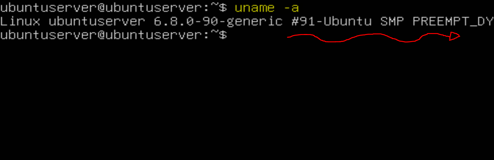

# 1.1 Comandos uname -a y dmesg

## ENUNCIADO

> En un sistema Linux, utiliza el comando uname -a para ver la versión exacta del kernel que se está ejecutando. Luego, utiliza dmesg para leer los mensajes del kernel desde el arranque y busca información sobre la detección de la CPU y los discos duros.
> 

---

### 1. COMANDO UNAME

El comando `uname -a`nos muestra información completa sobre el sistema operativo y el kernel. `uname` significa *Unix Name* y la opción `-a` significa *all* (todo)

Entonces, introduzco el comando `uname -a`  y así obtengo la **versión exacta del kernel que se está ejecutando**:



---

### 2. COMANDO DMESG

El comando `dmesg` en sistemas Linux muestra los **mensajes del buffer del kernel:**

- Mensajes generados durante el arranque del sistema
- Detección de hardware (USB, discos, memoria, CPU)
- Errores del kernel
- Eventos del sistema a bajo nivel

Ahora, uso `dmesg` para leer los mensajes del kernel y demás. **Necesito ejecutarlo con `sudo`**: 

```bash
sudo demsg 
```


¡Genial! Ahora quiero filtrar resultados para que **solo me muestre información sobre la CPU y los discos duros**. Para ello voy a usar el comando `grep` :

```bash
dmesg | grep -i -E "cpu|ata|sd|nvme|disk”
```

- `-i` → ignora mayúsculas/minúsculas
- `-E` → permite usar varias palabras clave (expresiones regulares)


---

### COMANDOS USADOS PARA LA PRÁCTICA:

- `uname -a` → muestra información completa sobre el sistema operativo y el kernel (*-a nos muestra todo, all*)
- `demsg` → nos sirve para leer los mensajes del kernel
- `grep` → busca y/o filtra texto dentro de archivos o en la salida de otros comandos.
- `grep -i -E` → -i ignora mayúsculas/minúsculas, y -E permite usar varias palabras clave (expresiones regulares)