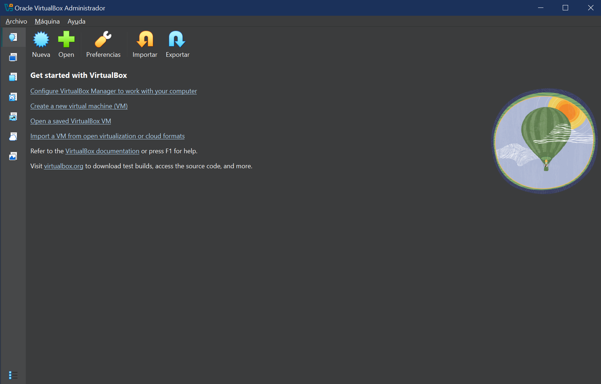

# 1.2 Descargar VirtualBox y Ubuntu Server

## Enunciado

> Descarga e instala VirtualBox. Luego, descarga la imagen ISO de una distribución ligera de Linux (como Lubuntu). Crea una nueva máquina virtual en VirtualBox, asígnale 1GB de RAM y un disco de 10GB*, y procede a instalar Ubuntu desde la ISO en la VM.
> 

*Yo le doy unos valores distintos

---

### 1. DESCARGA E INSTALACIÓN DE VIRTUAL BOX

1. Voy a la web oficial de VirtualBox → [https://www.virtualbox.org/](https://www.virtualbox.org/)
2. Le doy al botón de descarga (Download).
3. En la página siguiente hay un recuadro en el que pone *VirtualBox Platform Packages* y debajo un listado de descargables. Seleccionoel correspondiente a mi SO.
4. Se descarga un archivo ejecutable (.exe). Es mi instalador. **Lo ejecuto**.
5. Se abre el instalador. Le voy dando a *Siguiente*, acepto términos, sigo… ¡**Instalar**!
6. **Ya lo tengo instalado. Así se ve la interfaz:**

 

Problemas que pueden surgir:

- *Me dice que falta Microsoft Visual C++...* Prueba a instalar MV o actualizarlo a la versión más reciente si ya lo tienes, aquí está el enlace:
[https://learn.microsoft.com/es-es/cpp/windows/latest-supported-vc-redist?view=msvc-170](https://learn.microsoft.com/es-es/cpp/windows/latest-supported-vc-redist?view=msvc-170)

---

### 2. DESCARGA E INSTALACIÓN DE UBUNTU SERVER

**Antes de nada, voy a crear una máquina virtual:**

1. Abro VirtualBox y selecciono *Nueva*.
2. Le pongo el nombre que quiera, especifico su ubicación y de momento en ISO no pongo nada… ¿por qué? Pues porque **todavía no tengo el archivo ISO que necesito.** Lo descargaré un poquito más adelante…
3. Selecciono el OS y la distro correspondiente (*en mi caso, Linux y Ubuntu 64*).
4. En la siguiente pestaña escribo mi nombre de usuario y mi contraseña. Son datos importantes, **no los pierdas**.
5. En la pestaña de Hardware, configuro la memoria (*por ejemplo, 2048 MB, mejor que siempre sean potencias de 2*) y el nº de núcleos (*en mi caso elijo 2 CPUs*).
6. En la pestaña de Disco Duro, pongo un tamaño de disco de 10-20GB (20 ya sería mucho, solo si tenéis un buen pepino de ordenador). Creo la máquina. **Máquina creada** 😎.

**Ahora voy con Ubuntu Server:**

1. Hay que descargarse la ISO → [https://ubuntu.com/download/server](https://ubuntu.com/download/server) . Le doy al botón verde de **Download 24.04.3 LTS** (o la versión que haya en ese momento). Descargando... (*puede tardar bastante*).
2. Ya tengo la imagen (el *archivo ISO*). Debe tener un nombre parecido a este: ubuntu-24.04.3-live-server-amd64.iso. No lo "abro", simplemente lo tengo bien localizado.
3. Me voy a VB y abro la configuración de mi nueva máquina. Me voy a la pestaña de **almacenamiento > controlador > vacío**
4. Ya en vacío, en *atributos* voy a *Optical Drive*, le doy al iconito que es como un disco y selecciono *Choose a Disk file…*
5. Selecciono el archivo ISO que me he descargado  y le doy a *Aceptar*.
6. Inicio la máquina…

*Socorro!! No me inicia la máquina, dice que falló al iniciar y que montar un DVD lo puede solucionar, pero cuando vuelvo a seleccional la ISO sale el mismo problema!!*

Relaaaax, esto tiene fácil soluciónEsto pasa porque la máquina virtual intenta arrancar, pero no tiene un sistema operativo cargado o no está detectando la ISO. Ve a Configuración > Sistema > Placa Base. Cambia el orden en Boot Device Order y pon "Óptica" en primer lugar. Así, ya deberías poder iniciar la máquina. *Pero la opción de Boot Device Order está bloqueada, no la puedo modificar!! →* Mira a ver si en esa misma pestaña tienes la opción UEFI marcada. Si es así, desmárcala y ya podrás manipular el Boot Device Order.

1. Se inicia la máquina... Instalo → *Try or Install Ubuntu Server. → Dejo que la consola haga sus cosas… ¡Recuerda marcar las opciones corresponientes al llegar a SSH setup!

1. Tras la instalación, se reinicia la VM.
2. Luego me pide que introduzca mis credenciales. Procedo… **¡Éxito!**

---

### 3. COSITAS EXTRA

- Me he descargado el **Virtual Box Extension Pack**

