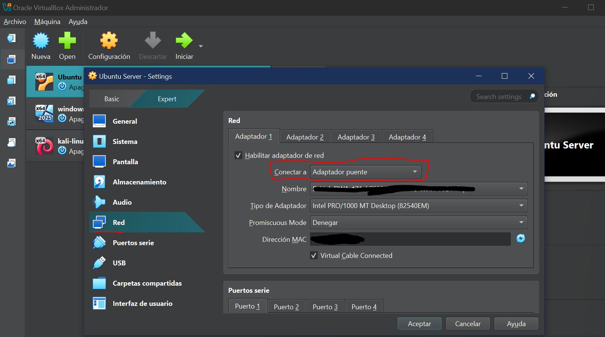

# 1.3 Cambiar a Adaptador Puente

## Enunciado

> Siguiendo con la VM de Ubuntu creada en la sesión anterior, apágala. Entra en su configuración y cambia el modo de red de NAT a "Adaptador Puente". Inicia la VM de nuevo y comprueba con el comando ip a que ahora tiene una dirección IP de tu red local (del mismo rango que tu PC anfitrión).
> 

---

### 1. CAMBIO DEL MODO DE RED

En la configuración de Red de mi máquina de Ubuntu, voy al desplegable de “Conectar a” y selecciono **Adaptador puente**.

---

### 2. COMPROBAR DIRECCIONES IP

Ahora voy a comprobar que mi máquina tiene una IP en el **mismo rango** que mi PC anfitrión.

1. En Ubuntu Server, introduzco el comando `ip a` para obtener la ip:

1. En mi máquina anfitriona de Windows, compruebo mi ip con `ipconfig` :

**¡EXITO!** 😎

---

### 3. DIFERENCIAS ENTRE NAT Y ADAPTADOR PUENTE

**NAT →** La máquina virtual usa la red del anfitrión para acceder a Internet mediante traducción de direcciones. 

**La diferencia clave es que tiene una IP interna distinta y no es visible en la red local.**

**Adaptador Puente** → La máquina virtual se conecta directamente a la red local como si fuera otro equipo físico. 

**En este caso, obtiene una IP del mismo rango y sí es visible en la red.**