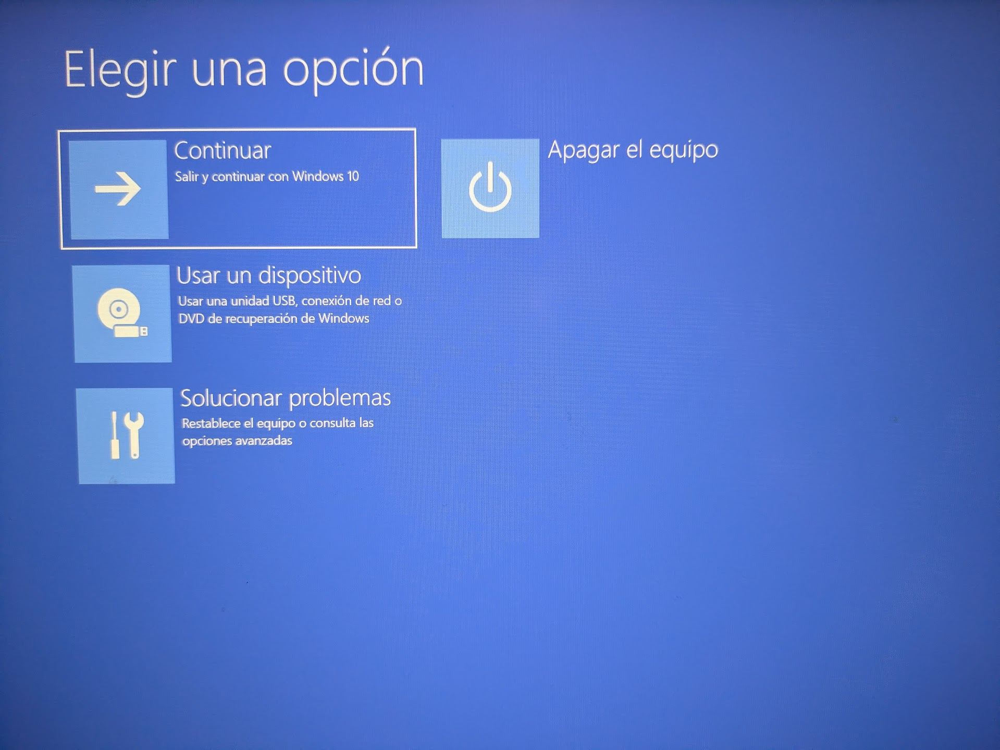

# 2.1 Configuración de Arranque Avanzado

## Enunciado

> 1. En un PC con Windows, mantén pulsada la tecla Shift mientras haces clic en "Reiniciar".

2. Esto te llevará al menú de Opciones de Arranque Avanzado.

3. Desde ahí, navega hasta las opciones para arrancar en la configuración de UEFI/BIOS y explora las opciones de arranque disponibles
> 

---

### 1. ABRIR CONFIGURACIÓN DE UEFI/BIOS

1. Primero, reinicio mi equipo a la vez que pulso “Shift”. Esta acción me conduce a esta pantalla:

1. Solucionar problemas > Opciones avanzadas > **Configuración UEFI
En mi caso aparece esta interfaz:**

---

### 2. BICHEANDO

Hay un montón de utilidades y configuraciones en la UEFI, como por ejemplo:

- Comprobar información de mi sistema
- Monitorizar hardware
- Gestionar la memoria
- Ajustes avanzados
- etc.

**Por ejemplo, desde mi UEFI BIOS Utility pude habilitar la tecnología de virtualización para poder trabajar con máquinas virtuales:**

