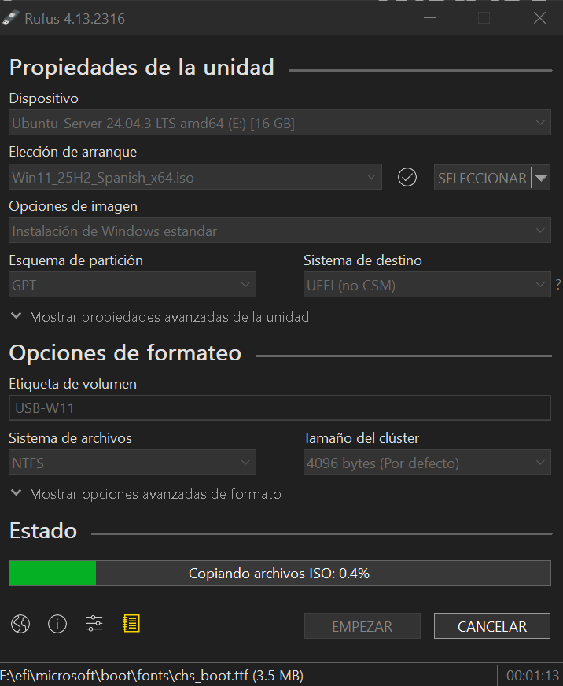

# 2.2 USB de arranque para W10/11

## Enunciado

> 1. Utilizando la Media Creation Tool de Microsoft*, crea una unidad USB de arranque para Windows 10/11.

2. Luego, utiliza esa unidad USB para instalar Windows en una máquina virtual nueva en VirtualBox.

3. Pasa por todo el proceso, incluyendo el particionado del disco virtual.
> 

*En mi caso, he utilizado la herramienta **Rufus** 

---

---

1. Primero he  descargado la ISO de Windows → https://www.microsoft.com/es-es/software-download/windows11
2. Luego he creado el USB booteable con Rufus:

1. Después he creado la máquina virtual para W11 en VirtualBox:
    1. Tipo: Microsoft Windows | Versión: Windows 11 (64-bit)
    2. Memoria RAM: 4096
    3. CPU: 2 procesadores
    4. 64GB (por recomendación de varias IAs) y con asignación dinámica, claro.

***HE MONTADO EL USB CON RUFUS Y HE CREADO LA MÁQUINA VIRTUAL… PERO POR MÁS QUE LO INTENTO, NO CONSIGO QUE APAREZCA EL USB EN CONFIGURACIÓN > USB, NI EJECUTANDO COMO ADMINISTRADOR, NI METIENDO EL USB CON VB ABIERTO, NI REINSTALANDO… ASÍ QUE VOY A CONTINUAR CON EL EJERCICIO USANDO DIRECTAMENTE LA ISO.**

1. Ahora conecto la ISO de Windows 11

1. Por cierto, en Placa Base me aseguro de tener EFI habilitado (Windows no va con BIOS, son con UEFI)
2. Inicio la máquina → Se ejecuta el instalador y avanzo → No tengo clave del producto → Elijo la versión (por ejemplo, WIndows 11 Pro) y avanzo hasta llegar a **Seleccionar ubicación para instalar Windows 11**
3. En esta pantalla empiezo a crear el particionado:
    1. Selecciono el *Drive 0 Unallocated Space* y le doy a siguiente
    2. Así se creará automáticamente:
    
    
    

¡Empieza la instalación! (Puede demorarse 15-20 minutos)

Instalando…

---

### No quiero iniciar sesión… (cortesía de chatgpt)

1. Cuando llego a la pantalla de iniciar sesión (*quiero continuar con la instalación sin iniciar sesión*), apago la máquina virtual.
2. En configuración de red, desmarco *habilitar adaptador de red.* Así desconecto la VM de internet
3. Vuelvo a iniciar la máquina, avanzo como antes por en instalador y me aparece esto:

1. Le doy a *No tengo internet* y continúo con la configuración limitada. Esto puede demorarse un ratín…
2. Finalmente se inicia el sistema… **¡Ya tengo Windows 11 instalado!**

---

### RESUMEN

1. He creado un USB con Rufus que contiene Windows 11
2. He creado y configurado una nueva VM en VB
3. He instalado Windows 11 usando la ISO
4. He configurado las particiones de forma automática