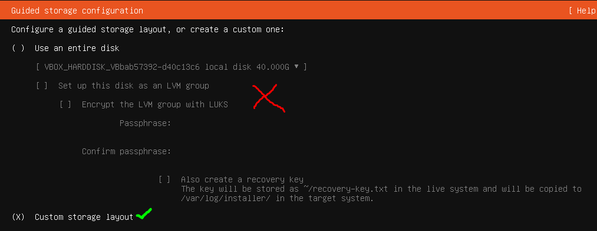

# 2.3 Ubuntu Desktop y partición

## Enunciado

> 1. Crea una nueva máquina virtual en VirtualBox.

2. Descarga la ISO de Ubuntu Desktop*. Inicia la instalación y, cuando llegues al paso del particionado, elige la opción "Algo más" (particionado manual).

3. Crea una partición raíz (/) de 20 GB y asigna el resto del espacio a una partición /home.
> 

Como ya he hecho varias veces el ejercicio de instalación de una ISO, voy a utilizar directamente mi MV con Ubuntu Server para realizar esta actividad.

---

### Primero: crear y preparar una máquina Ubuntu Server

1. He creado una máquina virtual con las siguientes características:
    1. Tipo Linux, versión Ubuntu 64
    2. 4096MB
    3. Disco duro tipo VDI, 40GB
2. Después he cargado la ISO en la unidad óptica y he iniciado la máquina
3. Voy siguiendo el asistente de instalación hasta llegar a la parte de **Storage configuration (Configuración del almacenamiento)**

---

### Particionado manual: partición raíz `/`

Elijo las siguientes opciones:



Elijo la configuración personalizada


Selecciono mi disco como disco de arranque


Empiezo a crear la partición raíz `/`


…Con estas propiedades

**¡YA TENGO LA PARTICIÓN RAÍZ `/`! VAMOOOS**

Ahora solo queda crear la partición `/home`

---

### Particionado manual: partición `/home`

Voy a crear la siguiente partición:


Vuelvo a elegir *free space* para añadir una nueva partición


Le asigno todo el tamaño, el formato ext4 y elijo /home


¡Hecho!

Ya tengo las particiones raíz `/`y `/home`hechas. Ahora solo queda continuar con la instalación.

---

### COMPROBACIÓN FINAL

Una vez finalizada la instalación, reinicio la máquina, me logueo y ya en mi Ubuntu, introduzco:

```bash
lslbk 
```

Y me muestra lo siguiente:


¡Está todo correcto!

Por cierto, no entendía de dónde salía el sda1. investigando descubrí que simplemente se trata de la Partición de arranque (GRUB)

---

### Conclusión: ¿por qué separar `/home` es buena práctica?

Básicamente, permite reinstalar el sistema sin perder los datos del usuario, evita que el sistema se quede sin espacio si se llena la carpeta personal y facilita las copias de seguridad y la administración del disco. **SON TODO VENTAJAS**

---

### EN RESUMEN:

1. He creado una máquina virtual en VB de 40GB
2. He cargado la ISO de Ubuntu Server y he iniciado la instalación
3. En *Storage configuration*, he marcado **Custom storage layout**
4. He elegido el disco como **Boot device**
5. En el especio libre, he creado las particiones `/`y `/home`una por una
6. He finalizado la instalación
7. He verificado con `lsblk`