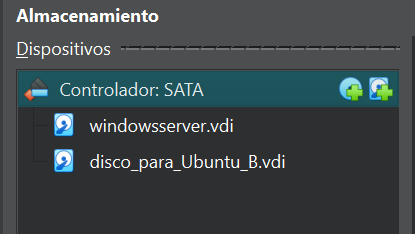

# 2.4 GRUB

## Enunciado

> 1. En la máquina virtual donde tienes instalado Windows, apágala.

2. Añade un segundo disco duro virtual de 30 GB. Inicia la VM con el Live USB de Ubuntu.* Instala Ubuntu en el segundo disco duro.

3. Al finalizar, el instalador debería haber instalado GRUB y, al reiniciar, deberías ver un menú que te permite elegir entre Ubuntu y Windows.
> 

*Lo he hecho directamente con la iso de Ubuntu, ya que ya he montado usb booteables en el pasado. No lo voy a hacer más

---

### 1. AÑADIR UN SEGUNDO DISCO DURO VIRTUAL

- Selecciono mi VM de Windows Server
- Configuración → Almacenamiento → Añadir disco duro (VDI, Reserva dinámica y 30GB)
- Ya tengo los dos discos: uno con Windows Server y otro vacío donde irá Ubuntu



---

### 2. MONTAR LA ISO DE UBUNTU

- Monto la ISO de Ubuntu como ya he hecho tantas veces en el pasado
- Cambio el orden de arranque para que se vea así:


Asi garantizo que empiece cargando la ISO

- Inicio la máquina

---

### 3. INSTALACIÓN DE UBUNTU EN EL SEGUNDO DISCO

- Al iniciar la máquina, me aparece la opción de instalar Ubuntu Server
- Voy siguiendo la instalación hasta llegar a **Storage Configuration.** Elijo **Custom storage layout**

---

### 4. CREAR PARTICIÓN

- Elijo el disco vacío de 30GB > Add GPT Partition


- Ahora tengo la partición formateada en ext4, montada en raíz y con tamaño de disco de 30GB:


Y más abajo tengo el disco de Windows (el de 50GB), compuesto por 3 particiones que hice hace tiempo…

- Sigo con la instalación hasta terminar.
- Con la máquina ya apagada, quito el medio de instalación (la ISO)
- Me aseguro de que el orden de los discos sea correcto: primero el de Ubuntu, en el puerto 0, y luego el de windows en el 1

---

### 5. RESULTADO

- Abro la máquina y se me abre Ubuntu directamente…
- Ejecuto `sudo update-grub`
- Reinicio con `sudo reboot`
- ¡EXITO!


---

## ALGUNAS COSITAS QUE ME HAN PASADO…

- Tuve que pedirle ayuda a chatgpt porque no se me iniciaba el GRUB.  Descubrí que el menú **estaba oculto**. Para cambiar esto, hay que modificar un archivo llamado grub. Lo miro así:
    
    `sudo nano /etc/default/grub`
    
- Cambio las siguientes líneas y sobreescribo el archivo:
    
    ```bash
    GRUB_TIMEOUT_STYLE=menu
    GRUB_TIMEOUT=10
    ```
    
- Vuelvo a actualizar con `sudo update-grub`
- **Reinicio… ¡Y ya me aparece el menú!**

---

### RESUMEN FINAL

- Añado un segundo disco virtual (30 GB) en **VirtualBox**.
- Monto la ISO de **Ubuntu Server** y arranco desde ella.
- Instalo Ubuntu en el disco nuevo (partición GPT, ext4, montada en `/`).
- Dejo el disco de Ubuntu como primero en el orden de arranque.
- Tras instalar, ejecuto `sudo update-grub` para que detecte **Windows Server**.
- Como no aparece el manú, edito `/etc/default/grub` y pongo:
    
    ```
    GRUB_TIMEOUT_STYLE=menu
    GRUB_TIMEOUT=10
    ```
    
- `sudo update-grub` → reiniciar → aparece el menú de **GRUB** con ambos sistemas