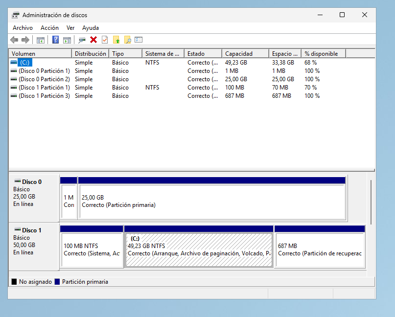

# 2.5 mbr2gpt /validate

## Enunciado

> 1. En una máquina virtual con Windows instalado en modo BIOS/MBR, abre el administrador de discos y comprueba que el disco está usando el estilo de partición MBR.

2. Luego, arranca la VM desde un USB de instalación* de Windows, abre el símbolo del sistema y ejecuta mbr2gpt /validate para ver si el disco es convertible a GPT.
> 

*Voy a hacer todo este ejercicio directamente en mi VM de Windows server

---

1. Primero abro el administrador de discos. Pulso **Windows + X** y lo abro:

1. Entro en las propiedades de mi disco de Windows (estoy ejecutando la máquina virtual con el GRUB, así que tengo que saber bien qué disco elegir) y miro la pestaña de volúmenes. Ahí veo:

Aquí veo *Registro de arranque maestro (MBR)*, que quiere decir que la VM está usando **BIOS + MBR**.

---

### AHORA VOY A HACER LA VALIDACIÓN CON `mbr2gpt`

- Cierro la máquina, monto la ISO de instalación de Windows Server, cambio el orden de arranque para que se lea primero la ISO y abro la VM
- Nada más aparecer la primera pantalla, pulso Shift + F10 para abrir el símbolo de sistema
- Ejecuto: `mbr2gpt /validate`

Me da error… ¿por qué?

- … Pues porque no estoy especificando el disco en el que tiene que hacer la validación, y por defecto lo está haciendo en el disk 0… ¡Pero yo quiero hacerlo en el disk 1! Así que:
`mbr2gpt /validate /disk:1`

¡AHORA SÍ!

**Eso significa que el disco MBR puede convertirse a GPT.**

---

### **RESUMEN**

- He comprobado el tipo de partición del disco donde tengo instalado el Windows Server.
- He arrancado el instalador de Windows y he ejecutado el símbolo del sistema
- He usado el comando `mbr2gpt /validate /disk:1`para validar la conversión a GPT