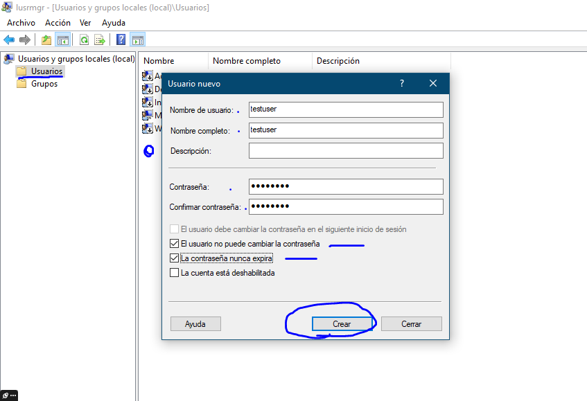

# 3.1 Usuario local “testuser”

## Enunciado

> En un equipo con Windows (sin dominio), abre lusrmgr.msc. Crea un nuevo usuario local llamado "testuser". Establece una contraseña y marca la opción "El usuario no puede cambiar la contraseña". Luego, añade este nuevo usuario al grupo local "Usuarios de Escritorio remoto".
> 

---

## 1. CREO EL USUARIO “TESTUSER”

- En mi Windows anfitrión, abro el administrador de usuarios locales
- En el panel izqdo, voy a Usuarios → Click dcho en el panel que aparece → **Usuario nuevo**
- Así lo creo:

- El usuario ya está creado.

---

## 2. AÑADO EL USUARIO A “USUARIOS DE ESCRITORIO REMOTO”

- Ahora me voy al panel izqdo → Grupos → Usuarios de escritorio remoto → **Agregar**

- Acepto.

---

**Usuario creado. Él mismo no puede cambiar su contraseña y pertenece al grupo de Usuarios de Escritorio remoto**

¡ÉXITO!