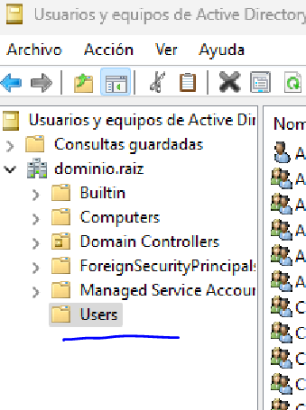

# 3.2 Perfiles móviles

## Enunciado

> **En un Windows Server**, crea una carpeta compartida llamada "Perfiles". En las propiedades de un usuario de Active Directory, ve a la pestaña "Perfil" y en la ruta de acceso al perfil, escribe \\servidor\Perfiles\%username%. La próxima vez que ese usuario inicie sesión en un cliente, se creará su perfil móvil en esa carpeta.
> 

---

## 1. CREO UN USUARIO

- He creado un dominio en mi Windows Server. Inicio sesión en el mismo.
- Ahora voy a crear un usuario en Active Directory:

`Administrador del servidor → Herramientas → Usuarios y equipos de Active Directory`

- Despliego mi dominio → Users → Click dcho → Nuevo → Usuario

Lo he llamado “testuser”

---

## 2. CREO LA CARPETA PARA PERFILES MÓVILES

- Busco una ubicación adecuada en el explorador de archivos de mi Windows Server y creo la carpeta **Perfiles**

- Voy a las propiedades de la carpeta → Pestaña de Compartir → Uso compartido avanzado
- Marco *Compartir esta carpeta*, luego voy a Permisos.
- Elijo **Todos** y le otorgo los permisos de lectura y cambios. **Aplico y acepto**.

- Ahora la ruta de red se verá así: `\\servidor\Perfiles`

---

## 3. CONFIGURO EL PERFIL MÓVIL

- Vuelvo a **Usuarios y equipos de Active Directory** y voy a las propiedades del usuario **testuser.**
- En la pestaña **Perfil** escribo:
`\\SERVIDOR\Perfiles\%username%`

¡Hecho!

---

Ahora, cuando **testuser inicie sesión en un PC del dominio**:

**Windows creará automáticamente la carpeta:
`\\SERVIDOR\Perfiles\testuser`**

### RESULTADO

- [x]  Usuario creado en AD
- [x]  Carpeta compartida `Perfiles`
- [x]  Perfil móvil configurado con **testuser**