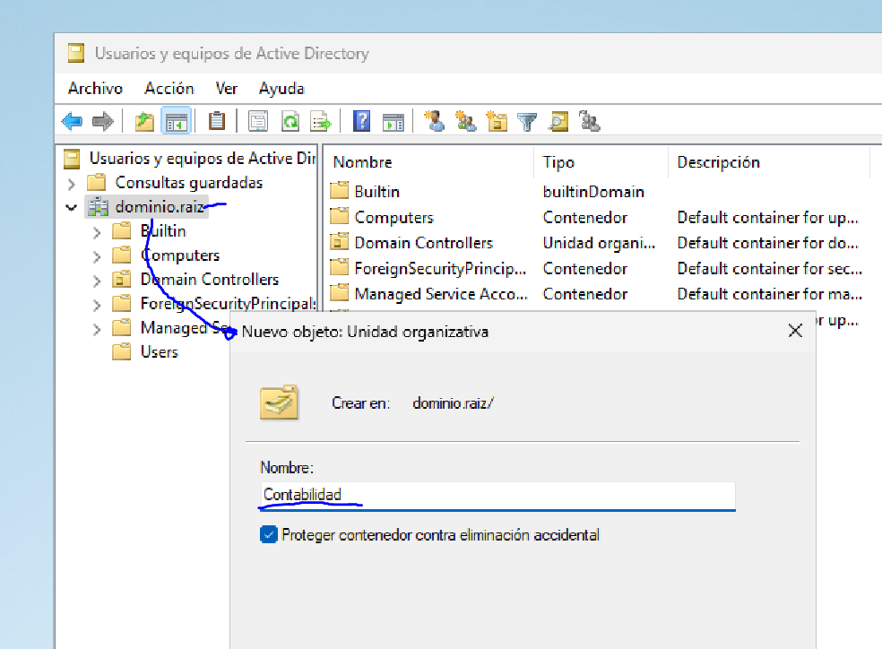

# 3.3 Delegando tareas

## Enunciado

> En un Windows Server con AD, abre dsa.msc. Crea una nueva OU llamada "Contabilidad". Dentro de esa OU, crea un usuario llamado "auditor". Haz clic derecho sobre la OU "Contabilidad" y selecciona "Delegar control...". Sigue el asistente para delegar al usuario "auditor" la tarea comùn de "Restablecer contraseñas de usuario".
> 

---

- En Usuarios y equipos de Active Directory, haciendo click derecho en mi dominio, he creado una nueva OU (Unidad Organizativa) llamada “Contabilidad”

- Luego he creado un usuario en este OU llamado **Pepe Sanz**

- Ahora, para delegar el control en Contabilidad, haciendo click dcho en la OU selecciono **Delegar control…**

- Marco la opción **Restablecer contraseñas de usuario y forzar cambio en el siguiente inicio de sesión** y finalizo**. ¡HECHO!**

---

### RESULTADO

Ahora el usuario **auditor** ahora puede **restablecer contraseñas de los usuarios dentro de la OU "Contabilidad"**, sin tener permisos de administrador del dominio.