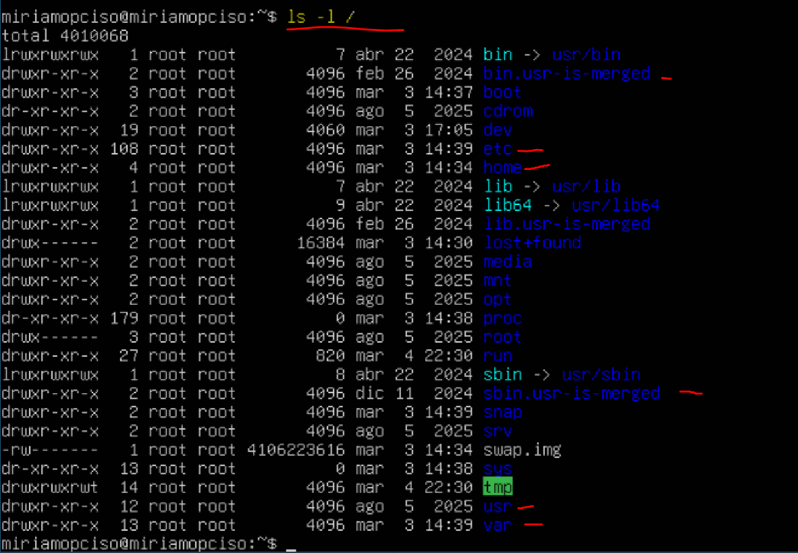

# 4.1 Navegando por directorios

## Enunciado

> 1. En una máquina virtual con Linux, ejecuta `ls -l /`

2. Observa los directorios principales (/etc, /home, /bin, /sbin, /usr, /var).

3. Utiliza el comando man hier para leer la página del manual que describe el estándar de jerarquía del sistema de archivos (FHS) y entender el propósito de cada directorio.
> 

---

- Uso el comando `ls -l /`

- Luego uso `man hier`

Este comando muestra el manual **hier**, que explica la **estructura del sistema de archivos de Linux** (cómo están organizadas las carpetas).

`hier` viene de **hierarchy (jerarquía)** y describe directorios como:

- `/bin` → comandos básicos del sistema
- `/etc` → archivos de configuración
- `/home` → carpetas de usuarios
- `/var` → archivos variables (logs, colas, etc.)
- `/usr` → programas y recursos del sistema

---