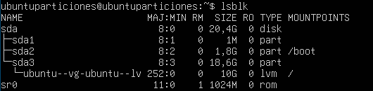

# 4.2 Volúmenes lógicos y Particiones

## Enunciado

> 1. En una VM de Linux con un disco duro virtual, utiliza `fdisk` o `gparted` para crear dos particiones.

2. Usa `pvcreate` para convertirlas en volúmenes físicos.

3. Luego, usa `vgcreate` para crear un grupo de volúmenes con esas dos particiones.

4. Finalmente, usa `lvcreate` para crear un volumen lógico que ocupe todo el espacio del grupo.
> 

---

## COMANDOS A USAR

**`lsblk`**→ Muestra los discos y particiones conectados al sistema. Se usa para identificar el disco donde vamos a trabajar.

**`fdisk`**→ Herramienta para crear, eliminar o modificar particiones en un disco.

**`pvcreate`**→ Inicializa una partición o disco como **volumen físico (PV)** para poder usarlo con LVM.

**`pvs`**→ Muestra información sobre los **volúmenes físicos** existentes.

**`vgcreate`**→ Crea un **grupo de volúmenes (VG)** uniendo uno o varios volúmenes físicos.

**`vgs`**→ Muestra información sobre los **grupos de volúmenes**.

**`lvcreate`**→ Crea un **volumen lógico (LV)** dentro de un grupo de volúmenes.

**`lvs`**→ Muestra información sobre los **volúmenes lógicos**.

**`mkfs.ext4`**→ Crea un sistema de archivos **ext4** en una partición o volumen lógico.

**`mount`**→ Monta un sistema de archivos para que el sistema operativo pueda acceder a él.

---

## 1. CREAR DOS PARTICIONES EN EL DISCO

Primero voy a ver los discos disponibles con `lsblk`



el sda es el dico duro virtual de la máquina, y tiene tres particiones: sda1 (GRUB) | sda2 (/boot) | sda3 (volumen lógico, donde está instalado el SO)

> Okey, como mi sistema ya está usando **LVM**, voy a añadir un segundo disco virtual (`sdb`) para hacer la práctica
> 

- Añado el disco:


- Compruebo:


sdb… ¡Ahí está!

- Entramos en `fdisk`

```bash
sudo fdisk /dev/sdb
```


- Puedo usar estas letras (he marcado en rojo la que me interesa):


- Introduzco:

```bash
n
p
1
(más de un GB)
```

- Y luego:

```bash
n
p
2
(Enter para que use el resto del espacio)
```

- Salgo guardando con `w`


¡Aquí están las nuevas particiones!

---

## 3. CONVERTIR LAS PARTICIONES EN VOLÚMENES FÍSICOS

Para ello, uso el comando `pvcreate`

```bash
sudo pvcreate /dev/sdb1
sudo pvcreate /dev/sdb2
```


---

## 4. COMBINAR PARTICIONES

Para combinar ambas particiones voy a crear un grupo de volúmenes y lo voy a llamar `vgdiscos` usando el comando `lvcreate`

```bash
sudo vgcreate vgdiscos /dev/sdb1 /dev/sdb2 
```


---

## 5. ESPACIO DEL VOLÚMEN LÓGICO

Ahora quiero crear un **volumen lógico llamado `lvdatos`** usando todo el espacio disponible del grupo.

```bash
sudo lvcreate -l 100%FREE -n lvdatos vgdiscos
```


---

## 6. FORMATEAR Y MONTAR

Y solo me queda darle formato al disco y montarlo.

- Para formatear uso **`mkfs.ext4`**

```bash
sudo **mkfs.ext4 /dev/vgdiscos/lvdatos**
```

- Por último, creo el directorio de montaje y monto:

```bash
sudo mkdir /montar
sudo mounr /dev/vgdiscos/lvdatos/montar
```

- Verifico con `lsblk`


¡Éxito!

---

## RESUMEN

✔ Particiones creadas

✔ Volúmenes físicos creados

✔ Grupo de volúmenes creado

✔ Volumen lógico creado

✔ Volumen lógico montado

### HISTORIAL DE COMANDOS

```bash
lsblk
sudo fdisk /dev/sdb
sudo pvcreate /dev/sdb1 /dev/sdb2
sudo vgcreate vgdiscos /dev/sdb1 /dev/sdb2
sudo lvcreate -l 100%FREE -n lvdatos vgdiscos
sudo mkfs.ext4 /dev/vgdiscos/lvdatos
sudo mkdir /montar
sudo mount /dev/vgdatos/lvdatos /montar
```