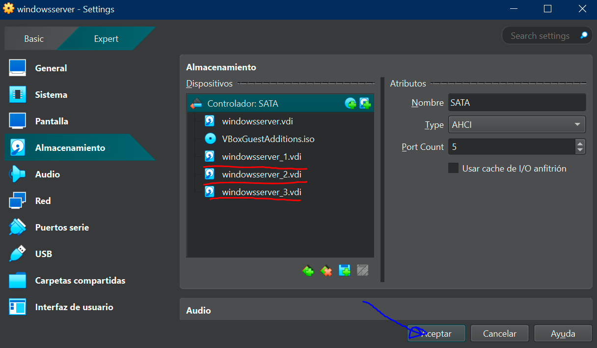

# 4.3 RAID 5

## Enunciado

> 1. En una VM de Linux, añade tres discos duros virtuales adicionales de 1GB cada uno

2. Usa mdadm para crear un array RAID 5 (/dev/md0) con esos tres discos.

3. Luego, formatea el nuevo dispositivo RAID con un sistema de archivos (mkfs.ext4 /dev/md0) y móntalo en un directorio.
> 

---

## 1. REQUISITOS PREVIOS

Para poder hacer la tarea, hay dos requisitos previos que debo cumplir: 

- Tener Windows Server instalado en mi Virtual Box
- Haber creado 3 discos duros virtuales

---

## 2. DISCOS VIRTUALES

Voy  a crear esos 3 discos virtuales: 

- Le doy a añadir **Hard Disk**
- Han de tener un tamaño de 20GB y ser tipo VDI

---

## 3. VERIFICAR DISCOS

Abro Windows Server y verifico los discos desde el Administrador de Discos: 

- Windows + X → Administrador de discos
- O ejecuto diskmgt.msc → Administrador de discos

---

## 4. DISCOS DINÁMICOS

Ojo, para RAID 5 no me sirven los discos básicos tal y como los tengo, necesito usar discos dinámicos:

- Entro en *Administrador de discos*
- **Click derecho** sobre cada disco (1, 2, 3)
- Selecciono *Convertir a disco dinámico*
- Marco los discos, acepto y confirmo

---

## 5. CREACIÓN DE RAID 5

Por fin, voy a crear el volumen RAID 5: 

- Hago Click derecho en uno de los espacios **No asignado** de uno de nuestros discos
- En el asistente le doy a Siguiente y seleccio al menos 3 discos
- Agrego los discos al volumen y le doy a Siguiente

---

## 6. FORMATO

A continuación voy a asignarle una letra (ej: E:) y un formato: 

- Elegijo por ejemplo, la letra E:
- Elegijo un sistema de archivos (NTFS o ReFS)
- Tamaño de unidad: Predeterminado
- Etiqueta: RAID5
- Formato rápido y finalizar

---

## 7. VERIFICAR RAID 5

En el administrador de discos ahora veo:

- Un solo volumen
- Estado: Correcto
- Tipo: RAID 5

**¡HECHO!**