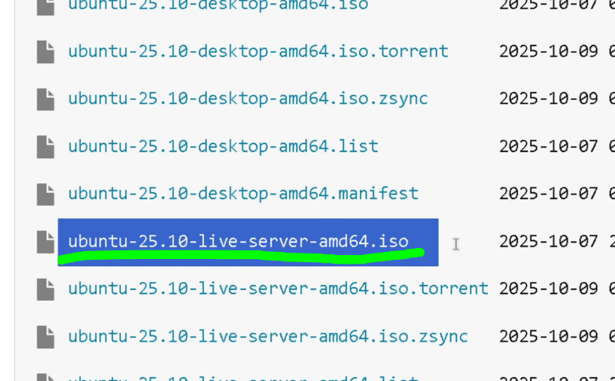

# 5.1 Hashes

## Enunciado

> 1. Descarga la ISO de una distribución de Linux.

2. En la página de descargas, busca el hash SHA-256 que publican

3. Una vez descargado el archivo, utiliza un comando (sha256sum en Linux, o Get-FileHash en PowerShell de Windows) para calcular el hash del archivo que has descargado y comprueba que coincide exactamente con el publicado.
> 

---

## 1. PERO, ¿QUÉ ES ESO DE “HASH”?

Un hash es el resultado de aplicar una función **hash** a un conjunto de datos (*texto, archivo, contraseña, etc.*).
El resultado es una cadena de longitud fija, que representa de forma única (o casi única) esos datos.

Ejemplo:

- Texto: hola
- Hash (SHA-256): `2cf24dba5fb0a30e26e83b2ac5b9e29e1b161e5c1fa7425e73043362938b9824`

**Hacer hash** significa pasar un dato por una función hash para obtener su valor hash.

**Algoritmos hash comunes:**

- MD5 (obsoleto, inseguro)
- SHA-1 (obsoleto)
- SHA-256 / SHA-512 (seguros y recomendados)
- bcrypt, scrypt, Argon2 (especiales para contraseñas)

---

## 2. COMPROBANDO MI HASH

(Directrices de Jesús):

- Voy la red IRIS mediante protocolo ftp >>
[**ftp.rediris.es/**](http://ftp.rediris.es/) (*poned esto en vuestro navegador*)
- Busco `releases.ubuntu` > `25.10`
- Elegijo este:

- En **SHA256SUMS** encuentro el número (HASH) que debo consultar para la iso de ubuntu:

El hash que aparece aquí dentro lo tenemos que comparar con el hash de la iso oficial de Ubuntu. **Tienen que coincidir**

- Voy a consultar el Hash de la ISO que me descargué de Ubuntu. Para ello, abro el PowerShell y escribo: `Get-FileHash ruta_del_archivo`

**Puedo descargarme esa .iso de Ubuntu desde la red iris, consultar el hash y compararlo con el oficial:**  https://help.ubuntu.com/community/UbuntuHashes