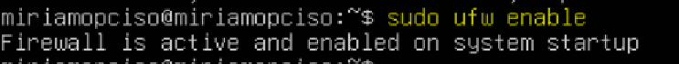

# 5.3 ufw

## Enunciado

> En una máquina virtual con Ubuntu, instala ufw (`sudo apt install ufw`). Habilítalo con `sudo ufw enable`. Por defecto, denegará todo el tráfico entrante. Luego, permite explícitamente el tráfico SSH con `sudo ufw allow ssh`. Comprueba el estado con `sudo ufw status`.
> 

---

1. Instalo **UFW** con estos comandos:

```bash
sudo apt update
sudo apt install ufw
```

---

1. Activo el firewall:

```bash
sudo ufw enable
```

me aparece esto:



---

1. Y ahora, para evitar que el firewall no bloquee conexiones SSH, escribo lo siguiente:

```bash
sudo ufw allow ssh
```

me dice lo siguiente:


---

1. Compruebo el estado del firewall

```bash
sudo ufw status
```

me aparece esto:


- **Status: active** → El firewall está **activado**.
- **22/tcp ALLOW Anywhere** → El **puerto 22 (SSH)** está permitido desde cualquier dirección IPv4.
- **22/tcp (v6) ALLOW Anywhere (v6)** → También está permitido para **IPv6**

---

## EXTRAS

- Comando para ver las reglas numeradas (esto puede permitirme trabajar con ellas más fácilmente para editarlas, eliminarlas…)

```bash
sudo ufw status numbered
```


- Por ejemplo, quiero borrar la regla nº2:

```bash
sudo ufw delete 2
```


- Para desactivar el firewall, simplemente escribo:

```bash
sudo ufw disable
```


---

### Resumen de comandos:

| Comando | Función |
| --- | --- |
| `sudo apt update` | Actualiza la lista de paquetes del sistema |
| `sudo apt install ufw` | Instala el firewall UFW |
| `sudo ufw enable` | Activa el firewall |
| `sudo ufw allow ssh` | Permite conexiones SSH (puerto 22) |
| `sudo ufw status` | Muestra el estado del firewall y sus reglas |
| `sudo ufw status numbered` | Muestra las reglas numeradas |
| `sudo ufw delete número` | Elimina una regla usando su número |
| `sudo ufw disable` | Desactiva el firewall |