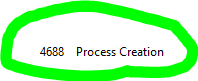

# 5. EXTRA

# Mini-Práctica de Auditorías

**ENUNCIADO:**
Queremos saber si el usuario ha ejecutado un juego.

**PISTAS:**

- Un juego es un .exe
- Es un proceso que "se crea"

---

## **PRIMER PASO: AUDITAR CREACIÓN DE PROCESOS**
Sino no podremos verlo

- Vamos a mmc.exe
- Archivo > Agregar o quitar complementos
- Editor de objetos de directiva de grupo > Agregar > Equipo Local > Finalizar > **Aceptar**
- Raíz de consola > Configuraciòn de windows > Configuración de seguridad > Directivas locales > Directiva de auditoría > Auditar seguimiento de objetos > Correcto > **Aceptar**

**VAMOS AL REGISTRO DE EVENTOS**

- Registro de eventos > seguridad > buscar el evento de creación de proceso (**con ID: 4688**)

¡ÉXITO!

---

**Si quisiéramos ver procesos creados antes de que activáramos la auditoría de creación de proyectos, tendríamos que ir a la carpeta "prefetch"**

Carpeta prefetch:
**`C:\Windows\Prefetch`**

---

## Auditoría de procesos: Correcto vs Error

**Correcto (Éxito)**
Registra cuando un proceso se crea o finaliza correctamente.
→ *Permite saber qué .exe se ejecutó, cuándo y qué usuario.*

**Error (Fallo)**
Registra cuando se intenta crear un proceso pero falla.
→ *Indica intentos de ejecución bloqueados (permisos, políticas, antivirus, AppLocker).*