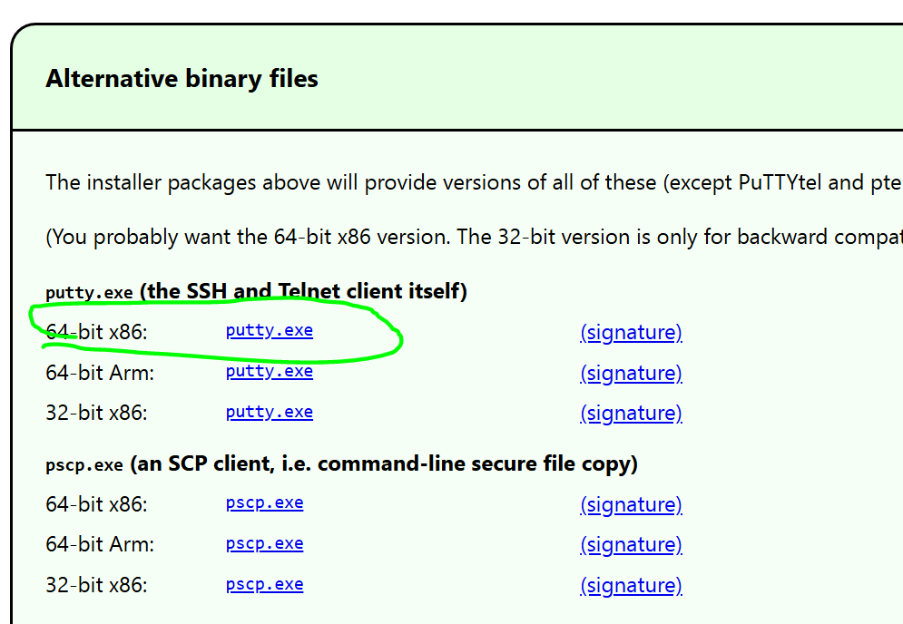

# 5.6 PuTTY

# 1. Primero, ¿qué es SSH?

**Secure Shell (SSH)** es un **protocolo de red seguro** que permite **conectarse a otro ordenador o servidor de forma remota** a través de una red (como Internet) y **controlarlo mediante una línea de comandos cifrada**

---

# 2. PuTTY

PuTTY es un programa gratuito que funciona como cliente de conexión remota, usado principalmente en Windows, para conectarse a otros equipos a través de la red.
Se utiliza sobre todo para acceder a servidores Linux/Unix de forma remota.

### **Primeros pasos**

- Ejecutamos nuestro Ubuntu Server desde Virtual Box
- Comprobamos nuestra ip con ip addr
- En el Símbolo de Sistema de nuestro Windows, hacemos ping a la dirección que nos aparece. ¡Tiene que funcionar!
- Aseguraros de estar en Adaptador de puente. A mí no me funcionaba porque estaba en NAT

### **Descarga de PuTTY**

- Descargar PuTTY: [https://www.chiark.greenend.org.uk/~sgtatham/putty/latest.html](https://www.chiark.greenend.org.uk/~sgtatham/putty/latest.html)
    
    
    
- Abrimos PuTTy, metemos la id de nuestro Ubuntu Server, metemos las credenciales y accederemos:

- Si escribimos w (who) veremos quién está metido