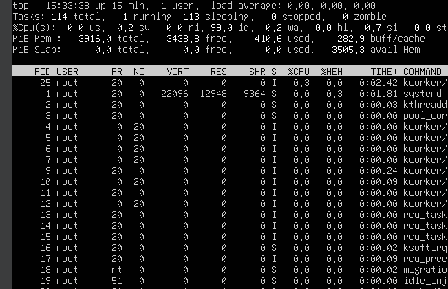

# 6.1 Monitorización en tiempo real

### ENUNCIADO

> En una máquina virtual con Linux, instala htop (sudo apt install htop). Ejecútalo y ordena los procesos por uso de CPU (pulsando P), por uso de memoria (pulsando M) y filtra por un usuario concreto (pulsando u). Abre otro terminal y ejecuta un comando que consuma CPU (como md5sum /dev/urandom) y observa cómo aparece en la parte superior de htop.
> 

---

# 1. MONITORIZACIÓN

La monitorización en sistemas operativos es el proceso de supervisar, medir y analizar el estado y rendimiento de los recursos del sistema en tiempo real o de forma periódica. Consiste en observar el estado y rendimiento de un sistema en el momento presente. Nos ayuda a detectar problemas de forma inmediata. Tenemos diversas herramientas para esto como:

- Administrador de Tareas
- top y htop
- Nagios
- Grafana
- Etc.

---

# 2. MONITORIZACIÓN EN LINUX

### Arrancamos nuestro Ubuntu Server

Pues eso… Luego probamos y/o instalamos los siguientes comandos:

---

## Comando `top`

Mete el comando `top`

*El comando top es una herramienta de monitorización en tiempo real que muestra los procesos activos y el uso de recursos del sistema en distribuciones basadas en Linux.*
Se usa para ver:

- Uso de CPU
- Uso de memoria
- Procesos activos
- Tiempo de actividad del sistema

---

## Comando `htop`

Mete el comando `htop`

*htop es una herramienta interactiva y mejorada para monitorizar procesos en sistemas basados en Linux. Es una alternativa más visual y fácil de usar que top*

---

## Comando `btop`

btop es una herramienta moderna de monitorización de recursos en sistemas basados en Linux.
Es la evolución de bashtop y bpytop, con una interfaz mucho más visual, fluida y completa.
Se usa para monitorear en tiempo real:

- CPU (por núcleo)
- Memoria RAM
- Swap
- Disco
- Red
- Procesos activos

Lo tendréis que instalar:
`sudo apt install btop`
Lo ejecutamos:

---

## Comando `glances`

`glances` es una herramienta avanzada de monitorización integral para sistemas basados en Linux. A diferencia de top, htop o btop, muestra muchísima información en una sola pantalla y puede funcionar incluso en modo cliente-servidor para monitorizar equipos remotos.

¿Qué puede monitorizar?

- CPU (por núcleo)
- Memoria RAM y Swap
- Disco (uso e I/O)
- Red (tráfico en tiempo real)
- Procesos
- Temperatura
- Docker (si está instalado)
- Servicios
- Sistema de archivos

---

## Gestión de Hardware en Linux

- `lscpu`: información sobre la cpu
- `lshw`: información sobre el hardware
- `ps`: información sobre los procesos en ejecución
- `ps aux`: procesos de todos los usuarios, procesos sin terminal y la información detallada

---

# 3. MONITORIZACIÓN EN POWER SHELL

- Primero de todo: **curso de powershell de jesús** >  [https://www.jesusninoc.com/02/17/curso-online-de-powershell-febrero-2026/](https://www.jesusninoc.com/02/17/curso-online-de-powershell-febrero-2026/)
- **Recordatorio I:** `GetProcess`> permite ver los procesos en ejecución
- **Recordatorio II:** una DLL (Dynamic Link Library) es un archivo con extensión .dll que contiene código y funciones reutilizables que pueden ser usadas por varios programas al mismo tiempo en Microsoft Windows.