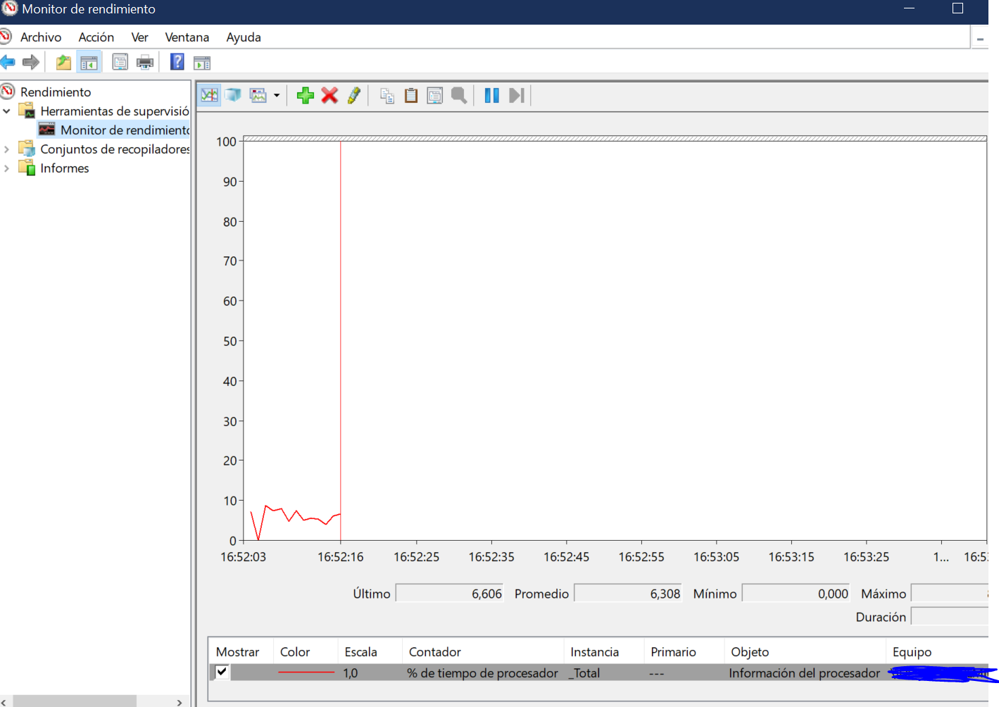

# 6.2 Monitorización continuada y análisis de rendimiento

### ENUNCIADO

> En Windows, abre el Monitor de Rendimiento (perfmon). Añade los contadores "% de tiempo de procesador" (para la CPU), "Mbytes disponibles" (para la memoria) y "Longitud media de la cola de disco" para el disco C:. Observa cómo varían en tiempo real mientras abres y usas diferentes aplicaciones.
> 

---

# 1. MONITOR DE RENDIMIENTO DE WINDOWS

El **Windows Performance Monitor** (en español **Monitor de rendimiento de Windows**) es una herramienta integrada en **Microsoft Windows** que permite **analizar el rendimiento del sistema en tiempo real o a lo largo del tiempo**. Sirve para detectar cuellos de botella en CPU, memoria, disco, red y otros recursos.

- Podemos añadir más contadores haciendo click dcho en el panel de abajo > **Agregar contadores**
- Hay muchísimos contadores. De hecho, si escribimos el siguiente comando en Power Shell, veremos la tremenda cantidad que hay:

Vamos a añadir:

- Memoria > Mbytes Disponibles

