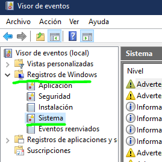

# 6.3 Registro y Análisis de Sucesos

### ENUNCIADO

> En Windows, abre el Visor de Eventos. Ve a Registros de Windows > Sistema. Filtra el registro actual para mostrar solo los eventos con el nivel "Error" y "Crítico" de las últimas 24 horas. Investiga uno de los errores que encuentres, copiando el "Origen" y el "ID del evento" y buscándolos en Google para entender su significado.
> 

---

### 1. ABRIR VISOR DE EVENTOS E IR AL REGISTRO

- Uso el comando **W+R** y ejecuto eventvwr.msc / o pulsamos la tecla de windows y lo buscamos directamente. **Se abre el Visor de Eventos**.
- En el panel izqdo: Registros de Windows > Sistema. Aquí vemos todas las movidas hardware, drivers y el propio sistema operativo.



---

### 2. FILTRANDO

- En el panel de la derecha, elijo “**Filtrar registro actual**
- Marco *Crítico* y *Error*. En **Registrado** elijo las *últimas 24h*
- Me aparece esto:


---

### 3. ¡A BICHEAR!

- Voy a buscar el error en Google y averiguar qué significa…

---

---

---

# AHORA VOY A HACERLO CON EL POWER SHELL

- Abro PowerShell ejecutando como administrador
    - Ejecuto: `Get-WinEvent -LogName system`
    - Me salen todos los eventos… vamos a filtrar lo que nos pide el enunciado: que sea error y crítico, y con el filtro de las 24h
    
    ```bash
    Get-WinEvent -LogName system | where {
        $_.leveldisplayname -eq "Error" -or $_.leveldisplayname -eq "Crítico" -and 
        ($_.timecreated -ge (get-date).AddHours(-24))
        }
    ```
    


## Explicación parte por parte

- `Get-WinEvent -LogName system`
→ Obtiene los eventos del registro **Sistema**.
- `|`
→ Pipe → Envía el resultado al siguiente comando.
- `where { }`
→ Filtra los eventos según una condición.
- `$_`
→ Representa cada evento individual.
- `eq "Error"`
→ Filtra eventos de nivel **Error**.
- `or`
→ Operador lógico **O**.
- `eq "Crítico"`
→ Filtra eventos de nivel **Crítico**.
- `and`
→ Operador lógico **Y**.
- `ge (get-date).AddHours(-24)`
→ Muestra solo eventos de las **últimas 24 horas**.
- `get-date` 
→ Fecha actual
- `.AddHours(-24)` 
→ Resta 24 horas
- `ge` 
→ Mayor o igual que

---