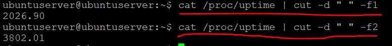

# 6.4 cut awk y Get-Counter

# 1. Comando `cut`



- `/proc/uptime` para obtener información sobre cuánto tiempo lleva encendido el sistema.
    
    *Ejemplo: 2026.90 3802.01*
    
- Primer número: tiempo total que el sistema ha estado encendido (uptime) en segundos.
- Segundo número: tiempo total que el CPU ha estado inactivo (idle) en segundos.

```
cat /proc/uptime | cut -d " " -f2
```

- cat /proc/uptime → muestra el contenido del archivo.
- cut → corta partes del texto.
- d " " → indica que el separador es un espacio.
- f1 → selecciona el campo 1.


---

# 2. Comando `awk`

`cat /proc/uptime | cut -d " " -f1 | awk '{print $1 " segundos"}'`

Este comando muestra cuántos segundos lleva encendido el sistema, agregando la palabra "segundos" al resultado.

**awk se usa para formatear texto.**

- $1 → representa el primer campo recibido.
- " segundos" → texto añadido al resultado.

---

# 3. Más cosas


- `cat /proc/loadavg` -> muestra información sobre la carga del sistema en Linux kernel.
    
    *0.00 0.00 0.00 significa que la CPU está prácticamente sin carga*
    
- `-f1-3` selecciona del campo 1 al 3. **Vamos a ponerlo bonito…**

```bash
cat /proc/loadavg | cut -d " " -f1,2,3 | awk '{print $1 " 1 minuto"}''{print $2 " 5 minutos"}''{print $3 " 15 minutos"}'
```


---

# 4. Comando `Get-Counter`

```powershell
Get-Counter "\Procesador(_Total)\% de tiempo de procesador"
```

- `Get-Counter`-> Es un comando de PowerShell que lee contadores de rendimiento del sistema (Performance Counters). Estos contadores miden recursos como: CPU, Memoria, Disco, y Red
- `\\Procesador` -> Indica el objeto de rendimiento que se quiere consultar. En este caso es el procesador (CPU).
- `(_Total)` -> Significa que se está midiendo todos los núcleos del procesador juntos, es decir, el uso total de CPU.
- `% de tiempo de procesador` -> Es el contador específico que mide qué porcentaje del tiempo la CPU está ocupada ejecutando procesos

**`Get-Counter -ListSet Memoria**` 

Busca la palabra Memoria, o la que introduzcas

```powershell
(Get-Counter "\Procesador(_Total)\% de tiempo de procesador").CounterSamples.CookedValue

for(1)
{
    (Get-Counter "\Memoria\bytes disponibles").CounterSamples.CookedValue / 1GB
    Start-Sleep -Seconds 1
}
```