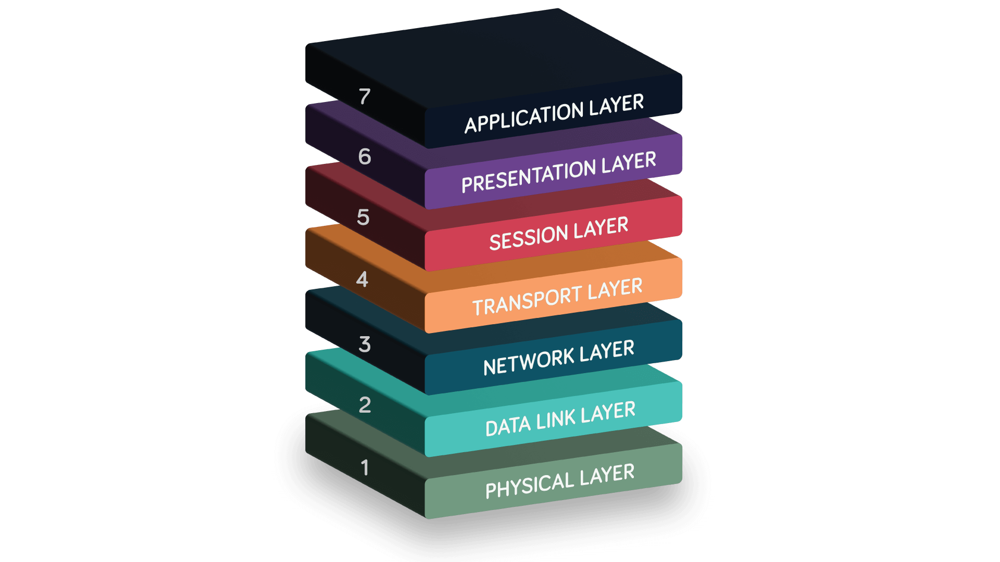
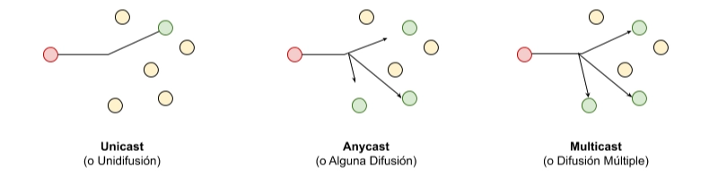

# UD1 - Conceptos básicos de redes

# 1.1 REPRESENTACIÓN DE LA INFORMACIÓN

En informática, toda información se almacena en bits (0,1). A partir de esta unidad mínima se construyen las demás, permitiendo representar desde textos hasta imágenes y videos.

→ *Un conjunto de 8 bits forma 1 byte, que suele corresponder a un carácter como letras y números.*

### UNIDADES DE ALMACENAMIENTO

Las unidades de almacenamiento permiten medir la cantidad de información que puede guardar o transmitir un sistema.

| Unidad | Símbolo | Equiv. en Bits | Equiv. en Bytes | Sistema | Uso común |
| --- | --- | --- | --- | --- | --- |
| Bit | b | 1 bit | — | Binario | Unidad mínima de información |
| Byte | B | 8 bits | 1 B | Binario | Letra, número o símbolo |
| Kilobyte | KB | 8,192 bits | 1,024 B | Binario | Texto, documentos |
| Kilobyte | kB | 8,000 bits | 1,000 B | Decimal | Capacidad de almacenamiento comercial |
| Megabyte | MB | 8,388,608 bits | 1,048,576 B = 1,024 KB | Binario | Fotos, música |
| Megabyte | MB | 8,000,000 bits | 1,000,000 B = 1,000 kB | Decimal | Fabricantes de discos/memorias |
| Gigabyte | GB | 8,589,934,592 bits | 1,073,741,824 B = 1,024 MB | Binario | Películas, software, almacenamiento |
| Gigabyte | GB | 8,000,000,000 bits | 1,000,000,000 B = 1,000 MB | Decimal | Capacidad de discos duros/comercio |
| Terabyte | TB | 8,796,093,022,208 bits | 1,099,511,627,776 B = 1,024 GB | Binario | Discos duros grandes |
| Terabyte | TB | 8,000,000,000,000 bits | 1,000,000,000,000 B = 1,000 GB | Decimal | Publicidad de almacenamiento |
| Petabyte | PB | 9,007,199,254,740,992 bits | 1,125,899,906,842,624 B | Binario | Big Data, servidores grandes |
| Exabyte | EB | 9,223,372,036,854,775,808 bits | 1,152,921,504,606,846,976 B | Binario | Escala de centros de datos grandes |
| Zettabyte | ZB | 9.44 × 10²¹ bits | 1.18 × 10²¹ B | Binario | Uso teórico / macrodatos globales |
| Yottabyte | YB | 9.67 × 10²⁴ bits | 1.21 × 10²⁴ B | Binario | Capacidad de Internet (estimada) |

---

# 1.2 SISTEMAS DE NUMERACIÓN

Los **sistemas de numeración** son formas de representar números utilizando diferentes símbolos y bases. En informática se utilizan principalmente **decimal, binario y hexadecimal**

### S. DECIMAL

- Es el sistema que usamos normalmente en la vida diaria.
- Base **10**
- Utiliza **10 dígitos**

### S. BINARIO

- Es el sistema que utilizan los **ordenadores** para almacenar y procesar información.
- Base 2
- Utiliza solo dos dígitos: 0 y 1

### S. HEXADECIMAL

- Se utiliza en informática para representar números binarios de forma más compacta.
- Base 16
- Utiliza 16 símbolos (1-9) y (A-F)

### CONVERSIONES

`1011` en binario:

- 1 × 2³ = 8
- 0 × 2² = 0
- 1 × 2¹ = 2
- 1 × 2⁰ = 1

Resultado: **11 en decimal**

`1A` en hexadecimal:

- 1 × 16¹ = 16
- A × 16⁰ = 10

Resultado: **26 en decimal**

**Conversión:**

1. Dividimos el número binario en grupos de cuatro
2. Sacamos la suma de cada sección de cuatro números
3. Cada resultado se corresponde con una letra o número

*Ejemplo:* `11011011`

- Agrupar de 4 en 4 → 1101 1011
- Convertir:
    - 1101 = 13 = D
    - 1011 = 11 = B

Resultado: **`DB`**

---

# 1.3 CÓDIGO ASCII

El código ASCII (American Standard Code for Information Interchange) permite traducir caracteres (letras, números y símbolos) a números que el ordenador puede entender:

- 0-31 → caracteres de control
- 48-57 → números
- 65-90 → mayúsculas
- 97 - 122 → minúsculas

La palabra “Hola”:

| Carácter | ASCII decimal | Binario |
| --- | --- | --- |
| H | 72 | 01001000 |
| o | 111 | 01101111 |
| l | 108 | 01101100 |
| a | 97 | 01100001 |

---

# 1.4 CONCEPTOS BÁSICOS

### ¿QUÉ ES UNA RED?

Una red es un conjunto de dispositivos conectados entre sí para compartir información. Para que esta comunicación funcione, cada dispositivo necesita identificarse mediante direcciones.

- **Dirección IP** → identifica al dispositivo en la red (como una dirección postal)
    - ipv4 → `127.0.0.1`
    - ipv6 → `2001:0db8:0000:1111:0000:0000:0000:0200`
- **Dirección MAC** → identificador físico del dispositivo
    - Dirección MAC → `xx-xx-xx-xx-xx-xx`

Estas direcciones permiten que los datos lleguen correctamente a su destino.

---

# 1.5 MODELO OSI

(**Open Systems Interconnection**) es una estructura de referencia que divide las funciones de una red en 7 capas, para estandarizar la comunicación entre sistemas distintos. Es un modelo abstracto, no técnico.



### CAPAS DE MODELO OSI

1. **Capa Física**
    
    Se encarga de transmitir los datos en forma de señales eléctricas, ópticas o de radio a través del medio físico (cables, fibra óptica, etc.).
    
2. **Capa de Enlace de Datos**
    
    Controla la comunicación entre dispositivos conectados directamente. Detecta errores y utiliza **direcciones MAC**. Los datos se organizan en **tramas**.
    
3. **Capa de Red**
    
    Se encarga del **direccionamiento lógico y el enrutamiento** de los datos entre redes. Aquí trabaja el **protocolo IP**.
    
4. **Capa de Transporte**
    
    Gestiona el envío de datos entre dispositivos y puede asegurar la entrega correcta. Usa protocolos como **TCP (fiable)** o **UDP (más rápido)**.
    
5. **Capa de Sesión**
    
    Establece, mantiene y finaliza las sesiones de comunicación entre aplicaciones.
    
6. **Capa de Presentación**
    
    Traduce, codifica o cifra los datos para que puedan ser interpretados correctamente por los sistemas.
    
7. **Capa de Aplicación**
    
    Es la capa más cercana al usuario y permite que aplicaciones como navegadores, correo electrónico o servicios web utilicen la red.
    

### PDU

Una **PDU (Protocol Data Unit)** es la **forma que toman los datos en cada capa del modelo OSI**.

Cada capa añade información adicional (encabezados) para que los datos puedan transmitirse correctamente.

| Capa | PDU |
| --- | --- |
| Aplicación | Datos |
| Presentación | Datos |
| Sesión | Datos |
| Transporte | Segmento (TCP) / Datagrama (UDP) |
| Red | Paquete |
| Enlace de datos | Trama |
| Física | Bits |

---

# 1.6 MODELO TCP/IP

El **modelo TCP/IP** es el modelo de referencia utilizado en Internet para la comunicación entre dispositivos en una red. Define cómo se transmiten los datos desde un dispositivo a otro mediante un conjunto de protocolos, siendo los más importantes **TCP (Transmission Control Protocol)** e **IP (Internet Protocol)**.

Este modelo está dividido en **4 capas**, cada una con funciones específicas.


### Capas del modelo TCP/IP

1. **Capa de Acceso a Red**
    
    Es la capa más baja. Se encarga de la comunicación física con la red y del acceso al medio de transmisión (cables, Wi-Fi, etc.). Incluye funciones de las capas **física y de enlace** del modelo OSI.
    
2. **Capa de Internet**
    
    Gestiona el **direccionamiento y el enrutamiento de los datos entre redes**. Aquí funciona el **protocolo IP**, que permite identificar cada dispositivo mediante una dirección IP.
    
3. **Capa de Transporte**
    
    Se encarga de la comunicación entre aplicaciones de distintos dispositivos. Controla el envío de datos y puede garantizar la entrega correcta. Utiliza protocolos como:
    
    - **TCP**: fiable, orientado a conexión.
    - **UDP**: más rápido, pero sin garantía de entrega.
4. **Capa de Aplicación**
    
    Es la capa más cercana al usuario. Permite que las aplicaciones utilicen la red para comunicarse. Incluye protocolos como **HTTP, FTP, SMTP o DNS**.
    

---

# 1.7 TOPOLOGÍAS DE RED

Una **topología de red** es la forma en que se conectan y organizan los dispositivos dentro de una red. Influye en el rendimiento, la escalabilidad, el coste y la tolerancia a fallos.

| Topología | Característica clave |
| --- | --- |
| Estrella | Más usada, depende del switch |
| Bus | Obsoleta, un solo cable |
| Anillo | Forma circular |
| Malla | Alta redundancia |
| Híbrida | Mezcla de varias topologías |

La topología **sí afecta al rendimiento y la disponibilidad de la red**, no solo el ancho de banda.

## Topología de Estrella


**Es la topología más usada en redes actuales (LAN).** Todos los dispositivos se conectan a un **dispositivo central (normalmente un switch)**.

**Ventajas**

- Fácil de instalar y ampliar
- Si falla un equipo, no afecta al resto

**Desventajas**

- Si falla el switch central, falla toda la red

## Topología Bus


Todos los dispositivos están conectados a **un único cable principal** (bus). **Obsoleta**

**Ventajas**

- Económica
- Fácil de implementar en redes pequeñas

**Desventajas**

- Si el cable principal falla, toda la red deja de funcionar
- Baja escalabilidad

## Topología en Anillo


Los dispositivos se conectan formando **un círculo** y los datos pasan de un equipo a otro. **Poco uso hoy en día**.

**Ventajas**

- Flujo ordenado de datos
- Menos colisiones que en bus

**Desventajas**

- Si falla un equipo puede afectar a toda la red
- Difícil de ampliar

## Topología en Malla


Cada dispositivo está conectado con **varios o todos los demás dispositivos**. **Usada en redes críticas y grandes infraestructuras.**

**Ventajas**

- Alta redundancia
- Muy fiable
- Gran disponibilidad

**Desventajas**

- Costosa
- Compleja de implementar

## Topología Híbrida


Es una **combinación de varias topologías** (por ejemplo estrella + malla). **Muy común en redes empresariales**.

**Ventajas**

- Flexible
- Escalable
- Adaptable a empresas

**Desventajas**

- Mayor complejidad

---

# 1.8 CALIDAD DE SERVICIO

La **QoS (Quality of Service)** es un conjunto de técnicas que se utilizan en redes para **gestionar el tráfico de datos y dar prioridad a los más importantes**, evitando problemas como retrasos, cortes o pérdida de información

En una red normal, todos los datos se tratan igual. Esto puede ser un problema cuando hay mucha carga, porque no es lo mismo descargar un archivo que hacer una videollamada. La QoS soluciona esto **decidiendo qué datos deben ir primero**.


Cuando una red está saturada pueden aparecer varios problemas:

- **Latencia** → retraso en la llegada de los datos
- **Jitter** → variación en ese retraso (muy molesto en audio/video)
- **Pérdida de paquetes** → datos que no llegan
- **Ancho de banda limitado** → no hay suficiente capacidad

La QoS actúa sobre estos factores para mantener la calidad.

### CÓMO FUNCIONA QoS

**1. Clasificación del tráfico**

- Identifica los tipos de datos que circulan por la red.
- *Ejemplos: VoIP, vídeo, navegación web y descargas.*

**2. Priorización**

- Asigna prioridad según la importancia del servicio.
- *Alta para videollamadas, media para web y baja para descargas.*

**3. Gestión del ancho de banda**

- Reserva parte del ancho de banda para ciertos servicios.
- *Ejemplo: 50% vídeo, 30% web y 20% descargas.*

**4. Control de tráfico**

- Aplica técnicas para organizar y limitar el tráfico.
- *Incluye colas, shaping y policing.*

---

# 1.9 DIRECCIONAMIENTO IP

El **direccionamiento IP** es el sistema que permite identificar de forma única a cada dispositivo conectado a una red que utiliza el **protocolo IP (Internet Protocol)**. Gracias a las direcciones IP, los dispositivos pueden comunicarse entre sí dentro de una red o a través de Internet.

Una **dirección IP** está formada por **dos partes principales**: 

- **Identificador de red (ID de red)**
- **Identificador de host (ID de host)**

→ IP: **192.168.1.25**

- ID de red → **192.168.1**
- ID de host → **25**

Para conocer tu IP:

```powershell
ipconfig 
```

### IPv4 VS IPv6

| Característica | IPv4 | IPv6 |
| --- | --- | --- |
| **Tamaño de la dirección** | 32 bits | 128 bits |
| **Formato de escritura** | 4 octetos en decimal separados por puntos | 8 bloques hexadecimales separados por “:” |
| **Ejemplo de dirección** | 192.168.1.1 | 2001:0db8:85a3:0000:0000:8a2e:0370:7334 |
| **Número de direcciones posibles** | ≈ 4.3 × 10⁹ direcciones | ≈ 3.4 × 10³⁸ direcciones |
| **Sistema de numeración** | Decimal | Hexadecimal |
| **Motivo de creación** | Primer protocolo IP ampliamente usado | Creado para solucionar el agotamiento de direcciones IPv4 |
| **Configuración de red** | Manual o mediante DHCP | Autoconfiguración automática (SLAAC) o DHCPv6 |
| **Seguridad** | IPSec opcional | IPSec integrado en el protocolo |
| **Estructura del encabezado** | Más compleja y con campos variables | Encabezado más simple y eficiente |
| **Broadcast** | Sí existe broadcast | No existe broadcast (se usa multicast) |
| **Uso actual** | Aún muy utilizado en Internet | Uso creciente, coexistiendo con IPv4 (dual stack) |
| **Representación compacta** | No permite abreviaciones | Permite abreviar ceros con “::” |
| **NAT (Network Address Translation)** | Muy utilizado por falta de direcciones | Generalmente no necesario por la gran cantidad de direcciones disponibles |

### CLASES DE DIRECCIONAMIENTO IPV4

| Clase | Bits iniciales | Rango | Red / Host |
| --- | --- | --- | --- |
| A | 0 | 1.0.0.0 – 127.255.255.255 | Red.Host.Host.Host |
| B | 10 | 128.0.0.0 – 191.255.255.255 | Red.Red.Host.Host |
| C | 110 | 192.0.0.0 – 223.255.255.255 | Red.Red.Red.Host |
| D | 1110 | 224.0.0.0 – 239.255.255.255 | Multicast |
| E | 11110 | 240.0.0.0 – 247.255.255.255 | Reservada |

En resumen, las clases **A, B y C** se utilizan para redes normales y se diferencian por la cantidad de bits dedicados a **red y host**, mientras que **D y E** no se utilizan para asignar direcciones a dispositivos.


### MÁSCARAS POR DEFECTO

| Clase | Máscara |
| --- | --- |
| A | 255.0.0.0 |
| B | 255.255.0.0 |
| C | 255.255.255.0 |

### DIRECCIONES ESPECIALES

Son direcciones IP que tienen un **significado específico dentro de una red** y no se usan como direcciones normales de dispositivos.

| Tipo | Significado | Ejemplo |
| --- | --- | --- |
| Todo a 0 | Identifica el propio host o una dirección no especificada | 0.0.0.0 |
| Todo a 0 en red | Host dentro de la red | 0.0.0.19 |
| Host todo a 0 | Representa la **dirección de red** | 192.168.1.0 |
| Todo a 1 | **Broadcast general** (difusión a toda la red) | 255.255.255.255 |
| Host todo a 1 | **Broadcast de una red concreta** | 192.168.1.255 |
| 127.x.x.x | **Loopback**, se usa para probar la red del propio equipo | 127.0.0.1 |

Idea clave:

- **Red con host = 0 → dirección de red**
- **Red con host = 255 → dirección de broadcast**

### DIRECCIONES RESERVADAS

Son rangos de direcciones IP **reservados para redes internas (intranets)**. No se usan directamente en Internet.

| Clase | Rango |
| --- | --- |
| A | 10.0.0.0 |
| B | 172.16.0.0 – 172.31.0.0 |
| C | 192.168.0.0 – 192.168.255.0 |

Se utilizan en:

- Redes domésticas
- Redes de empresas
- Redes internas

Para conectarse a Internet normalmente se utiliza **NAT (Network Address Translation)**.

---

# 1.10 SUBNETTING

El **subnetting** es una técnica que permite dividir una red grande en varias redes más pequeñas llamadas **subredes**. Esto se hace para mejorar la organización, la seguridad y el rendimiento de la red

En lugar de tener todos los dispositivos en una única red (*lo que genera mucho tráfico y posibles conflictos*), se separan en grupos más pequeños que funcionan de forma más eficiente.

Por ejemplo, en una empresa se pueden crear subredes diferentes para:

- Administración | Profesores | Alumnos

**Cada grupo trabaja en su propia subred, reduciendo la congestión y mejorando la seguridad.**

### CÓMO FUNCIONA

Una dirección IP tiene dos partes: **Red y Host**

→ El subnetting consiste en **“robar” bits de la parte de host** para crear una nueva parte: la **subred**.

```
Antes:   RED | HOST
Después: RED | SUBRED | HOST
```

Esto permite tener más redes, pero menos dispositivos en cada una.

### MÁSCARAS DE SUBNETTING

La máscara indica qué bits pertenecen a la red/subred y cuáles al host.

*Ejemplo:*

- IP: 192.168.1.0
- Máscara: 255.255.255.0

En binario:

- 255 → bits de red (1)
- 0 → bits de host (0)

Cuando hacemos subnetting, aumentamos los bits en 1 (máscara más larga).

## IDEAS CLAVE

- Subnetting = dividir redes
- Más bits de red → más subredes
- Menos bits de host → menos dispositivos
- Siempre hay 2 direcciones no utilizables (red y broadcast)
- Se usa para organizar redes grandes

---

# 1.11 IPV6


IPv6 (*Internet Protocol version 6*) es la evolución del protocolo IPv4. Se creó porque las direcciones IPv4 empezaron a agotarse debido al enorme crecimiento de internet, dispositivos móviles, servidores y dispositivos IoT.

Mientras que IPv4 usa 32 bits, IPv6 utiliza 128 bits, lo que permite una cantidad gigantesca de direcciones posibles.

IPv4 permite aproximadamente unos 4300 millones de direcciones. Debido al inmenso crecimiento de la cantidad de dispositivos, esto se ha hecho insuficiente. **IPv6 amplía enormemente este límite**, con más de 340 decillones de direcciones posibles.

### CARACTERÍSTICAS DE IPv6

- **Direcciones mucho más grandes** → tenemos direcciones de 128 bits frente a los 32 bits de las IPv4, permitiendo crear muchas más redes y dispositivos únicos.
- **Uso de hexadecimal** → IPv6 utiliza numeración hexadecimal.
- **Formato** → una dirección IPv6 se compone de:
    - 8 bloques
    - Cada bloque tiene 4 caracteres hexadecimales
    - Los bloques se separan con “:”
    - Cada carácter hexadecimal equivale a 4 bits
    - Al haber 32 caracteres hexadecimales:
    $32 x 4 = 128$ bits
- **Autoconfiguración** → IPv6 puede generar automáticamente direcciones IP
- **Mejor soporte para seguridad** → incluye soporte IPSec, lo que permite:
    - Cifrado
    - Autenticación
    - Integridad de datos
- **Mejor enrutamiento** → las tablas de enrutamiento son más eficientes, lo que mejora el rendimiento, la escalabilidad y la velocidad en grandes redes.

### ABREVIACIÓN DE DIRECCIONES IPv6

Las direcciones IPv6 suelen contener muchos ceros. Para simplificar esto, existen reglas de compresión:

#### Regla 1: eliminar ceros a la izquierda

- `00a5` → `a5`
- `0615` → `615`

#### Regla 2: sustituir bloques largos de ceros por ::

- `3410:0000:0000:0000:0000:0000:0000:2900` → `3410::2900`

#### Regla 3: :: solo puede usarse una vez

- *¡Ojo!* el símbolo :: solo puede usarse **una vez**. “`5199::1767::00a5`” sería incorrecto, ya que la máquina **no puede adivinar** cuántos bloques de cero hay en cada parte.
- Para abreviar, se elegiría el bloque más grande de ceros.

#### Ejemplo paso a paso

Dirección original: `5199:0000:0000:1767:0000:0000:0000:00a5`

- Paso 1 → elegir mayor bloque de ceros: 
`5199:0000:0000:1767::00a5`
- Paso 2 → eliminar ceros a la izqda:
`5199:0:0:1767::a5`

Dirección final: `5199:0:0:1767::a5`

### TIPOS DE DIRECCIONES IPv6



*IPv6 no utiliza broadcast como IPv4, sino **multicast.***

#### Unicast

Identifica un único dispositivo. Es el tipo más común.
*Ej: un ordenador enviando datos a un servidor web*

#### Anycast

Varios dispositivos comparten la misma dirección, y entonces el router envía los datos al más cercano. Esto reduce latencia y mejora el rendimiento.
*Ej: muy usado en DNS*

#### Multicast

Un único envío llega a varios dispositivos.
*Ej: streaming, videoconferencias o distribución multimedia*

### PREFIJOS IPv6 IMPORTANTES

| Uso | Prefijo | Primera IPv6 | Última IPv6 | Fracción que ocupa |
| --- | --- | --- | --- | --- |
| Unicast global | 2000::/3  | 2000::/3 | 3fff::/3 | 1/8 |
| Unicast local único | fc00::/7 | fc00::/7 | fdff::/7 | 1/128 |
| Unicast local en enlace | fe80::/10 | fe80::/10 | febf::/10 | 1/1024 |
| Multicast | ff00::/8 | ff00::/8 | ffff::/8 | 1/256 |

| Prefijo | Uso | Explicación |
| --- | --- | --- |
| `2000::/3` | Unicast global | Direcciones públicas de internet. Equivalen a las IP públicas IPv4 |
| `fc00::/7` | Local único | Direcciones privadas. Equivalente aproximado a 192.168.x.x y 10.x.x.x |
| `fe80::/10` | Local enlace | Direcciones locales de enlace. Solo funcionandentro de la red local y no se enrutan por Internet. |
| `dd00::/8` | Multicast | Direcciones multicast. Permiten enviar información a múltiples dispositivos. |