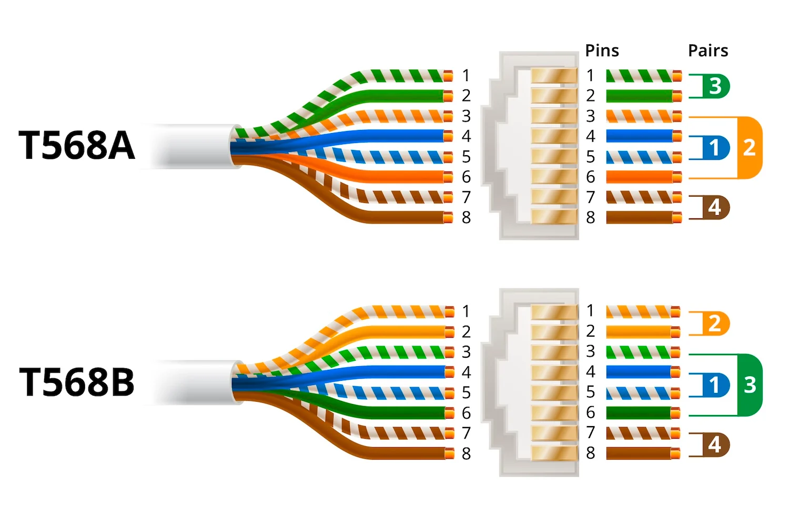
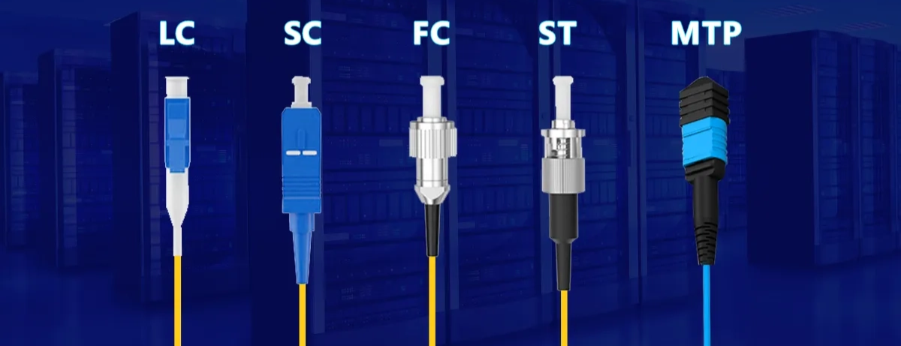
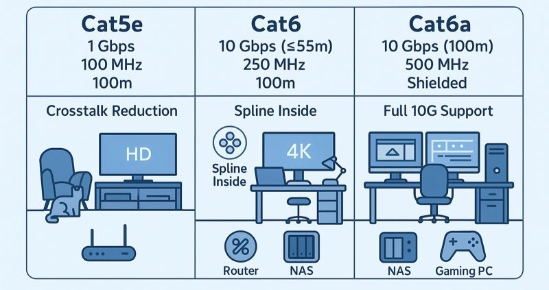

# UD2 - Redes LAN cableadas e inalámbricas

# 2.1 ETHERNET Y MEDIOS FÍSICOS

### A) ETHERNET

Ethernet es una **tecnología de red LAN** definida por el estándar IEEE 802.3 (*conjunto de normas que especifica cómo los dispositivos se comunican a través de cables de red (como los RJ-45) en una LAN (red de área local*). 

**Permite que dispositivos dentro de una red local se comuniquen mediante cables o fibra óptica.**

#### Funciones principales de ethernet:

- Define cómo se envían los datos
- Define el formato de las tramas
- Define el tipo de cableado
- Define velocidades de trasmisión

#### Velocidades tipicas

| Tipo | Velocidad | Detalles |
| --- | --- | --- |
| Ethernet Clásico (10BASE-T) | 10 Mbps | Usaba cable coaxial o par trenzado y era ideal para pequeñas redes locales |
| Fast Ethernet (100BASE-TX) | 100 Mbps | Popular en redes empresariales y hogares durante los años 90-2000 |
| Gigabit Ethernet (1000BASE-T) | 1 Gbps | Usa cables de par trenzado Cat5e o superior, fundamental para entornos de alta demanda de datos |
| 10 Gigabit Ethernet (10GBASE-T) | 10 Gbps | Usado en centros de datos y servidores de alto rendimiento, pues facilitan las grandes transferencias de datos. |
| Redes Ethernet en fibra óptica | hasta 400 Gbps | Usadas en grandes infraestructuras y proveedores de servicios a la nube. |

### B) CSMA/CD

**Carrier Sense Multiple Access with Collision Detection** (*Acceso múltiple con escucha de portadora y detección de colisiones*) es un método usado en las primeras redes IEEE Ethernet definidas por el estándar IEEE 802.3 para controlar cómo varios dispositivos compartían el mismo cable de red.

#### Funcionamiento

1. El dispositivo escucha el medio.
2. Si está libre, transmite.
3. Si dos equipos transmiten a la vez: → ocurre una colisión.
4. Los dispositivos esperan un tiempo aleatorio.
5. Reintentan la transmisión.

Actualmente las colisiones casi no existen gracias a los switches modernos.

---

# 2.2 TRAMA ETHERNET

La información en Ethernet se envía en tramas (frames). 

La **trama Ethernet** definida en el estándar IEEE 802.3 es la estructura de datos que viaja por una red Ethernet. Cada trama está formada por varios campos, y cada uno cumple una función específica.

### ESTRUCTURA DE LA TRAMA

- **Preamble + SFD (8 bytes):** sincronizan emisor y receptor e indican el inicio de la trama.
- **MAC destino (6 bytes):** dirección física del equipo que recibe los datos.
- **MAC origen (6 bytes):** dirección física del equipo que envía los datos.
- **Tipo/Longitud (2 bytes):** indica el protocolo transportado (IPv4, IPv6, ARP, etc.) o el tamaño de los datos.
- **Datos / Payload (46–1500 bytes):** información útil que se transmite.
- **FCS/CRC (4 bytes):** detecta errores en la transmisión para verificar que la trama llegue correctamente.

### DIRECCIÓN MAC

La MAC es una dirección física única del adaptador de red.

*Ej:* `01:1F:D0:C8:D6:6E`

- Vendor ID → fabricante
- Device ID → identificador del dispositivo

Para averiguar en **Windows** → `ipconfig /all`

Para averiguar en **Linux** → `ifconfig`

---

# 2.3 CABLES RJ45



- **Cable directo**: utiliza el mismo estándar en ambos extremos (T568A-A o T568B-B)
    - PC → Switch
    - PC → Hub
    - Router → Switch
    - Switch → Router
    - *Por ejemplo, si conectas un pc al switch, usas un cable directo, ya que un extremo habla por un par, y el otro escucha por el mismo par. Es el más común en redes LAN modernas*.
- **Cable cruzado:** cada extremo usa un estándar distinto (uno T568A y otro T568B)
    - PC → PC
    - Switch → Switch
    - Router → Router
    - *Por ejemplo, antes de los switcher actuales, si querías conectar 2 PCs directamente y sin switch, necesitabas un cable cruzado. Así, el cable se encarga de que lo que una PC transmite, la otra lo reciba (y viceversa).*

---

# 2.4 MEDIOS FÍSICOS


### A) CABLE UTP

El cable **UTP** (*Unshielded Twisted Pair*) es el cable más económico, flexible y usado. Utiliza **pares trenzados sin blindaje**. Tiene la desventaja de ser sensible a interferencias electromagnéticas.

#### Categorías

- Cat 5e → 1 Gbps de velocidad
- Cat 6 → hasta 10 Gbps de velocidad

### B) CABLE STP

El cable **STP** (*Shielded Twisted Pair*) se utiliza en fábricas, salas de servidores y entornos industriales en general. **Posee un blindaje metálico y protege contra EMI**.

#### Tipos

- **FTP (Foiled Twisted Pair):** una lámina general alrededor de todos los pares
- **STP:** blindaje individual por par
- **S/FTP:** blindaje individual + global → máxima protección

### C) FIBRA ÓPTICA


Transmite los datos por medio de pulsos de luz. Ofrecen una gran velocidad, pueden recorrer largas distancias y no tienen interferencias.

#### Tipos

- **Monomodo (SMF):** recorre hasta 100 km, usándose en campus y ciudades.
- **Multimodo (MMF):** recorre hasta 550 m, usándose en edificios, oficinas…

#### Estructura de la fibra

| Parte | Función |
| --- | --- |
| Núcleo | Transporta luz |
| Cladding | Refleja la luz |
| Cubierta | Protección |

---

# 2.5 TOPOLOGÍAS DE RED


### 1. Topología en bus

Todos los equipos comparten un único cable principal (backbone)

- Es sencilla y barata de implementar
- Genera muchas colisiones y si el cable falla, cae toda la red.
- *Ej: redes coaxiales antiguas*.

### 2. Topología estrella

Todos los dispositivos se conectan a un switch central.

- Es fácil de administrar y si falla un cable, solo cae un equipo.
- Si falla el switch, cae toda la red.
- *Ej: es la más utilizada en LAN modernas.*

### 3. Topología en anillo

Los dispositivos se conectan formando un círculo.

- Es ordenada y detectar errores es más sencillo.
- Una sola falla puede interrumpir toda la red.
- *Ej: el sistema Token Ring de IBM, ya casi obsoleto*

### 4. Topología en malla

Cada dispositivo se conecta con otros tantos.

- Tiene alta redundancia y es muy confiable.
- Es una topología costosa y compleja.
- *Ej: centros de datos*

### 5. Topología árbol

Posee una estructura jerárquica basada en estrellas.

- Es muy escalable y permite segmentación.
- Un fallo en un nodo superior afecta a ramas enteras.

### 6. Topología híbrida

Combina varias topologías.

- *Ej: estrella en oficinas, árbol entre plantas y malla en CPD*

---

# 2.6 SWITCHES Y DOMINIOS

Por cierto… ¿Qué es una **LAN**? es una Red de área local que conecta dispositivos en uun área limitada como una oficina, una casa, etc. Existen LAN **cableadas** (*par trenzado, fibra óptica o coaxial*) e **inalámbricas** (*WLAN - Wireless LAN*) que usa señales de radio (Wi-Fi)

### EVOLUCIÓN DE LOS DISPOSITIVOS DE RED

→ **Repetidores:** (*obsoleto*) amplifican señales para extender la longitud del cable.

→ **Hubs:** (*obsoleto*) conectan dispositivos pero crean un dominio de colisión

→ **Switches:** aprenden direcciones MAC y dirigen datos al destinatario correcto

→ **Routers:** conectan distintas redes y proporcionan servicios adicionales.

### SWITCHES

Es un dispositivo que conecta varios dispositivos dentro de una **LAN**. Reenvía las tramas de datos basándose en la dirección MAC. Un switch básico se caracteriza por:

- Opera en la capa 2 (*Enlace de datos*) del modelo OSI.
- No divide dominios de broadcast
- Reduce dominios de colisión (*cada puerto = dominio de colisión independiente*)

### DOMINIO DE COLISIÓN

Es el área de la red donde dos dispositivos pueden enviar datos al mismo tiempo **causando colisiones**. Esto sucede principalmente en **hubs** o redes half-duplex. Sin embargo, en switches modernos, cada puerto es un dominio de colisión diferente, lo que **reduce mucho las colisiones.**

#### Transmisiones

- **Simplex** → unidireccional, como en una emisora de radio FM
- **Half-duplex** → bidireccional, pero solo una parte puede transmitir a la vez, como un sistema de radio de un taxi.
- **Full-duplex** → bidireccional y pudiendo transmitir simultáneamente ambas partes, como una llamada telefónica.

### DOMINIO DE BROADCAST (DIFUSIÓN)

Es el área de la red donde un mensaje broadcast (*destinado a todos los dispositivos*) es recibido por todos los dispositivos. Por lo tanto, **todos los dispositivos de la misma LAN reciben los broadcast**. 

Un switch básico no divide dominios de broadcast, pero un router sí.

*Un ejemplo de broadcast sería ARP (Address Resolution Protocol)*

---

# 2.7 WI-FI (802.11)


Wi-Fi es una **tecnología de red inalámbrica** utilizada para conectar dispositivos dentro de una LAN sin necesidad de cables. Usa el **estándar IEEE 802.11** y define comunicaciones de redes LAN inalámbricas.

Wi-Fi permite transmitir datos usando **ondas de radio** en lugar de cables. Así, la información “viaja por el aire” desde el dispositivo hasta el router o punto de acceso (AP)

### A) RELACIÓN ENTRE WI-FI Y LAS CAPAS OSI

#### Capa física

- La capa física se encarga de enviar señales de radio, elegir frecuencia y transmitir bits inalámbricamente.
- Aquí trabajan antenas, canales, bandas de frecuencia y modulación.

#### Capa de enlace de datos (MAC)

- Controla quién transmite, cuándo transmite, cómo evitar conflictos y como identificar dispositivos.
- Es parecida a Ethernet, pero adaptada a redes inalámbricas.

### B) PUNTO DE ACCESO (AP)

En Wi-Fi normalmente existe un dispositivo central: `Access Point (AC)` o punto de acceso. El AP:

- Permite la señal Wi-Fi
- Recibe conexiones
- Conecta los dispositivos inalámbricos con la red local o Internet.

*Por ejemplo, en casa, normalmente el router hace también de AP*

### C) FUNCIONAMIENTO BÁSICO DEL WI-FI

1. **El AP emite señal**
→ El router inalámbrico envía constantemente ondas de radio para que los dispositivos detecten la red, la cual aparece con un nombre como `SSID`
2. **El dispositivo busca redes**
→ El móvil, portátil, computadora, etc. busca y detecta las redes cercanas.
3. **Autenticación**
→ El usuario introduce la contraseña y el router verifica identidad, permisos y seguridad.
4. **Conexión**
→ El dispositivo recibe acceso a la red y ya puede navegar, enviar datos y usar internet.

### D) CONTROL DE ACCESO - 802.1X


El **estándar IEEE 802.11** sirve para controlar quién entra en la red. *Se usa mucho en empresas, universidades y redes corporativas*.

#### Componentes

- **Suplicante:** es el dispositivo que quiere entrar en la red. Usa EAP (*Lenguaje de identificación*) para identificarse.
- **Autenticador:** (*normalmente witch, router o AP Wi-Fi*) su función es pedir identificación y comunicarse con el servidor.
- **Servidor de autenticación:** verifica si el usuario tiene permiso, normalmente usando `RADIUS`

Finalmente el suplicante obtiene acceso a la red. **Solo** los autorizados usan la red.

### E) EVOLUCIÓN DEL WI-FI

| Generación | Estándar | Velocidad |
| --- | --- | --- |
| Wi-Fi 1 → limitado por interferencias | 802.11b | 11 Mbps |
| Wi-Fi 2 → mayor velocidad y mejor alcance | 802.11a | 54 Mbps |
| Wi-Fi 3 → combina velocidad y compatibilidad | 802.11g | 54 Mbps |
| Wi-Fi 4 → introduce MIMO, mayor alcance y estabilidad | 802.11n | 600 Mbps |
| Wi-Fi 5 → usa MU-MIMO, canales de 160 MHz | 802.11ac | 6.9 Gbps |
| Wi-Fi 6 → OFDMA, MU-MIMO mejorado, más eficiencia | 802.11ax | 9.6 Gbps |
| Wi-Fi 6E → Expande Wi-Fi 6 al espectro de 6 GHz | extensión ax | 9.6 Gbps |
| Wi-Fi 7 → Canal de 320 MHz, modulación 4096-QAM | 802.11be | hasta 46 Gbps |

### F) BANDAS DE FRECUENCIA

#### 2.4 GHz

- Ofrece un mayor alcance
- Es compatible con una amplia gama de dispositivos
- Es susceptible a la interferencia de otros dispositivos
- Puede saturarse debido a la alta densidad de dispositivos

#### 5 GHz

- Proporciona velocidades de conexión más rápidas
- Experimenta menos saturación
- Tiene un alcance más limitado
- No es compatible con dispositivos más antiguos

### G) MODOS DE FUNCIONAMIENTO

**Modo de infraestructura:** usa un router o AP para gestionar la comunicación. *Es adecuado para redes grandes y complejas*.

**Modo Ad-hoc:** los dispositivos se conectan directamente sin un intermediario. *Ideal para redes pequeñas y simples.*

---

# 2.8 SEGURIDAD EN WI-FI

### EVOLUCIÓN

`WEP > WPA > WPA2 > WPA3`

#### 1. WEP (Wired Equivalent Privacy) — 1999

Fue el primer protocolo de seguridad utilizado en redes Wi-Fi. Utilizaba **cifrado RC4 con claves de 64 o 128 bits**. Su objetivo era ofrecer una seguridad similar a una red cableada, pero tenía muchas vulnerabilidades y podía romperse fácilmente con herramientas básicas. 
→ *Obsoleto*.

#### 2. WPA (Wi-Fi Protected Access) — 2003

WPA apareció como una mejora temporal para solucionar los problemas de WEP. Introdujo claves dinámicas, mejor autenticación y el protocolo TKIP. 
→ *Fue una solución temporal y actualmente también se encuentra obsoleto*.

#### 3. WPA2 — 2004

Fue durante muchos años el estándar de seguridad Wi-Fi. Introdujo el uso de `AES-CCMP`, que aumentó significativamente la seguridad. Además incorpora el modo Personal y el modo Enterprise con autenticación RADIUS. 
→ *Actualmente se usa ampliamente y es compatible con la mayoría de dispositivos.*

#### 4. WPA — 2018

Mejora significativamente la protección frente a ataques de fuerza bruta, robo de contraseñas y espionaje en redes públicas. Utiliza `SAE + AES-GCMP`. 
→ *Es el estándar de seguridad Wi-Fi actual y el recomendado enr edes modernas.*

### CONFIGURACIONES BÁSICAS DE LA RED WIFI

**SSID (Service Set Identifier)**

- Es el nombre de la red Wi-Fi que ven los dispositivos al buscar redes disponibles. 
→ *Se recomienda usar un nombre único, evitar datos personales y no dejar el nombre por defecto del router*.

**Canal**

- Es la frecuencia específica dentro de la bamda Wi-Fi (2.4, 5 o 6 GHz)
→ *Se recomienda usar canales poco saturados. En 2.4GHz suelen usarse 1, 5 y 11. Muchos routers permiten la selección automática.*

**Tipo de cifrado**

- Define el sistema de seguridad de la red Wi-Fi.
→ *Usar WPA3 si es posible y evitar WEP*.

**Filtrado MAC**

- Permite aceptar únicamente dispositivos con direcciones MAC autorizadas.
→ *Esto añade una capa estra de control pero ojo, las MAC pueden falsificarse*.

**QoS (Quality of Service)**

- Prioriza determinados tipos de tráfico, como videollamadas, streaming o juegos online. Ayuda a reducir latencia, cortes y jitter.

**Modo de red / ancho de canal**

- Define el estándar usado (n/ac/ax) y el ancho del canal (20/40/80/160 GHz)
→ S*e recomienda usar modo mixto si hay dispositivos antiguos. Usar 80 o 160 MHz en redes modernas para mayor velocidad*

**Potencia de transmisión**

- Controla el alcance de la señal Wi-Fi
→ *Lo mejor es ajustarla al tamaño del espacio. Demasiada potencia puede causar interferencias con redes vecinas.*

---

# 2.9 WiMAX


es una tecnología de acceso inalámbrico de largo alcance basada en el estándar `IEEE 802.16`. Está diseñada para ofrecer conexión inalámbrica en áreas mucho más grandes que Wi-Fi. Características:

- Mayor cobertura que Wi-Fi.
- Usa antenas potentes y torres base.
- Utiliza modulación OFDM.
- Puede cubrir hasta 50 kms.
- Permite velocidades similares a ADSL o fibra básica.
- Es escalable: puede soportar desde pocos usuarios hasta miles.

### BANDAS DE FRECUENCIA WiMAX

- 2.3 GHz
- 2.5 GHz
- 3.5 GHz
- 5.8 GHz

### COMPARATIVA: WiMAX VS Wi-Fi

**WiMax** → funciona en redes metropolitanas y rurales ofreciendo una gran cobertura. Está más orientado a proveedores y grandes áreas. *Puede verse afectado por la distancia, obstáculos, clima o cantidad de usuarios.*

**Wi-Fi** → se usa en redes locales que requieren de menor cobertura. Típico en uso doméstico y empresarial.

---

# 2.10 REDES MÓVILES: EVOLUCIÓN


#### TECNOLOGÍA 1G (1979 - años 90)

Primera generación de telefonía móvil.

- comunicación analógica,
- solo voz,
- baja calidad,
- poca seguridad,
- sin transmisión de datos.
- uso de FDMA (*Frequency Division Multiple Access*)

#### TECNOLOGÍA 2G (1991 - 2000)

Introduce voz digital.

- mejor calidad de llamadas,
- aparición de SMS,
- más seguridad,
- tecnología GSM.
- Usaba TDMA (*Time Division Multiple Access*)

#### TECNOLOGÍA 2.5G (1999 - 2003)

Mejora de 2G con acceso básico a Internet.

- GPRS → Permitió conexión móvil mediante paquetes de datos.
- EDGE → Aumentó la velocidad hasta aproximadamente 200Kbps
- Fue la primera experiencia real de internet móvil

#### 3G — UMTS (Universal Mobile Telecommunications System) (2001 - 2010)

Supuso el inicio del Internet móvil moderno.

- navegación web,
- videollamadas,
- correo electrónico,
- velocidades de hasta 2 Mbps
- arquitectura UTRAN (Node B + RNC)

#### 3.5G — HSDPA (High-Speed Downlink Packet Access (2005 - 2012)

Mejora de 3G enfocada en aumentar la velocidad de descarga.

- hasta 14 Mbps
- mejor streaming,
- redes sociales,
- mejoras técnicas de modulación y corrección de errores.

#### TECNOLOGÍA 4G — LTE (2010 - presente)

Tecnología basada completamente en IP.

- velocidades hasta 100 Mbps - 1 Gbps
- baja latencia (30-50 ms)
- uso de MIMO
- modulación OFDMA (en enlace descendente) y SC-FDMA (en enlace ascendente)
- arquitectura All-IP
- Ideal para video HD, juegos online y aplicaciones en tiempo real

#### TECNOLOGÍA 5G (2020 - presente)

Última generación de redes móviles.

- velocidades de hasta 20 Gbps
- latencia ultra baja (1-10 ms)
- uso de mmWave
- Massive MIMO con cientos de antenas.
- soporte para millones de dispositivos IoT.
- edge computing y virtualización de red.

Tipos de despliegue:

- NSA (Non-Standalone)
- SA (Standalone)

#### TECNOLOGÍA 6G (~2030)

Se encuentra en desarrollo. Inteligente, cuántica y con IA integrada.

- velocidades superiores a 100 Gbps
- Internet háptico y holográfico
- Conectividad global inteligente
- Uso intensivo de IA y big data

```
1G → voz analógica
2G → voz digital + SMS
2.5G → Internet básico
3G → Internet móvil
3.5G → más velocidad
4G → alta velocidad y baja latencia
5G → ultra velocidad + IoT
6G → IA, todo conectado, en desarollo
```

---

# 2.11 COMPARATIVA ETHERNET  VS Wi-Fi

Ethernet y Wi‑Fi son las dos tecnologías más utilizadas para conectar dispositivos a una red local. **Ambas permiten acceder a Internet y compartir recursos, pero funcionan de forma diferente.**

- **Ethernet** utiliza cable físico (*normalmente UTP Cat5e, Cat6 o superiores*). Al existir una conexión directa entre el dispositivo y el switch, la comunicación es mucho más estable y predecible. Por eso **sigue siendo la mejor opción para tareas exigentes** como videojuegos online, videollamadas, streaming 4K/8K o transferencia de archivos grandes.
- **Wi‑Fi** utiliza ondas de radio y ofrece una gran ventaja: **movilidad**. Permite conectar portátiles, móviles o tablets sin cables. Sin embargo, **depende mucho de factores externos** como paredes, distancia al router, interferencias o saturación de la red.

**Algunos conceptos importantes a tener en cuenta:**

- Latencia → tiempo que tarda un paquete en ir y volver por la red
- Jitter → variación de la latencia
- Ancho de banda → cantidad de datos que pueden transmitirse

*Una red con mucha latencia o jitter provoca retrasos, cortes y mala calidad en juegos o videollamadas.*

### COMPARACIÓN GENERAL

| **Característica** | **Ethernet** | **Wi‑Fi** |
| --- | --- | --- |
| Estabilidad | Muy alta | Variable |
| Movilidad | Baja | Muy alta |
| Latencia | Muy baja | Mayor |
| Interferencias | Casi inexistentes | Frecuentes |
| Velocidad real | Muy constante | Depende del entorno |

*En la práctica, la mayoría de redes modernas utilizan un sistema híbrido: dispositivos fijos por Ethernet y móviles por Wi‑Fi.*

## A) VENTAJAS DE ETHERNET FRENTE A Wi-Fi

→ La principal ventaja de Ethernet es la **estabilidad**. Como la transmisión se realiza por cable, no existen problemas habituales de las redes inalámbricas como interferencias o pérdida de señal.

→ Ethernet también proporciona una **latencia mucho menor**. Esto resulta fundamental en aplicaciones en tiempo real como videojuegos competitivos, VoIP o videollamadas.

→ Otra ventaja importante es la **velocidad sostenida**. Aunque Wi‑Fi anuncia velocidades muy altas, esas cifras suelen ser teóricas y compartidas entre todos los dispositivos conectados.

#### Situaciones donde Ethernet es mejor

- Gaming competitivo
- Servidores y NAS
- Streaming profesional
- Transferencia de archivos grandes
- Videollamadas importantes
- Redes empresariales


## B) LIMITACIONES DEL Wi-Fi

Wi‑Fi es extremadamente cómodo, pero tiene limitaciones importantes:

→ La primera es la **interferencia**. Las señales inalámbricas pueden verse afectadas por paredes, electrodomésticos u otras redes cercanas.

→ También influye mucho la **distancia al router**. Cuanto más lejos esté el dispositivo, peor será la calidad de la señal.

→ Además, **el ancho de banda se comparte entre todos los usuarios conectados**, por lo que el rendimiento disminuye cuando hay muchos dispositivos utilizando la red.

- Interferencias = Pérdida de velocidad
- Saturación = Mayor latencia
- Obstáculos físicos = Menor cobertura
- Distancia = Señal más débil

---

# 2.12 IMPLANTACIÓN DE UNA LAN

La implantación de una LAN consiste en diseñar e instalar toda la infraestructura necesaria para conectar dispositivos dentro de una red local.

No se trata únicamente de colocar cables. También es necesario **organizar correctamente los dispositivos, planificar el crecimiento futuro y facilitar el mantenimiento.**

#### Elementos principales de una LAN

1. **Switch** → Conecta dispositivos dentro de la LAN
2. **Router** → Une redes diferentes
3. **Punto de acceso** → Permite conexión Wi-Fi
4. **Rack** → Organiza los equipos
5. **Patch panel** → Centraliza conexiones

---

# 2.13 ELEMENTOS DE RED

### HUB


El hub o concentrador es un dispositivo intermediario y fue uno de los primeros dispositivos utilizados en redes LAN. Cuando recibe datos por un puerto, los envía a todos los demás formando una topología bus, aunque físicamente sea una estrella **→ Esto genera colisiones porque todos los dispositivos comparten el mismo medio**.

*Actualmente está prácticamente obsoleto, aunque aún siguen siendo usados como sniffers para monitorizar el tráfico en redes.*

### SWITCH


El switch sustituyó al hub porque mejora muchísimo el rendimiento. Forma una topología de estrella tanto física como lógicamente. Aprende las direcciones MAC de los dispositivos y envía cada trama únicamente al destinatario correcto. Gracias a ello:

- desaparecen prácticamente las colisiones,
- aumenta la velocidad,
- cada puerto funciona de manera independiente.

→ Las **MAUs** eran dispositivos utilizados principalmente en redes Token Ring. Su función era **conectar físicamente los equipos** formando un anillo lógico, aunque externamente pareciera una topología en estrella.

Cada dispositivo se conectaba a la MAU y esta se encargaba de mantener el paso ordenado de los datos alrededor del anillo.

**Aunque actualmente están prácticamente en desuso, son importantes porque ayudan a entender que una red puede tener una topología física distinta de su topología lógica.**

Características principales:

- Utilizadas en redes Token Ring.
- Funcionamiento en anillo lógico.
- Posibilidad de apilar varias MAUs.
- Muy poco utilizadas en redes modernas.

### ROUTER


También llamado pasarela, puerta de enalace o gateway, el router **conecta redes diferentes**, normalmente la LAN con Internet, como suelen vendernos los ISP (*Internet Service Provider)*. Además puede:

- separar dominios broadcast,
- aplicar seguridad,
- realizar NAT,
- gestionar rutas.

## PUNTO DE ACCESO INALÁMBRICO


El AP (Access Point) o WAP (wireless AP) permite conectar dispositivos inalámbricos a una red cableada. En empresas es habitual instalar varios AP para cubrir todo el edificio.

## MÓDEM

El módem (*MOdulador/DEModulador*) es el dispositivo encargado de convertir señales digitales en señales válidas para el medio de transmisión y viceversa. Tradicionalmente se utilizaban en redes telefónicas analógicas, aunque actualmente siguen siendo fundamentales en conexiones ADSL, cable, fibra o redes móviles.

El módem suele ser el equipo que conecta la red doméstica o empresarial con el proveedor de Internet (ISP).

#### Tipos de módem

| Tipo de módem | Tecnología | Estado actual | Comentario |
| --- | --- | --- | --- |
| **Módem telefónico (dial-up)** | Usa línea telefónica analógica (56 kbps máx.) | 🧓 En desuso | Era común en los 90. Muy lento, casi extinto. |
| **Módem ADSL / DSL** | Usa la línea telefónica, pero con señal digital | ⚠️ En declive | Aún se usa en zonas rurales o donde no hay fibra. |
| **Módem de cable (DOCSIS)** | Usa cable coaxial (como el de TV por cable) | ☑️ Vigente | Muy usado por ISPs de cable; ofrece alta velocidad. |
| **Módem de fibra óptica (ONT o GPON)** | Usa fibra óptica (señal de luz) | 🚀 En expansión | Es el estándar actual en la mayoría de países. |
| **Módems móviles (3G/4G/5G)** | Usa red móvil | 🚀 Muy vigente | En smartphones y routers móviles. |
| **Módems satelitales** | Usa señal satelital | 🌍 En uso limitado | Ideal para zonas sin cobertura terrestre. |

*En conexiones de fibra óptica modernas, el módem suele integrarse con el router en un único dispositivo proporcionado por el operador.*

## CONECTORES MÁS IMPORTANTES

Los **conectores RJ** (*Registered Jack*) se utilizan en instalaciones de redes y telefonía mediante cable de par trenzado. Existen distintos tipos según su uso y número de contactos.

- **RJ‑45:** es el más utilizado en redes Ethernet. Puede encontrarse en formato macho (el conector del cable) y hembra o roseta (la toma de pared). Usa 8 contactos y cables de 4 pares trenzados.
    
    
    
- **RJ‑11:** se utiliza principalmente en instalaciones telefónicas. Tiene menos contactos que el RJ-45 y actualmente no se usa en redes Ethernet.
    
    
    
- **SC, ST y LC:** conectores habituales de fibra óptica.
    
    
    

## ELEMENTOS PASIVOS DE RED: ADAPTADORES


También conocidos como **NIC** (*Network Interface Card*) son dispositivos periféricos de E/S que permiten conectar un equipo a una red.

---

# 2.14 CABLEADO ESTRUCTURADO


El cableado estructurado es un sistema organizado de instalación de cables dentro de edificios. Es la “autopista” que conecta a todos los dispositivos. Se utiliza para transportar:

→ *Datos, voz, vídeo, cámaras IP, dispositivos IoT…*

**La topología utilizada es estrella**, donde cada toma de red se conecta individualmente al **rack o patch panel**. *La gran ventaja de este sistema es que un fallo en un cable solo afecta a un puesto concreto.*

### Subsistemas del cableado estructurado:

| **Subsistema** | **Función** | **Ejemplo** |
| --- | --- | --- |
| Entrada de edificio | Entrada del operador | *Operador pone 12 hilos de fibra OS2; el técnico los empalma en caja ODF* |
| Equipamiento | Sala de operadores | *Router del ISP, firewall, core switch* |
| Backbone vertical | Comunicación entre plantas | *8 fibras OM4 en tubo de 50 mm; cada planta tiene un TR* |
| Backbone horizontal | Cableado del mismo piso | *2 tubos de 40 mm con 50 pares Cat 6A cada uno* |
| Administración | Patch panels y etiquetado | *48 puertos RJ-45 etiquetados 2B- 01…2B-48* |
| Área de trabajo | Tomas RJ-45 del usuario | *RJ-45 doble (datos + voz) a 30 cm del enchufe eléctrico* |

### Tipos de cableado



- **Cableado vertical:** conecta plantas, salas técnicas y edificios. Suele usar fibra óptica para soportar grandes velocidades y largas distancias.
- **Cableado horizontal:** conecta los puestos de trabajo dentro de una misma planta. Normalmente utiliza Cat5e, Cat6 o Cat6A. También forman parte del cableado horizontal los **patch cords** o latiguillos, que unen el equipo con la roseta.

### Rack o armario de comunicaciones


Es la estructura en la que se organizan los dispositivos de red. Dentro del rack suelen instalarse: switches, routers, patch panels, SAI, organizadores de cable, bandejas y ventilación.

Los racks suelen ener tamaños estándares de 19 pulgadas…

- 6U: pequeñas instalaciones.
- 12U: aulas o oficinas pequeñas.
- 42U o 47U: empresas y CPD.

La profundidad del rack depende de los equipos instalados.

### Patch panel


El patch panel es un panel con puertos RJ‑45 hembra que sirve para organizar y centralizar todas las conexiones. **Se instala dentro del rack entre el cableado horizontal y los switches**.

Ventajas del patch panel:

- facilita cambios de red,
- mejora el orden,
- simplifica reparaciones,
- reduce errores de conexión.

### Canalizaciones


Son las estructuras por donde se conducen los cables. Su función es:

- proteger el cableado,
- organizar la instalación,
- facilitar ampliaciones.

Tipos habituales:

- canaletas de pared,
- bandejas aéreas,
- tubos corrugados.

### Medios de transmisión

La elección del medio físico depende de la distancia, velocidad y entorno.

- **UTP Cat5e:** hasta 1 Gbps, económico y muy utilizado en hogares y oficinas.
- **Cat6 y Cat6A:** mayores velocidades, mejor rendimiento y adecuados para redes modernas.
- **Fibra multimodo:** utilizada normalmente dentro de edificios o campus. Permite altas velocidades a distancias medias.
- **Fibra monomodo:** se utiliza en largas distancias y redes de operadores. Puede alcanzar decenas de kilómetros.

### Fibra óptica

La fibra óptica transmite datos mediante pulsos de luz. Sus principales ventajas son su altísima velocidad, gran distancia y su inmunidad a interferencias electromagnéticas. Se estructura de la siguiente forma:

- Núcleo: por donde viaja la luz.
- Cladding: refleja la luz dentro del núcleo.
- Cubierta protectora: protege físicamente el cable.

Los conectores más utilizados son → ST, SC y LC

*El conector LC es muy común actualmente porque ocupa menos espacio y es más seguro.*

### Modos de transmisión

1. **Simplex:** la comunicación se realiza en una dirección
→ *televisión*
2. **Half-Duplex:** los dispositivos pueden transmitir y recibir, pero no simultáneamente.
→ *walkie-talkies*
3. **Full-Duplex:** la transmisión ocurre simultáneamente en ambos sentidos.
→ *Es el modo utilizado en Ethernet moderno.*

### Herramientas de cableado

Para realizar instalaciones de red se utilizan distintas herramientas. Las más importantes son:

- crimpadora RJ‑45,
- tester de continuidad,
- certificador Fluke,
- pelacables,
- patch cords prefabricados.

El certificador permite comprobar profesionalmente que la instalación cumple los estándares.

---

# 2.15 VARIANTES DE ETHERNET

### A) AUTO-MDI/MDIX

La tecnología Auto-MDI/MDIX permite que un puerto Ethernet detecte automáticamente si necesita funcionar como una interfaz **MDI o MDIX**. *En la práctica, esto significa que los dispositivos pueden adaptarse automáticamente al tipo de cable conectado.*

Antes de esta tecnología era necesario diferenciar claramente entre:

- Cable directo → usado normalmente entre PC y switch.
- Cable cruzado → usado entre dispositivos similares, como PC-PC o switch-switch.

Con Auto-MDI/MDIX, **el propio dispositivo intercambia internamente los pares de transmisión y recepción cuando es necesario**. Gracias a ello, hoy en día casi todos los switches modernos permiten conectar dispositivos sin preocuparse del tipo exacto de cable.

Ventajas principales:

- Simplifica instalaciones.
- Reduce errores de cableado.
- Facilita el mantenimiento.
- Ahorra tiempo al administrador de red.

### B) FAST ETHERNET – 100BASE-TX

Fast Ethernet, también llamado 100Base-TX, apareció en 1995 como evolución del Ethernet clásico. Su objetivo fue aumentar la velocidad de transmisión desde 10 Mbps hasta 100 Mbps. Se caracteriza por:

- Velocidad máxima de 100 Mbps
- Medio físico → cable trenzado
- Categoría mínima de CAT 5
- Conector → RJ-45
- Transmisión half-duplex y full-duplex

Para que toda la red funcione realmente a 100 Mbps, todos los componentes deben soportar Fast Ethernet:

- Tarjetas de red.
- Switches o hubs.
- Cableado adecuado.

Si uno de los elementos es más lento, **la velocidad total se reduce automáticamente**. *Por ejemplo, si el switch solamente soporta 10 Mbps, toda la comunicación con ese dispositivo funcionará a esa velocidad.*

También es importante recordar que Fast Ethernet puede funcionar:

- En topología bus si se usa hub.
- En topología estrella si se usa switch.

En redes modernas prácticamente siempre se utiliza la **topología estrella**.

### C) APILAMIENTO DE SWITCHES Y HUBS

El apilamiento consiste en conectar varios switches o hubs entre sí para ampliar el número de puertos disponibles y facilitar la administración.

Existen varias formas de realizar este apilamiento:

#### 1. Mediante cables Ethernet

Los switches pueden conectarse utilizando puertos normales o puertos especiales uplink/downlink. Dependiendo del fabricante puede ser necesario utilizar cable directo o cruzado.

#### 2. Mediante módulos SFP

Los módulos **SFP** (*Small Form-factor Pluggable*) son transceptores extraíbles que permiten utilizar enlaces de cobre o fibra óptica. Son muy utilizados para:

- Conexiones backbone.
- Enlaces verticales entre plantas.
- Conexiones de alta velocidad.

#### 3. Mediante conectores propietarios

Algunos fabricantes utilizan **sistemas propios de stacking**. En estos casos normalmente todos los switches deben ser del mismo fabricante.

### D) DIRECCIONES MAC

Cada tarjeta de red (NIC) posee una dirección física única denominada MAC (Media Access Control). Esta dirección viene programada por el fabricante y permite identificar de forma única a cada dispositivo dentro de una red.

### Consultar la dirección MAC

En Windows:

```powershell
ipconfig /all
```

En Linux:

```bash
ifconfig
```

---

# 2.16 INSTALACIONES

#### Nuevas edificaciones

En España, las instalaciones de telecomunicaciones en edificios están reguladas por el Real Decreto 346/2011. Esta normativa establece criterios para garantizar:

- Correcto funcionamiento.
- Mantenimiento adecuado.
- Escalabilidad futura.
- Compatibilidad con servicios modernos.

El objetivo es que los edificios estén preparados para servicios de voz, datos, televisión, internet y hogar digital.

#### Centros de procesamiento de datos (CPD)


Un CPD es el lugar donde se concentran los recursos informáticos y de red de una organización.

En un CPD suelen encontrarse:

- Servidores.
- Sistemas de almacenamiento.
- Equipos de red.
- Sistemas de alimentación.
- Sistemas de refrigeración.

Su función es garantizar el funcionamiento continuo de los servicios informáticos.

La norma **ANSI TIA-942** clasifica los CPD en varios niveles según su tamaño y complejidad.

| Nivel | Características |
| --- | --- |
| Nivel 1 | Hasta 100 usuarios |
| Nivel 2 | Varios espacios en un edificio |
| Nivel 3 | Varios edificios en campus |
| Nivel 4 | Infraestructura distribuida |

Cuanto mayor es el nivel:

- mayor redundancia existe,
- más disponibilidad ofrece,
- y más compleja es la infraestructura.

---

# 2.17 CENTROS DE PROCESAMIENTO DE DATOS

Un centro de procesamiento de datos debe cumplir requisitos muy estrictos.

#### 1. Disponibilidad

Los servicios deben estar operativos las 24 horas del día durante todo el año.

#### 2. Redundancia

Se duplican elementos críticos como:

- alimentación eléctrica,
- conexiones de red,
- almacenamiento,
- climatización.

#### 3. Seguridad

Debe existir:

- control de acceso,
- prevención de incendios,
- monitorización continua.

#### 4. Condiciones ambientales

La temperatura recomendada suele situarse entre 21 ºC y 23 ºC para evitar sobrecalentamientos.

Además, los materiales utilizados deben ser resistentes al fuego y los sistemas de extinción normalmente emplean CO₂.

### ETIQUETADO Y ORGANIZACIÓN

#### Norma ANSI/TIA/EIA-606A

Esta norma define cómo deben etiquetarse los elementos de una instalación de red. El objetivo es facilitar:

- mantenimiento,
- documentación,
- ampliaciones,
- localización de averías.

Para ello se etiquetan espacios, paneles, puertos y cableado.

#### Ejemplos de etiquetado

- Espacios → `5A`= *planta 5, espacio A*
- Patch panel → `5A-A`
- Puerto concreto → `5A-A-01`
- Cableado vertical → `5A/1D-01`

Indica origen, destino y número de cable. Este sistema de identificación facilita enormemente el trabajo de administración de red.

---

# 2.17 DISEÑO JERÁRQUICO DE REDES

Las redes modernas se diseñan utilizando modelos jerárquicos para facilitar la administración y el crecimiento. Los principios principales son:

1. Jerarquía = dividir la red en capas
2. Modularidad = Separar funciones
3. Resistencia = Soportar fallos
4. Flexibilidad = Facilitar ampliaciones

### MODELO DE TRES CAPAS

#### A) Capa de acceso

La capa de acceso conecta directamente los dispositivos finales: *PCs, impresoras, teléfonos IP, puntos Wi-Fi*… **En esta capa suelen utilizarse switches de capa 2.**

Funciones habituales:

- VLAN.
- Seguridad de puertos.
- QoS.
- Alimentación PoE.
- Control de acceso.

Es la capa más cercana al usuario final.

#### B) Capa de distribución

La capa de distribución conecta múltiples switches de acceso y actúa como frontera entre capa 2 y capa 3. Aquí se aplican políticas de red como:

- ACL,
- filtrado,
- routing entre VLAN,
- balanceo de carga,
- redundancia.

También ayuda a controlar los dominios broadcast.

#### C) Capa núcleo

La capa núcleo (core) es el backbone principal de la red. Su función es transportar grandes cantidades de tráfico a máxima velocidad. Se caracteriza por:

- Muy alta disponibilidad.
- Baja latencia.
- Alta capacidad.
- Redundancia.

En esta capa **se prioriza la velocidad** frente a tareas complejas de filtrado o inspección.

#### D) Núcleo contraído

En redes pequeñas o medianas puede combinarse la capa núcleo y la capa de distribución en un único dispositivo. **A este diseño se le llama núcleo contraído.**

Ventajas:

- Menor coste.
- Menos dispositivos.
- Administración más sencilla.

Desventaja:

- Menor escalabilidad que un diseño completo de tres capas.

Es muy utilizado en pequeñas empresas donde no se espera un crecimiento masivo de la infraestructura.